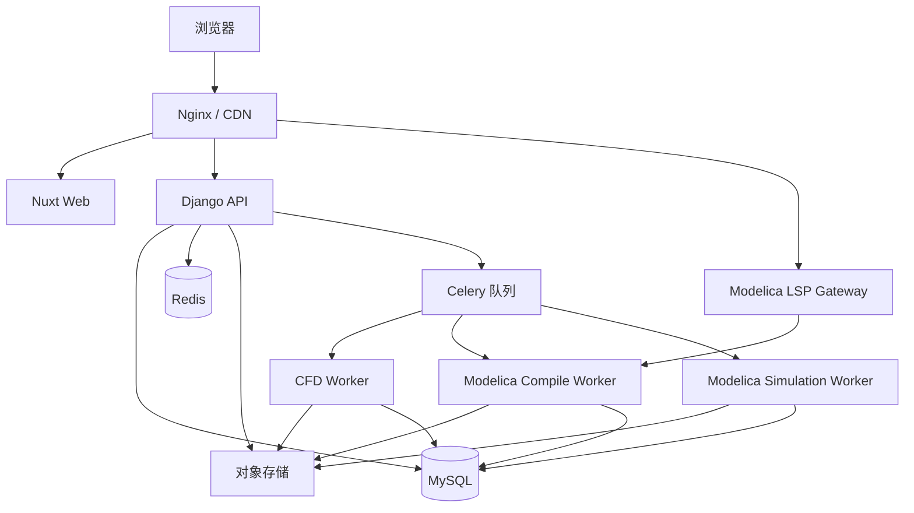
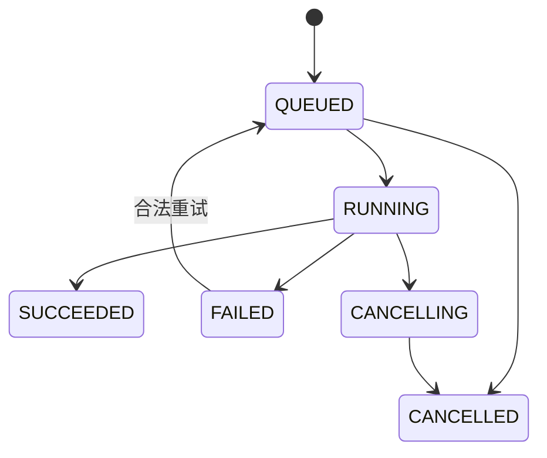

# CFD 与 Modelica 工程仿真平台——完整软件开发规格书

> 文档版本：V1.1  
> 文档状态：可进入产品设计、UI 设计、数据库建模与编码阶段  
> 目标读者：产品经理、UI/UX、前端、后端、数值算法、测试、运维人员  
> 首版范围：响应式 Web 平台，包含教学型 CFD 工具和可实际建模、编译、运行的 Modelica 子系统；不包含原生 App、小程序、商业 CFD 软件云端授权调用和通用三维网格计算

---

## 1. 文档目标与实施原则

本文档将原始大纲细化为一套可实现的软件规格。开发团队应以本文档中的模块边界、数据结构、接口契约、状态机、权限规则、计算规则和验收标准为实现依据。

实施时遵循以下原则：

1. **先闭环、后扩展**：V1 必须完成“学习内容—算法查询—CFD/Modelica 建模与仿真—结果保存—社区讨论”的完整闭环。
2. **计算服务与业务服务隔离**：Web API 不直接执行 CFD 或 Modelica 编译求解；计算任务统一进入队列，由独立且受限的 Worker 执行。
3. **首版求解器可验证**：V1 只内置边界明确、计算规模可控、存在基准解或公开基准数据的教学型求解器。
4. **所有输入均可校验**：前端表单约束只用于改善体验，后端必须再次校验参数、资源额度和文件类型。
5. **接口优先**：Web 端通过版本化 API 使用业务能力，以便后续复用到 App、小程序或桌面客户端。
6. **内容与公式可迁移**：文章正文采用结构化 JSON 与净化后的 HTML 双存储；公式保留 LaTeX 源码。
7. **可观测、可追踪**：用户操作、管理操作和仿真任务均具有唯一标识、状态记录和必要日志。
8. **Modelica 能力必须真实可用**：Modelica 模块不是语法展示器，必须形成“项目—源码—检查—编译—实验—求解—结果”的完整执行链；未支持的语言特性必须在编译阶段明确拒绝。
9. **语言子集先明确后扩展**：V1 实现本文规定的 Modelica 子集，编译器、运行时和组件库分别版本化，禁止用未声明兼容性的语法静默降级。

### 1.1 关键名词

| 名词 | 定义 |
|---|---|
| 内容 | 知识文章、算法条目或公式条目 |
| 仿真工具 | 平台预先发布的一类参数化计算程序 |
| 仿真任务 | 用户针对某个工具提交的一次具体计算 |
| 求解器版本 | 决定计算逻辑、默认参数和结果格式的不可变版本号 |
| Modelica 项目 | 用户组织 `.mo` 源文件、依赖、资源和实验配置的顶层工作空间 |
| Modelica 编译单元 | 一次由项目版本、顶层模型、编译器版本和依赖锁定共同确定的不可变编译输入 |
| 扁平模型 | 完成继承、修改、连接展开和名称解析后，用于结构分析与代码生成的方程系统 |
| 实验 | 顶层模型、参数覆盖、起止时间、容差、输出变量和求解器设置的可复现实验定义 |
| 组件库 | 按语义版本发布、包含 Modelica 类与资源文件的只读依赖包 |
| FMU | 依据 FMI 标准导入或导出的模型交换/联合仿真单元 |
| 匿名访客 | 未登录用户，只能浏览公开内容和查看公开案例 |
| 注册用户 | 完成账号注册且状态正常的用户 |
| 内容编辑 | 可创建、编辑、提交内容，但不能最终发布 |
| 版主 | 管理指定论坛板块及其内容 |
| 管理员 | 管理用户、内容、工具、任务和系统配置 |

---

## 2. 产品定位、目标与边界

### 2.1 产品定位

面向 CFD、系统仿真及航空发动机工程用户的知识与实践平台，融合以下五项核心能力：

- **知识库**：系统化的流体力学、数值方法、湍流、网格、边界条件和软件实践内容。
- **算法与公式库**：公式速查、算法原理、离散格式、伪代码和可复制代码示例。
- **在线仿真**：可配置、可排队、可追踪、可视化、可导出的教学型 CFD 小程序。
- **Modelica 建模与仿真**：提供工程项目、源码编辑、语法与语义检查、模型编译、组件库、实验管理、SUNDIALS 求解、结果分析和 FMI/FMU 能力。
- **社区论坛**：围绕理论、算法、软件使用、论文和工程问题展开交流。

### 2.2 V1 业务目标

- 用户能在 3 次点击内从首页进入目标知识文章、公式或仿真工具。
- 用户提交仿真后能够离开页面，任务完成后仍可在个人中心查看结果。
- 内容管理员可以在不修改代码的情况下维护分类、文章、算法、公式和推荐位。
- 管理员能够查看任务队列、失败原因、资源消耗并终止异常任务。
- 用户能够在浏览器中创建 Modelica 项目，调用平台组件库组装或编写模型，完成编译和动态仿真，并复现实验结果。
- Modelica 编译错误能够定位到文件、行列和语义阶段；成功仿真能够追溯源码版本、依赖、编译器、运行时和求解器配置。
- 所有公开内容具备稳定 URL、SEO 元信息和站内搜索入口。

### 2.3 V1 不实现的内容

- 任意 CAD 几何上传、通用网格划分与任意三维 CFD 求解。
- 浏览器内直接运行 Fluent、STAR-CCM+、COMSOL 等商业软件。
- 商业软件许可证托管或共享。
- 用户上传并执行任意 Python、C/C++、UDF 或 OpenFOAM 代码。
- Modelica 外部 C/Fortran 函数、任意系统命令、网络访问、动态加载本机库和用户自定义原生二进制。
- 完整兼容 Modelica Language Specification 的全部高级特性；V1 仅承诺第 10 章定义的语言子集。
- 私信、在线课程付费、论文全文托管、即时聊天和视频直播。
- 高性能计算集群自动伸缩；V1 预留接口，但先采用固定 Worker 池。

### 2.4 后续扩展

- OpenFOAM 容器化模板 Case。
- 二维非结构网格、稳态传热、可压缩喷管流动等工具。
- 组织/团队空间、私有案例、课程系统和作业评测。
- 对象存储直传、消息中间件升级、Kubernetes 与 HPC 调度器对接。
- 图形化 Modelica 拓扑编辑器、完整 Modelica Standard Library 兼容、更多索引约简与撕裂策略、FMI 3.0 高级能力和 CFD–Modelica 联合仿真。

---

## 3. 用户角色与权限矩阵

### 3.1 角色

系统采用 RBAC。一个用户可拥有多个后台角色；论坛版主权限还应绑定具体板块。

| 权限项 | 游客 | 注册用户 | 内容编辑 | 版主 | 管理员 |
|---|:---:|:---:|:---:|:---:|:---:|
| 浏览已发布内容 | ✓ | ✓ | ✓ | ✓ | ✓ |
| 搜索公开内容 | ✓ | ✓ | ✓ | ✓ | ✓ |
| 点赞、收藏、评论 |  | ✓ | ✓ | ✓ | ✓ |
| 提交仿真任务 |  | ✓ | ✓ | ✓ | ✓ |
| 查看自己的任务 |  | ✓ | ✓ | ✓ | ✓ |
| 创建/编辑自己的 Modelica 项目 |  | ✓ | ✓ | ✓ | ✓ |
| 编译和运行自己的 Modelica 模型 |  | ✓ | ✓ | ✓ | ✓ |
| 发布公共 Modelica 示例 |  | 申请后 | ✓ |  | ✓ |
| 管理 Modelica 组件库与编译器版本 |  |  |  |  | ✓ |
| 发布论坛帖子/回复 |  | ✓ | ✓ | ✓ | ✓ |
| 创建知识/算法草稿 |  |  | ✓ |  | ✓ |
| 发布知识/算法内容 |  |  |  |  | ✓ |
| 管理指定板块 |  |  |  | ✓ | ✓ |
| 管理仿真工具与版本 |  |  |  |  | ✓ |
| 管理用户、权限、系统配置 |  |  |  |  | ✓ |

### 3.2 用户状态

`PENDING_VERIFY`、`ACTIVE`、`MUTED`、`SUSPENDED`、`DELETED`。

- `MUTED`：可登录、浏览和运行仿真，不能发帖、回复或评论。
- `SUSPENDED`：禁止登录；已发布公开内容保留，但显示账号状态。
- `DELETED`：逻辑删除；个人信息匿名化，依法或依规则保留必要审计数据。

---

## 4. 首版范围与优先级

### 4.1 P0：必须交付

1. 注册、登录、退出、邮箱验证、忘记密码、个人资料。
2. 知识分类树、文章列表、文章详情、标签、评论、点赞、收藏。
3. 算法分类、算法详情、公式索引、公式搜索与复制。
4. 四个在线工具：一维对流扩散、二维方腔顶盖驱动流、圆管层流、湍流模型参数对比。
5. Modelica 工程项目、文件树、Monaco 源码编辑器、自动保存、版本快照、语法高亮、补全、跳转和诊断。
6. Modelica V1 语言子集编译链：词法/语法、AST、名称与类型检查、实例化/扁平化、连接展开、方程平衡检查、DAE 结构分析、代码生成与编译缓存。
7. Modelica 实验管理和动态仿真：参数覆盖、起止时间、输出间隔/采样点、容差、IDA/CVODE 选择、任务排队、事件处理、结果图表与 CSV/JSON/MAT 导出。
8. 平台基础组件库和首批航空发动机零维组件库；组件参数、端口、单位、文档、图标和验证算例齐备。
9. 仿真任务队列、进度、取消、失败重试、结果展示、CSV/PNG/JSON 导出。
10. 论坛板块、帖子、楼层回复、点赞、举报、审核与通知。
11. 全站搜索。
12. 管理后台：内容、用户、论坛、CFD 工具、Modelica 组件库/编译器版本、任务和系统配置。
13. Docker 化部署、日志、监控、备份、自动测试和上线验收。

### 4.2 P1：首版上线后

- OAuth 第三方登录。
- WebSocket 实时任务进度；P0 可先使用 2 秒轮询。
- Markdown 批量导入、内容修订对比和定时发布。
- 公开仿真案例与参数一键复现。
- Modelica 可视化连接编辑器、项目复制/公开模板、参数扫描和多工况对比。
- FMU 导入、FMI 2.0 Model Exchange 导出与基础验证；FMU 只能在隔离容器中解析和运行。
- OpenSearch/Elasticsearch；数据量较小时先使用 MySQL 全文索引。
- 文章阅读历史、用户关注、周榜/月榜。

### 4.3 P2：中长期

- OpenFOAM 模板 Case、对象存储直传、大文件分片上传。
- 组织空间、算力套餐、任务优先级和集群调度。
- 多语言内容、原生 App、小程序。
- FMI 2.0 Co-Simulation、FMI 3.0、与 CFD 求解器的弱耦合联合仿真。
- 完整 MSL 兼容、用户私有组件库发布、组织级模型仓库、HPC 参数扫描和优化。

---

## 5. 固定技术方案

为避免实现阶段在“Vue 或 React”“轮询或 WebSocket”等问题上反复决策，V1 固定采用以下组合。

### 5.1 前端

- **Nuxt 3 + Vue 3 + TypeScript**：公开页面使用 SSR/SSG，用户中心和仿真页使用客户端交互。
- **Pinia**：登录用户、全局配置、未读消息等全局状态。
- **Element Plus**：后台及复杂表单；公开内容页使用项目自有样式封装。
- **TipTap**：文章、帖子和回复编辑器。
- **KaTeX**：公式渲染；服务端和客户端均做错误兜底。
- **Shiki 或 highlight.js**：代码高亮。
- **ECharts**：二维曲线、等值线和矢量图；V1 不引入 Three.js。
- **Monaco Editor**：Modelica 源码编辑、诊断、补全、符号跳转和差异对比；语言能力通过自研 LSP 服务提供。
- **Vue Flow**：P1 Modelica 图形连接编辑器；P0 仅实现只读组件拓扑预览，不作为源码事实来源。
- **Zod**：前端接口数据与表单 Schema 校验。
- **Vitest + Playwright**：单元、组件与端到端测试。

### 5.2 后端

- **Python 3.12 + Django 5.x + Django REST Framework**。
- **SimpleJWT**：短期 Access Token + 可轮换 Refresh Token；Web 端优先将 Refresh Token 放入 HttpOnly Cookie。
- **Celery + Redis**：异步任务、重试和定时任务。
- **Django Channels**：P1 实时进度；P0 保留事件接口并采用轮询。
- **Modelica Language Server**：独立进程提供增量语法分析、诊断、补全、悬停、符号和定义跳转；不得在 Django 请求线程内完成全项目编译。
- **drf-spectacular**：生成 OpenAPI 3 文档。
- **django-filter**：筛选、排序和分页。
- **Gunicorn**：WSGI；启用 Channels 时单独部署 ASGI 服务。

### 5.3 数据与存储

- **MySQL 8**：业务数据，字符集 `utf8mb4`，时区统一存 UTC。
- **Redis**：缓存、限流计数、Celery Broker、短期任务进度。
- **S3 兼容对象存储**：用户图片、文章图片和仿真结果文件；本地开发使用 MinIO。
- **MySQL 全文索引**：V1 搜索；当公开内容达到约 10 万条或搜索质量不足时迁移 OpenSearch。

### 5.4 数值计算与 Modelica 运行时

- NumPy、SciPy、Numba、Matplotlib。
- 每个求解器以独立 Python 包实现，禁止依赖 Django ORM。
- Worker 通过固定协议读取标准化参数，输出 `manifest.json`、数据文件和预览图。
- 每个工具版本绑定代码镜像摘要或代码版本号，保证历史任务可追溯。
- **Modelica 编译器核心**：C++20；前端采用 ANTLR4 或等价生成式解析器，内部使用稳定 AST/IR，编译阶段不得依赖 Web 框架。
- **符号处理**：自研实例化、扁平化、连接展开、常量传播、别名消除、方程平衡、关联矩阵、BLT 分块和基础 Pantelides 索引约简；复杂撕裂和高阶优化按版本扩展。
- **数值运行时**：SUNDIALS IDA 负责 DAE，CVODE 负责显式 ODE，KINSOL 用于一致初值/非线性代数环；稀疏线性求解优先 KLU，提供稠密回退。
- **代码生成**：扁平 IR 生成受控 C/C++ 残差、事件、输出和 Jacobian 接口，在固定工具链容器中编译为任务专用制品；禁止拼接未经转义的用户文本进入 Shell。
- **结果格式**：P0 使用平台自定义列式二进制/NPZ + `manifest.json`，同时导出 CSV；P1 增加 MAT v4 兼容输出。

### 5.5 工程与部署

- Monorepo：`frontend/`、`backend/`、`solvers/`、`modelica/`、`libraries/`、`infra/`、`docs/`。
- Docker Compose：本地开发和单机生产起步。
- Nginx：TLS 终止、反向代理、静态文件、上传限制。
- CI：代码检查、单元测试、求解器基准测试、镜像构建、数据库迁移检查。

---

## 6. 总体架构



### 6.1 服务职责

| 服务 | 职责 | 禁止事项 |
|---|---|---|
| Nuxt Web | 页面渲染、交互、表单校验、图表展示 | 不保存可信权限状态，不执行重型计算 |
| Django API | 鉴权、业务规则、数据持久化、签发下载地址 | 不在请求线程中求解 CFD |
| Celery Worker | 读取任务、执行求解、写结果、更新进度 | 不接受任意用户代码，不直接暴露公网端口 |
| Modelica LSP Gateway | 管理编辑会话、增量诊断、补全、悬停与跳转 | 不生成可信发布制品，不直接运行仿真 |
| Modelica Compile Worker | 解析、语义检查、扁平化、结构分析、代码生成、受控编译和缓存 | 不访问公网，不加载用户原生库，不复用可写工作目录 |
| Modelica Simulation Worker | 加载已签名编译制品，执行 SUNDIALS、处理事件和写结果 | 不接收未编译源码，不执行外部进程或任意动态库 |
| MySQL | 业务事实数据、任务状态、审计记录 | 不保存大体积结果数组 |
| Redis | 缓存、队列、限流、瞬时进度 | 不作为永久任务记录 |
| 对象存储 | 图片、附件、仿真结果、导出文件 | 不保存未校验的可执行文件 |

### 6.2 核心业务流

#### 仿真任务

1. 前端取得工具定义与参数 Schema。
2. 用户填写参数并请求预估计算量。
3. API 校验参数、用户额度和并发数。
4. API 创建 `QUEUED` 任务并投递队列。
5. Worker 抢占任务，将状态改为 `RUNNING`，定期写进度。
6. Worker 生成结果清单和文件；成功则置为 `SUCCEEDED`，异常则置为 `FAILED`。
7. 前端轮询状态，成功后读取清单并渲染图表。

#### 内容发布

1. 编辑创建草稿。
2. 服务端净化 HTML、解析目录和公式、生成摘要。
3. 编辑提交审核；管理员通过或驳回。
4. 发布后刷新缓存、搜索索引、站点地图和推荐位。

#### Modelica 编译与仿真

1. 用户编辑项目文件；前端按版本号保存增量内容，LSP 返回非权威的实时诊断。
2. 用户选择顶层模型并执行“检查”；API 固化项目快照、依赖锁和编译选项，创建编译任务。
3. Compile Worker 在隔离容器中完成解析、实例化、扁平化、结构检查与代码生成；成功后写入不可变编译制品。
4. 用户基于成功编译单元创建实验，覆盖允许修改的参数并提交仿真任务。
5. Simulation Worker 校验制品签名，计算一致初值，调用 IDA/CVODE，处理时间/状态/关系事件并持续写进度。
6. 成功后生成结果清单、变量元数据、统计摘要和日志；前端按变量树选择曲线并支持多任务对比。
7. 任一结果均可追溯至项目快照、顶层模型、组件库锁文件、编译器/运行时版本和 SUNDIALS 配置。

---

## 7. 前端信息架构、页面分布与布局规范

本章是前端实现和 UI 设计的强制约束。设计目标不是制作传统“企业宣传官网”，而是构建一个与 CFD 技术主题相契合、能长期承载知识阅读、数值计算和工程讨论的专业工作平台。

### 7.1 页面设计目标与统一原则

#### 7.1.1 总体气质

- 关键词：专业、克制、精确、清晰、可信、可计算。
- 主页面保持简洁，不使用大面积人物照片、轮播广告、自动播放视频、夸张渐变或过多悬浮装饰。
- 视觉表达可引用“流线、网格、等值线、速度矢量”等 CFD 语言，但只能作为低对比度背景或局部图形，不得影响文字阅读。
- 内容页以阅读效率为第一目标，仿真页以参数输入和结果判读为第一目标，论坛以问题定位和回复浏览为第一目标。
- 各分支页面共享导航、颜色、字号、间距、按钮和反馈规则，但允许根据任务采用不同的信息密度与栏位结构。

#### 7.1.2 信息层级

页面信息按以下层级组织：

1. 当前用户要完成的核心任务，例如搜索知识、阅读文章、提交计算或浏览帖子。
2. 完成任务所需的上下文，例如分类、参数说明、收敛状态、作者和发布时间。
3. 相关内容与下一步建议，例如相关文章、关联公式、推荐工具和相似问题。
4. 运营内容与平台信息，例如公告、推荐位和页脚链接。

一个页面只能有一个视觉上的主操作按钮。并列的次操作采用描边按钮或文字按钮，避免多个高饱和按钮争夺注意力。

#### 7.1.3 页面类型

| 页面族 | 主要页面 | 核心任务 | 推荐密度 | 基本结构 |
|---|---|---|---|---|
| 门户型 | 首页 | 理解平台并快速进入目标功能 | 低 | 全宽分区 + 有限卡片 |
| 导航型 | 知识库、算法库、工具列表 | 查找、筛选和比较 | 中 | 标题区 + 筛选区 + 内容列表 |
| 阅读型 | 文章、算法、公式详情 | 连续阅读和定位章节 | 低至中 | 左辅助栏 + 正文 + 右目录 |
| 工作台型 | 仿真运行页、任务结果页 | 配置、运行和分析 | 高 | 参数区 + 主工作区 + 状态区 |
| 社区型 | 论坛、帖子详情 | 扫描话题和讨论 | 中至高 | 板块/列表 + 内容流 + 侧栏 |
| 管理型 | 个人中心、管理后台 | 批量处理和状态追踪 | 高 | 固定侧栏 + 表格/表单工作区 |
| 入口型 | 登录、注册、错误页 | 完成单一动作 | 低 | 居中单卡片 |

### 7.2 设计系统基线

#### 7.2.1 色彩

V1 使用浅色主题，预留深色主题变量但不要求上线。所有颜色必须以 CSS Design Token 定义，页面中禁止散落硬编码颜色。

| Token | 建议值 | 用途 |
|---|---:|---|
| `--color-primary-600` | `#1769AA` | 主按钮、选中项、链接、关键数据 |
| `--color-primary-50` | `#EEF6FC` | 轻量选中背景、信息提示背景 |
| `--color-accent-500` | `#18A999` | 成功计算、速度场/流线点缀；不可替代成功状态色 |
| `--color-text-900` | `#17212B` | 标题和主要文字 |
| `--color-text-600` | `#52606D` | 摘要、辅助说明 |
| `--color-border-200` | `#DCE3E9` | 卡片、表格和输入框边界 |
| `--color-surface-0` | `#FFFFFF` | 页面主体、卡片表面 |
| `--color-surface-50` | `#F6F8FA` | 页面背景、分区背景 |
| `--color-success-600` | `#218739` | 成功、已收敛、已发布 |
| `--color-warning-600` | `#B25E09` | 警告、待审核、部分收敛 |
| `--color-danger-600` | `#C0362C` | 失败、删除、高风险操作 |

- 正文和背景的对比度至少为 4.5:1，大字号文字至少为 3:1。
- 求解结果配色优先采用 Viridis、Cividis 等感知均匀色带；禁止默认使用彩虹色带。
- “成功/警告/失败”除颜色外必须同时显示图标和文字。

#### 7.2.2 字体与排版

- 中文界面字体栈：`Inter, "Noto Sans SC", "Microsoft YaHei", system-ui, sans-serif`。
- 公式使用 KaTeX 字体；代码使用 `JetBrains Mono, Consolas, monospace`。
- 页面基础字号 16 px，最小辅助文字 12 px，常规辅助文字不小于 14 px。
- 正文行高 1.75；列表/表格行高 1.5；表单控件高度统一为 40 px，大按钮为 44 px。

| 层级 | 桌面字号/行高 | 移动字号/行高 | 使用场景 |
|---|---|---|---|
| Display | 44/56 px | 32/42 px | 首页首屏主标题，仅一处 |
| H1 | 36/48 px | 28/38 px | 页面标题、文章标题 |
| H2 | 28/40 px | 24/34 px | 页面主要分区 |
| H3 | 22/32 px | 20/30 px | 卡片组、文章三级标题 |
| Body | 16/28 px | 16/27 px | 正文 |
| Small | 14/22 px | 14/22 px | 元数据、辅助说明 |

#### 7.2.3 间距、圆角和阴影

- 采用 4 px 基础网格，常用间距为 4、8、12、16、24、32、48、64、96 px。
- 普通卡片圆角 8 px，输入框和按钮 6 px，弹窗 12 px；禁止每种组件使用不同圆角。
- 卡片默认使用 1 px 边框，不默认添加阴影；仅悬浮卡片、弹窗和固定浮层使用轻阴影。
- 首页各主要分区桌面端上下间距 80–96 px，移动端 48–64 px。
- 内容型页面顶部到 H1 的距离控制在 32–48 px，避免无意义大留白。

#### 7.2.4 图标、插图与数据图形

- 图标统一使用同一套线性图标库，默认 20 px；不混用彩色拟物图标。
- CFD 插图应表达真实物理对象或数值过程，例如管流剖面、方腔流线、网格局部放大，不使用与内容无关的抽象科技素材。
- 首页 Hero 背景可使用低对比度等值线与结构网格，透明度建议 6%–12%，必须关闭指针交互。
- 图表必须具备标题、坐标名称、单位、图例、数据下载和无障碍文字摘要。

### 7.3 栅格、宽度与响应式规则

#### 7.3.1 断点

| 名称 | 范围 | 栅格 | 页面边距 | 主要行为 |
|---|---:|---:|---:|---|
| Mobile | `< 768 px` | 4 列 | 16 px | 单列；侧栏变抽屉；表格允许横向滚动 |
| Tablet | `768–1023 px` | 8 列 | 24 px | 两列卡片；阅读页隐藏左树，仅保留目录按钮 |
| Desktop | `1024–1439 px` | 12 列 | 32 px | 完整导航；双栏或三栏布局 |
| Wide | `≥ 1440 px` | 12 列 | 自适应 | 内容最大宽度固定，避免文字和图表无限拉伸 |

#### 7.3.2 内容容器

- 公共页面主容器最大宽度 1280 px。
- 首页 Hero 可全宽使用背景，但文字、按钮和图形必须落在 1280 px 容器内。
- 阅读正文理想宽度 760 px，最大 840 px；数学推导或大表格可在正文内临时扩展至 960 px。
- 仿真工作台桌面端最大宽度 1440 px，以保证参数表单和图表同时可见。
- 后台管理页面在大屏可扩展到 1600 px，但数据表格必须提供列显隐设置。

#### 7.3.3 响应式变换

- 不允许只按比例缩小桌面页面；移动端必须重排内容优先级。
- 三栏阅读页在平板变为“正文 + 右侧目录”，在手机变为单栏正文，知识树和目录由顶部按钮打开抽屉。
- 仿真工作台在手机端按“问题说明 → 参数 → 提交 → 进度 → 结果”顺序纵向排列；结果图表不得缩成不可读缩略图。
- 管理表格在手机端不强制卡片化，允许横向滚动，并固定首列和操作列。
- 断点前后不得丢失表单值、筛选条件、图表选项和滚动定位。

### 7.4 全站公共骨架与导航

#### 7.4.1 桌面端 Header

Header 高度 64 px，白色或半透明白色背景，滚动后固定在顶部并出现 1 px 下边框。由左到右排列：

1. Logo 与站点名，点击回首页；占用约 180 px。
2. 一级导航：知识库、算法与公式、CFD 仿真、Modelica、社区。
3. 弹性空白区域。
4. 全站搜索触发器，桌面宽度不足时只保留图标。
5. 通知入口，登录后显示未读数，最大显示 `99+`。
6. 未登录显示“登录”和“注册”；已登录显示头像菜单。

一级导航使用文字高亮和 2 px 底边表示当前模块，不使用厚重胶囊背景。Header 中不得加入超过 6 个一级入口；低频入口放入用户菜单或 Footer。

#### 7.4.2 移动端 Header

- 高度 56 px；左侧为菜单按钮，中间为 Logo/站点名，右侧为搜索和用户入口。
- 一级导航进入左侧抽屉；抽屉内同时显示登录状态和五个主模块。
- 任务运行或结果页可将中间标题替换为任务短名称，但必须保留返回路径。

#### 7.4.3 面包屑

- 首页和一级模块首页不显示面包屑。
- 文章、算法、工具和帖子详情页必须显示，最多呈现 4 级；中间层级过长时折叠。
- 面包屑用于定位，不替代页面 H1；移动端只显示“返回上一级”与当前页简称。

#### 7.4.4 Footer

Footer 使用浅灰背景，桌面端分为品牌说明、内容入口、支持与规则、联系信息四列；移动端使用折叠组。

必须包含：关于平台、使用条款、隐私政策、内容规范、仿真免责声明、联系我们、备案信息、站点版本。不得在 Footer 重复展示大量文章链接。

#### 7.4.5 全局搜索入口

- 桌面端点击 Header 搜索后打开居中搜索面板，宽度 640–720 px；支持 `Ctrl/Cmd + K`。
- 面板包含输入框、最近搜索、热门词和五类结果预览；输入 300 ms 后请求建议。
- 回车进入完整搜索页；Esc 关闭；键盘上下键可选择建议。
- 未输入内容时不发送搜索请求；搜索历史仅在本地或用户授权后同步。

### 7.5 路由与页面分布

| 路由 | 页面 | 布局模板 | 权限 | SEO |
|---|---|---|---|---|
| `/` | 首页 | `MarketingLayout` | 公开 | SSR |
| `/knowledge` | 知识库首页 | `DiscoveryLayout` | 公开 | SSR |
| `/knowledge/category/:slug` | 知识分类页 | `DiscoveryLayout` | 公开 | SSR |
| `/knowledge/:slug` | 文章详情 | `ReadingLayout` | 公开 | SSR |
| `/algorithms` | 算法库 | `DiscoveryLayout` | 公开 | SSR |
| `/algorithms/:slug` | 算法详情 | `ReadingLayout` | 公开 | SSR |
| `/formulas` | 公式速查 | `ReferenceLayout` | 公开 | SSR |
| `/formulas/:slug` | 公式详情 | `ReadingLayout` | 公开 | SSR |
| `/simulation` | 仿真工具列表 | `DiscoveryLayout` | 公开 | SSR |
| `/simulation/:slug` | 工具介绍与参数页 | `WorkbenchLayout` | 登录后运行 | SSR + CSR |
| `/simulation/tasks/:id` | 任务进度与结果 | `WorkbenchLayout` | 所有者/管理员 | noindex |
| `/modelica` | Modelica 模块首页 | `ModelicaHubLayout` | 公开 | SSR |
| `/modelica/projects` | 我的 Modelica 项目 | `ModelicaProjectLayout` | 登录 | noindex |
| `/modelica/projects/:id/editor` | 源码编辑与项目检查 | `ModelicaIDELayout` | 项目成员 | noindex |
| `/modelica/projects/:id/models/:class_name` | 模型/组件检查器 | `ModelicaIDELayout` | 项目成员 | noindex |
| `/modelica/projects/:id/experiments` | 实验列表 | `ModelicaProjectLayout` | 项目成员 | noindex |
| `/modelica/projects/:id/experiments/:experiment_id` | 实验配置 | `ModelicaIDELayout` | 项目成员 | noindex |
| `/modelica/runs/:id` | 编译/仿真进度与结果 | `ModelicaResultLayout` | 项目成员/管理员 | noindex |
| `/modelica/libraries` | 组件库目录 | `DiscoveryLayout` | 公开/按库权限 | SSR |
| `/modelica/libraries/:name/:version` | 组件库版本详情 | `ReferenceLayout` | 公开/按库权限 | SSR |
| `/modelica/templates` | 示例项目和模板 | `DiscoveryLayout` | 公开 | SSR |
| `/forum` | 论坛首页 | `CommunityLayout` | 公开 | SSR |
| `/forum/sections/:slug` | 论坛板块 | `CommunityLayout` | 公开 | SSR |
| `/forum/posts/:id` | 帖子详情 | `CommunityLayout` | 公开 | SSR |
| `/search` | 搜索结果 | `DiscoveryLayout` | 公开 | noindex |
| `/login`、`/register` | 账号入口 | `AuthLayout` | 未登录 | noindex |
| `/user/:username` | 公开用户主页 | `ProfileLayout` | 公开 | SSR |
| `/me/overview` | 个人概览 | `AccountLayout` | 登录 | noindex |
| `/me/tasks` | 我的仿真任务 | `AccountLayout` | 登录 | noindex |
| `/me/modelica` | 我的 Modelica 项目与运行记录 | `AccountLayout` | 登录 | noindex |
| `/me/bookmarks` | 收藏与历史 | `AccountLayout` | 登录 | noindex |
| `/me/posts` | 我的内容 | `AccountLayout` | 登录 | noindex |
| `/me/settings` | 账号设置 | `AccountLayout` | 登录 | noindex |
| `/notifications` | 通知中心 | `AccountLayout` | 登录 | noindex |
| `/admin/*` | 自建管理端 | `AdminLayout` | 后台角色 | noindex |

前端在 `layouts/` 中实现上述布局模板；具体页面不得复制 Header、Sidebar 或 Footer。访问受限路由时先显示轻量骨架，权限确认失败后跳转到登录或 403 页面，禁止短暂渲染受限内容。

### 7.6 主页面详细布局

首页目标是让首次访问者在 10 秒内理解“这是一个覆盖 CFD 与 Modelica 的工程仿真学习、计算与交流平台”，并能在 3 次点击内进入知识、CFD 工具或 Modelica 工作台。首页不承担完整展示所有内容的任务。

#### 7.6.1 首页纵向结构

| 顺序 | 分区 | 桌面高度建议 | 核心内容 | 交互 |
|---:|---|---:|---|---|
| 1 | Header | 64 px | 品牌、5 个主入口、搜索、账号 | 固定导航 |
| 2 | Hero | 520–620 px | 主标题、说明、2 个操作、CFD/系统模型视觉图 | 搜索/跳转，无轮播 |
| 3 | 核心能力 | 280–360 px | 学习、CFD、Modelica、社区 4 个能力入口 | 整卡可点 |
| 4 | 学习路径 | 360–440 px | 5 阶段路径及当前推荐 | 横向步骤/移动端纵向 |
| 5 | 推荐仿真 | 420–520 px | 3–4 个工具与预览结果 | 查看详情、载入示例 |
| 6 | 精选知识 | 420–520 px | 1 个主推荐 + 4 个次推荐 | 分类和详情跳转 |
| 7 | 算法与公式 | 280–360 px | 热门算法、公式速查 | 复制公式/进入详情 |
| 8 | 社区动态 | 320–420 px | 6–8 个高质量主题 | 查看板块和帖子 |
| 9 | Footer | 自适应 | 规则、支持、联系 | 普通链接 |

#### 7.6.2 Hero

桌面端使用 7:5 双栏结构，左侧文字，右侧使用 CFD 流场与 Modelica 系统拓扑的克制组合。右侧优先使用真实求解示例的静态可视化，例如网格/流线、组件连线和时序曲线；不得做持续高负载 WebGL 动画。

左侧内容固定为：

- 一行产品主张，控制在 18 个汉字以内。
- 两行解释，说明知识库、CFD 工具、Modelica 系统仿真和社区能力。
- 主按钮“进入仿真平台”，点击后展示“CFD 工具 / Modelica 工作台”二选一；次按钮“浏览知识库”。
- 按钮下方显示低权重信任信息，例如“基础工具免费使用”“结果可下载”“理论与案例相互关联”。

首页搜索框不与两个 CTA 同时争夺第一视觉层。V1 建议将搜索作为 Header 常驻入口，并在 Hero 文案下以轻量宽输入框显示；屏幕高度不足时可隐藏信任信息，不能隐藏主按钮。

#### 7.6.3 核心能力区

使用 4 张等宽卡片，1024 px 以下改为 2×2，移动端单列；不使用 6–8 张小图标宫格：

| 卡片 | 标题 | 描述重点 | 预览元素 | 入口 |
|---|---|---|---|---|
| 学习仿真 | 系统化知识路径 | CFD、Modelica、数值算法与验证 | 章节树局部 | `/knowledge` |
| CFD 工具 | 可复现的流动实验 | 配置参数、观察收敛、下载结果 | 小型流场图 | `/simulation` |
| Modelica | 系统级动态仿真 | 编写模型、连接组件、配置实验、分析曲线 | 拓扑 + 时序图 | `/modelica` |
| 解决问题 | 面向工程的社区 | 提问、案例讨论、经验沉淀 | 主题列表局部 | `/forum` |

卡片悬浮时只改变边框、背景和箭头位置，不做明显放大，避免页面晃动。

#### 7.6.4 学习路径区

- 左侧或上方为分区标题和 80–120 字说明。
- 路径为 5 个阶段：流体基础 → 离散方法 → 压力速度耦合 → 湍流与近壁面 → 工程验证。
- 每个阶段显示完成条件、文章数量和推荐入口；未登录用户不显示虚假的学习进度。
- 移动端改为纵向时间线，只默认展开第一个阶段。

#### 7.6.5 推荐仿真区

桌面端采用“左侧工具列表 5 列 + 右侧预览 7 列”的组合，而不是重复普通内容卡片。选择左侧工具时，右侧切换问题示意图、可调参数、预计耗时和示例结果；切换不得自动提交计算。

首屏只推荐 3–4 个稳定工具。每项显示工具类型、难度、平均耗时和版本状态；无可用工具时显示维护说明，并保留知识内容入口。

#### 7.6.6 精选知识、算法和社区

- 精选知识使用“1 张横向主推荐 + 4 条紧凑列表”，主推荐允许封面，列表不重复大图。
- 算法与公式区左右分栏；算法展示名称、用途、精度与稳定性标签，公式展示可复制的核心表达式。
- 社区区按主题列表展示标题、板块、回复数、最后活跃时间和“已解决/精华”状态，不显示干扰阅读的大头像墙。
- 每个分区底部只保留一个“查看全部”入口。

#### 7.6.7 首页数据与降级

- 推荐内容由后台运营位读取；失败时回退到已发布内容的质量分与发布时间排序。
- 单一区块接口失败时只降级该区块，不得导致首页整体 500。
- 非首屏区块可延迟加载；SSR 输出标题、摘要和基本链接，图表与交互在客户端激活。
- 首页图片统一声明宽高，避免布局位移；Hero 主图桌面端不超过 300 KiB，移动端提供独立裁剪图。

### 7.7 分支页面详细布局

#### 7.7.1 知识库首页与分类页

知识库强调“体系化学习”，不得做成单纯按发布时间排列的博客。

桌面布局：

| 区域 | 宽度 | 内容 | 行为 |
|---|---:|---|---|
| 页面标题区 | 12 列 | 标题、简介、搜索、学习路径入口 | 保持简洁，不放封面轮播 |
| 左侧知识树 | 3 列/240 px | 一级分类、二级主题、文章数量 | 桌面端吸顶，记忆展开状态 |
| 中央内容区 | 6–7 列 | 路径卡、精选文章、文章列表 | 支持难度/类型/软件筛选 |
| 右侧辅助栏 | 2–3 列/240 px | 学习进度、热门标签、最近更新 | 平板隐藏，手机置于列表末尾 |

- 分类页顶部显示分类定义、前置知识、包含主题和预计学习时长。
- 文章列表默认采用紧凑横向列表，含标题、摘要、难度、更新时间和阅读时长；只有精选条目可使用封面。
- 筛选条件同步到 URL Query，刷新和分享后可恢复。
- 文章总数较少时不显示复杂筛选器，避免空控件占位。

#### 7.7.2 知识文章详情页

桌面端采用三栏：左侧 240 px 章节树，中间 760–840 px 正文，右侧 220 px 当前页目录。总宽不足 1180 px 时先隐藏左侧章节树。

正文从上到下包括：面包屑、标题、副标题、作者与更新时间、难度/标签、摘要、正文、参考文献、修订信息、互动区、相关文章。

- 右侧目录在滚动时高亮当前 H2/H3；点击标题后 URL 写入锚点。
- 正文中的公式编号、图题、表题和引用格式统一；宽公式可横向滚动，不能溢出页面。
- 代码块顶部显示语言、文件名和复制按钮；行号按内容需要启用。
- 文章操作栏在桌面端可位于正文左缘，移动端固定在底部时最多保留收藏、分享和目录三个按钮。
- 评论区与正文之间至少留 64 px，防止讨论内容干扰文章结束位置。

#### 7.7.3 算法库与算法详情页

算法库强调比较和选择：

- 顶部提供用途、方程类型、离散类型、精度阶数、稳定性、网格类型筛选。
- 默认列表使用表格式行项目，列为算法名、主要用途、精度、优点、限制、关联求解器；移动端退化为摘要卡片。
- 支持勾选 2–4 个算法进入对比视图；对比字段固定，缺失值明确显示“暂无数据”。

算法详情仍使用阅读布局，但正文前增加摘要矩阵：适用问题、精度、稳定性、计算成本、边界限制。伪代码、流程、公式和实现注意事项必须分区，不把所有信息堆进一个长文本块。

#### 7.7.4 公式速查页与公式详情页

- 桌面端左侧为分类树 220 px，中间为可搜索公式列表，右侧为“已收藏/最近复制”辅助栏。
- 每个公式条目展示名称、渲染结果、符号摘要、适用条件和复制按钮；源码只在展开后显示。
- 公式详情使用单栏正文 + 右侧目录，重点展示变量定义表、量纲检查、推导条件、常见变形和关联算法。
- 点击复制时让用户选择 LaTeX 或纯文本；成功反馈不超过 2 秒且不阻塞操作。

#### 7.7.5 仿真工具列表页

页面顶部由标题、说明、状态公告和搜索组成。主体为左侧筛选栏 + 右侧工具区：

- 筛选项：维度、稳态/瞬态、物理类型、难度、预计耗时、可用状态。
- 工具卡片桌面端每行 3 张，宽度不小于 280 px；卡片包含真实示例预览、名称、说明、标签、平均耗时、版本和状态。
- 默认排序优先显示稳定、入门和最近使用工具；“维护中”工具仍可查看说明，但运行按钮禁用并显示原因。
- 列表顶部提供“卡片/紧凑列表”切换，选择保存在本地。

#### 7.7.6 仿真工具运行页

这是平台的核心工作台。桌面端采用 4:8 双栏：左侧参数区 360–420 px，右侧问题与结果区占剩余空间；页面最大宽度 1440 px。

左侧参数区从上到下：

1. 工具名、版本和可用状态。
2. 参数分组导航：物理参数、网格、数值方法、输出选项。
3. 动态表单；每项含标签、值、单位、范围、帮助和错误提示。
4. 计算量、预计耗时、配额影响。
5. “运行仿真”主按钮、“恢复默认”文字按钮。

右侧工作区使用标签页：问题说明、几何/网格示意、示例结果、当前任务结果。运行前默认展示问题说明，提交后自动切换到进度/结果，但用户仍可返回参数区查看只读快照。

- 参数区桌面端可在 Header 下吸顶，但其内部内容超高时独立滚动；不能同时出现页面和面板两个难以控制的滚动条。
- 参数验证采用输入后即时校验 + 提交时全量校验；错误时聚焦第一个非法字段。
- 有未提交修改时，在运行按钮旁显示“参数已修改”；离开页面前提示保存或放弃。
- 提交后生成不可变参数快照，当前表单继续修改不会改变正在运行的任务。
- 移动端底部固定操作栏只显示预计耗时和运行按钮；表单正文保留足够底部留白。

#### 7.7.7 任务进度与结果页

页面顶部显示任务名、短 ID、状态、创建时间、工具版本，以及“复制参数重跑”“下载结果”“取消任务”等操作。

结果区按状态变化：

| 状态 | 主区域 | 辅助区域 | 允许操作 |
|---|---|---|---|
| `QUEUED` | 排队位置、等待说明 | 参数摘要 | 取消、离开页面 |
| `RUNNING` | 进度、当前阶段、残差预览 | 参数与资源使用 | 请求取消、离开页面 |
| `SUCCEEDED` | 图表、云图、表格和摘要 | 收敛信息、参数、文件清单 | 下载、重跑、分享（P1） |
| `FAILED` | 用户可理解的失败原因 | 日志摘要、参数 | 修改参数、合法重试 |
| `CANCELLED` | 取消时间和说明 | 参数摘要 | 复制参数重跑 |

成功结果页使用“概览、场数据、曲线、数据表、求解日志”标签页。概览必须先给出关键数值、收敛结论和警告，再显示图表；不能让用户自行从原始日志猜测计算是否可信。

图表工具栏统一提供变量、单位、色带、线型、导出 PNG/SVG/CSV 和恢复视图。危险或异常结果在图表上方使用常驻警告条，不用瞬时 Toast。

#### 7.7.8 Modelica 模块与工作台

Modelica 使用独立于普通内容页和 CFD 参数页的工作台布局，但沿用全站字体、色彩、按钮、状态和消息组件。

**模块首页 `/modelica`**：首屏只解释“创建模型—检查编译—运行实验—分析结果”四步，并提供“新建项目”“从模板开始”“浏览组件库”三个入口。下方展示首批模板（弹簧质量、热网络、液压回路、发动机转子/容腔/管路）和语言支持范围；不得把它做成 Modelica 宣传文章集合。

**项目列表 `/modelica/projects`**：使用表格/紧凑卡片双视图，显示项目名、所有者、最近编辑、顶层模型、依赖状态、最近编译和最近仿真。支持按名称、标签、更新时间筛选，以及新建、复制模板、归档和软删除。新建项目向导只收集名称、标识、模板、可见性和 Modelica 版本，不在向导内堆放求解参数。

**IDE 页面 `/modelica/projects/:id/editor`**：桌面端固定为四区，宽度可拖动并保存到用户偏好：

| 区域 | 默认位置/尺寸 | 核心内容 | 必须行为 |
|---|---|---|---|
| 项目栏 | 左侧 240 px | 文件树、模型树、依赖、资源 | 新建/重命名/移动/删除、冲突提示 |
| 编辑区 | 中央自适应 | Monaco 多标签源码编辑器 | 高亮、补全、悬停、跳转、查找、未保存标记 |
| 检查器 | 右侧 300 px | 当前类、参数、变量、端口、注解、文档 | 点击定义跳回源码，参数只读/可改状态明确 |
| 底部面板 | 高 220 px，可折叠 | 问题、编译输出、任务、变量浏览 | 错误按文件/严重级别筛选，点击定位行列 |

IDE 顶部工具栏从左到右固定为：项目名/分支快照、顶层模型选择、保存状态、“检查模型”、“创建实验”、“运行”以及任务状态。不得把“保存”和“运行”合并；有未保存内容时运行需先创建一致快照。自动保存采用 2 秒防抖和乐观版本号，冲突时禁止静默覆盖，必须提供本地/服务器差异视图。

P0 图形区只提供由已编译模型生成的只读拓扑：组件方框、端口、连接和层级导航；源码是唯一事实来源。P1 引入可编辑画布时，每次拖放或连线必须生成确定性的 Modelica 修改并展示差异，生成失败则回滚画布操作。

**实验配置页**采用左右双栏：左侧为参数树、搜索和“仅显示已覆盖”，右侧为仿真设置、输出变量和资源预估。参数值同时显示名称、描述、类型、单位、默认值、当前值、来源层级和范围；修改后立即做类型/单位检查，但只有提交时生成不可变实验版本。

**Modelica 结果页**顶部展示模型、实验版本、状态、编译器/运行时版本和可复现标识。主体使用：

1. 左侧 280 px 变量树，支持层级、类型、单位和别名筛选。
2. 中央图表区，支持同单位多变量叠加、多 Y 轴、缩放、游标、差值和多运行对比。
3. 右侧可折叠属性面板，展示变量元数据、统计量、事件点和来源组件。
4. 底部标签：求解摘要、事件记录、初始化、日志、文件清单。

变量数量超过 500 时使用虚拟列表；前端按时间窗口和变量批量请求数据，禁止一次加载完整结果。移动端不提供完整 IDE 编辑，默认进入只读项目概览、任务状态和结果查看；源码编辑需明确提示使用桌面端，不能在窄屏显示不可操作的缩小 IDE。

#### 7.7.9 论坛首页与板块页

论坛首页采用 8:4 双栏。左侧为板块和主题流，右侧为发帖按钮、社区规则、待解决问题和热门标签。

- 板块区每行显示板块图标、说明、主题数、回复数和最后活跃主题；不使用过大的彩色板块卡片。
- 主题列表包含状态、标题、标签、作者、回复/浏览和最后回复时间。
- “最新、热门、待解决、精华”使用标签切换，并写入 URL Query。
- 发帖按钮只在有权限时显示为主按钮；无权限时显示登录或邮箱验证提示。
- 板块页 Header 明确显示版主、板块规则和发帖门槛。

#### 7.7.10 帖子详情页

桌面端主体 8–9 列，右侧辅助栏 3–4 列。帖子正文与回复统一按楼层平铺：

- 首帖包含标题、状态、标签、作者信息、发布时间、正文和操作。
- 每层回复左侧保留紧凑作者栏，右侧为正文；窄屏改为作者信息横排。
- 楼层顶部显示编号、时间、回复目标；底部显示回复、点赞、举报。
- 采纳答案使用绿色边框和文字标识，不改变正文背景为高饱和颜色。
- 右侧显示帖子目录（长帖）、相关主题、板块规则；移动端放在回复列表之后。
- 回复编辑器默认折叠为单行入口，点击后展开；草稿自动保存。

#### 7.7.11 全站搜索结果页

- 顶部保留大搜索框和结果总数；左侧为类型、分类、标签、时间筛选，右侧为结果列表。
- “全部、知识、算法、公式、CFD 工具、Modelica 模型/组件、论坛”作为类型标签；切换后保留关键词。
- 每条结果展示类型标识、标题、带安全高亮的摘要、路径/分类、时间和关键元数据。
- 无结果时展示拼写建议、清除筛选和推荐入口，不能只显示空白页。

#### 7.7.12 登录与注册页

使用 `AuthLayout`，桌面端为居中 420–480 px 表单卡片，可在左侧保留低对比度品牌说明；移动端去除装饰，表单铺满可用宽度。

- 一个页面只完成一个账号任务。
- 密码规则在输入前显示，验证错误紧邻字段。
- 登录后回到经过白名单校验的原目标路由。
- 不在登录页展示推荐文章、社区热帖等分散注意力的内容。

#### 7.7.13 公开用户主页

顶部为头像、昵称、专业方向、简介和公开统计；下方使用“发布内容、论坛主题、公开案例”标签页。邮箱、任务历史、收藏、登录时间和权限角色默认不可公开。

#### 7.7.14 个人中心

桌面端左侧固定 220 px 侧栏，右侧主工作区；侧栏包括概览、CFD 仿真任务、Modelica 项目与运行、收藏与历史、我的内容、通知、账号设置。

- 概览页显示进行中任务、近 30 日使用量、最近收藏和待处理通知，不展示无意义装饰图表。
- 任务页使用表格，列出名称、工具、状态、创建时间、耗时和操作；支持状态、工具和时间筛选。
- 收藏按知识、算法、公式、帖子分类，支持批量取消收藏。
- 设置页按账号安全、个人资料、通知偏好、隐私和注销分组；高风险操作独立放在页面底部危险区。
- 移动端侧栏改为页面顶部下拉导航，不使用横向挤压的小侧栏。

#### 7.7.15 管理后台

后台采用独立 `AdminLayout`：左侧 240 px 深浅对比侧栏、顶部 56 px 工具栏、右侧主工作区。后台可以使用 Element Plus，但颜色、字体和状态仍继承全站 Token。

- 仪表盘第一屏只显示需要行动的数据：失败任务、Modelica 编译错误聚类、待审核内容、未处理举报、队列异常和服务状态。
- 列表页统一为“页面标题/主操作 → 筛选栏 → 批量操作 → 表格 → 分页”。
- 编辑页优先使用单页分组表单；字段超过 30 个时使用左侧锚点导航，不随意拆成多步向导。
- 表格表头吸顶，操作列固定在右侧；默认显示 6–10 个关键列，其余通过列设置打开。
- 审核页采用左右对照：左侧原内容/差异，右侧规则、历史和审核操作。
- 删除、封禁、工具下线和版本发布必须显示影响范围，并要求二次确认；不可逆操作需要输入目标名称确认。

### 7.8 通用组件与交互状态

#### 7.8.1 核心组件清单

前端必须在 `components/ui/` 和业务组件目录中统一实现以下组件，不允许各页面重复造型：

- `AppHeader`、`AppFooter`、`Breadcrumbs`、`MobileNavDrawer`。
- `PageHeader`、`SectionHeader`、`ContentContainer`、`StickyAside`。
- `SearchBox`、`FilterBar`、`SortMenu`、`TagChip`、`StatusBadge`。
- `ArticleListItem`、`ToolCard`、`ForumTopicRow`、`UserCompactCard`。
- `ParameterField`、`UnitInput`、`ParameterGroup`、`RunSummary`。
- `TaskStatusPanel`、`ResidualChart`、`FieldPlot`、`ResultDataTable`。
- `EmptyState`、`ErrorState`、`Skeleton`、`InlineAlert`、`ConfirmDialog`。

#### 7.8.2 加载、空白和错误

| 场景 | 表现 | 禁止行为 |
|---|---|---|
| 首次页面加载 | 与最终布局一致的骨架屏 | 全屏转圈且页面跳动 |
| 局部刷新 | 保留旧数据并显示局部加载状态 | 清空整个页面 |
| 空数据 | 解释原因 + 一个推荐动作 | 只写“暂无数据” |
| 权限不足 | 说明所需权限 + 登录/返回入口 | 泄露受限内容标题或摘要 |
| 网络错误 | 保留输入与筛选 + 重试按钮 | 自动无限重试 |
| 服务维护 | 显示影响范围与恢复提示 | 所有页面统一跳 500 |

- Toast 只用于轻量成功反馈，持续 2–4 秒；错误原因、表单错误和计算警告必须常驻显示。
- API 错误文案映射到统一错误码，前端不得直接显示后端异常栈。
- 骨架屏尺寸必须接近真实内容，避免累计布局偏移。

#### 7.8.3 表单

- 标签位于输入框上方，单位优先显示在输入框内部后缀；不能只用 Placeholder 充当标签。
- 数值字段同时接受键盘输入和步进按钮，明确小数位和科学计数法规则。
- 参数范围、默认值和物理含义放在帮助文本中；错误文本替换帮助文本时页面不得明显跳动。
- 保存、发布、运行等动作在请求期间禁用重复提交，并显示动作级进度。

#### 7.8.4 表格与分页

- 默认每页 20 条，支持 20/50/100；用户选择可记忆。
- 表格必须包含明确表头、空状态和加载状态；可排序列显示排序方向。
- 批量操作只在选中行后出现；批量删除不得与普通筛选按钮相邻。
- 后端分页的筛选、排序、页码同步到 URL，浏览器前进/后退可恢复。

#### 7.8.5 可访问性与键盘

- 所有交互元素具有可见焦点；弹窗打开后焦点进入弹窗，关闭后返回触发按钮。
- 抽屉、下拉、标签页和图表工具栏符合 ARIA 语义。
- 不能仅依赖 Hover 展示必要操作；触屏和键盘必须能访问。
- “减少动态效果”系统设置启用时关闭平滑位移和背景动画。

### 7.9 页面性能与实现约束

- 首页首屏只加载 Header、Hero 和首个内容区所需资源；非首屏图片使用懒加载。
- 路由级代码拆分，ECharts、TipTap、KaTeX 仅在需要的页面加载。
- 公开列表和详情使用 SSR；筛选、收藏、任务进度和图表在客户端激活。
- 避免在列表中渲染完整 ECharts 实例；卡片预览使用服务端生成的静态图片或轻量 SVG。
- 每个页面必须设置稳定的 Loading、Error 和 Empty 状态，不允许依靠通用异常页兜底正常业务空态。
- 布局组件不读取具体业务 API；页面负责取数，业务组件负责展示和交互。

### 7.10 页面验收标准

UI/UX 和前端验收至少覆盖：

1. 访客能够在首页 10 秒内识别平台的三项核心能力，并在 3 次点击内进入任意主要模块。
2. 1280 px 桌面端首页首屏只出现一个主标题和一个主操作，不存在轮播、弹窗广告或自动播放内容。
3. 文章页在 1440 px 下正文宽度不超过 840 px，目录随滚动正确高亮；375 px 下无横向页面溢出。
4. 仿真页在 1366×768 下可以同时看到核心参数、运行按钮和主要工作区；移动端参数可完整填写。
5. 从任务提交到完成，用户始终能看到任务状态，并可离开页面后从个人中心重新进入结果。
6. 搜索和所有主要列表的筛选条件可以通过 URL 恢复和分享。
7. 加载、空数据、403、404、网络错误、维护中、计算失败均有独立可操作页面状态。
8. 键盘可完成导航、搜索、参数填写、提交任务和弹窗确认；焦点顺序合理。
9. Lighthouse 移动端目标：Performance ≥ 80、Accessibility ≥ 90、Best Practices ≥ 90、SEO ≥ 90；以约定测试环境和固定数据集测量。
10. 主要页面在 Chrome、Edge、Firefox、Safari 当前及前一主版本完成视觉回归测试；断点至少覆盖 375、768、1024、1366、1440 px。

---

---

## 8. 功能模块规格

### 8.1 用户与认证

### 功能

- 邮箱注册、邮箱验证码、登录、退出、刷新令牌、忘记密码、重置密码。
- 用户名唯一且注册后 30 天内只允许修改一次。
- 头像、昵称、简介、单位、研究方向、个人网站。
- 登录设备列表与主动下线。
- 用户公开主页展示公开文章、公开帖子和获得的社区统计，不展示邮箱和仿真记录。

### 规则

- 密码最少 10 位，必须同时包含字母和数字；服务端使用 Django 默认强哈希策略。
- 验证码有效期 10 分钟，同邮箱 60 秒内不可重复发送，单 IP/邮箱均限频。
- 连续登录失败触发渐进式限流，不向客户端暴露账号是否存在。
- 注销为两阶段：确认后进入 7 天冷静期，期间可撤销；到期执行匿名化。

### 验收

- Access Token 过期后可无感刷新；Refresh Token 被撤销后不能再次使用。
- 被停用用户的现有令牌在权限检查时立即失效。
- 未验证邮箱可登录，但不能发帖或运行仿真。

### 8.2 知识库

### 内容结构

一级分类建议：

1. 流体力学基础。
2. 控制方程与物理建模。
3. 数值离散方法。
4. 压力—速度耦合。
5. 湍流模型。
6. 网格与近壁面处理。
7. 边界与初始条件。
8. 多相流、传热与燃烧入门。
9. Fluent、OpenFOAM、STAR-CCM+ 实践。
10. 验证、确认与误差分析。

### 文章字段与编辑能力

- 标题、副标题、Slug、摘要、封面、作者、协作者、分类、标签。
- TipTap JSON 原文、净化 HTML、纯文本、自动目录、公式列表、参考文献。
- 状态：`DRAFT`、`IN_REVIEW`、`REJECTED`、`SCHEDULED`、`PUBLISHED`、`ARCHIVED`。
- 自动保存草稿，保留最近 20 个修订版本。
- 预览使用不可猜测临时令牌，有效期 24 小时。
- 发布时生成 canonical URL、Open Graph、结构化数据和站点地图条目。

### 详情页交互

- 桌面端显示右侧目录，滚动时高亮当前章节。
- 公式可复制 LaTeX；代码块可复制并显示语言。
- 点赞、收藏、评论、分享链接、纠错反馈。
- 相关文章先按共同标签，再按分类和热度召回。

### 评论

- 两级结构：根评论 + 回复；不无限嵌套。
- 每页 20 个根评论，子回复默认展示 3 条，可展开。
- 作者可删除自己的评论；有回复的评论删除后保留“该评论已删除”占位。

### 8.3 算法与公式库

### 算法条目模板

每条算法至少包含：

- 名称、中英文别名、分类、适用方程、适用网格。
- 原理、离散公式、符号定义、稳定性/精度、限制条件。
- 算法步骤、伪代码、流程图、代码示例。
- 推荐参数、常见问题、参考文献和关联文章。

建议初始内容：SIMPLE、SIMPLEC、PISO、Rhie–Chow、显式/隐式时间推进、一阶迎风、二阶迎风、中心差分、QUICK、TVD、Gauss-Seidel、共轭梯度、GMRES、多重网格。

### 公式条目模板

- 名称、LaTeX 源、渲染预览、分类、变量定义、量纲、适用假设。
- 关联算法/文章、来源、关键词。
- 支持按“控制方程、无量纲数、湍流、传热、可压缩流”等筛选。
- 复制操作提供 LaTeX 和纯文本两种格式。

### 验收

- 无效 LaTeX 不得阻塞整页；局部显示错误提示并保留源码复制。
- 公式搜索支持中文名、英文名、别名和符号关键词。
- 算法代码示例只展示文本，不提供服务器执行按钮。

### 8.4 在线仿真平台

### 工具列表

卡片显示：名称、简介、难度、求解类型、维度、预计耗时、输入规模上限、示例预览、当前版本、可用状态。

### 工具运行页

- 左侧：分组参数表单、单位、默认值、范围、帮助文本、恢复默认。
- 右侧：问题示意图、预计计算量、示例结果；任务完成后切换为结果标签页。
- 提交前展示参数摘要和额度消耗。
- 对同一用户、同一工具、同一参数和同一求解器版本，可选择复用 24 小时内的成功结果；用户也可强制重算。

### 任务能力

- 创建、查看进度、取消排队任务、请求取消运行任务、复制参数重跑。
- 失败任务最多允许用户手动重试 2 次；参数错误不允许原样重试。
- 任务默认私有；P1 可将成功任务发布为公开案例。
- 结果下载地址为短期签名 URL，不暴露存储桶。

### 状态机



状态转换只能由服务端执行；数据库采用条件更新，防止多个 Worker 重复运行同一任务。

### 通用参数 Schema

工具参数定义使用 JSON Schema 子集，后台保存并由前端动态生成表单：

```json
{
  "type": "object",
  "required": ["nx", "peclet"],
  "properties": {
    "nx": {
      "type": "integer",
      "title": "网格数",
      "default": 101,
      "minimum": 21,
      "maximum": 1001,
      "unit": "-",
      "group": "mesh"
    },
    "peclet": {
      "type": "number",
      "title": "Péclet 数",
      "default": 10.0,
      "minimum": -100.0,
      "maximum": 100.0,
      "group": "physics"
    }
  }
}
```

服务端不得直接信任后台填写的 Schema；工具发布时需要执行 Schema 自检和示例任务。

### 结果标准

每个成功任务在对象存储中形成独立目录：

```text
simulation/{user_id}/{task_uuid}/
├── manifest.json
├── input.json
├── summary.json
├── fields.npz
├── table.csv
├── preview.png
└── solver.log
```

`manifest.json` 至少包含：格式版本、工具 Slug、求解器版本、输入文件、结果文件、字段名、单位、数组形状、图表建议、创建时间和校验和。前端只读取清单中声明的文件。

### 资源限制

| 项目 | 普通用户默认值 | 管理员可配置 |
|---|---:|:---:|
| 同时排队/运行任务 | 2 | ✓ |
| 每日新建任务 | 20 | ✓ |
| 单任务墙钟时间 | 120 s | ✓ |
| 单任务内存 | 1 GiB | ✓ |
| 单任务结果总量 | 50 MiB | ✓ |
| 结果保留时间 | 90 天 | ✓ |

达到限制时返回明确错误码和下次可用时间，不能只返回 HTTP 500。

### 8.5 Modelica 语言与系统仿真

Modelica 模块与“在线 CFD 工具”并列。它复用统一账号、配额、任务状态、通知和结果存储，但具有独立的项目、源码、编译、组件库与实验领域模型。第 10 章给出语言子集、编译器、运行时和验收细节。

### 功能闭环

1. 从空项目或平台模板创建 Modelica 项目。
2. 在文件树和源码编辑器中创建、编辑、重命名、移动和删除 `.mo` 文件。
3. 获得语法高亮、诊断、补全、悬停、定义/引用跳转、文档提示和模型大纲。
4. 锁定组件库依赖，选择顶层 `model`，执行快速检查或正式编译。
5. 查看扁平模型摘要、变量/参数/方程数量、连接展开结果和结构诊断。
6. 创建版本化实验，覆盖参数、配置时间和求解器、选择输出变量并预估资源。
7. 提交动态仿真，观察初始化、积分、事件和结果写入进度。
8. 在变量树中选择曲线，查看事件、统计量和求解日志，导出或复制实验复现。

### 项目与文件

- 项目状态：`ACTIVE`、`ARCHIVED`、`DELETING`、`DELETED`；可见性：`PRIVATE`、`UNLISTED`、`PUBLIC`。
- P0 单项目拥有者模型；预留成员表。P1 支持 `OWNER/EDITOR/VIEWER` 协作角色。
- 文件仅允许 UTF-8 文本 `.mo`、平台允许的图片/表格资源；V1 不允许上传可执行文件、共享库和脚本。
- 项目每次正式检查、编译或运行都生成不可变快照；自动保存修订不直接成为可复现版本。
- 删除文件前检查引用；仍允许删除，但必须展示受影响类并保留恢复期内的修订。

### 编译与运行

- “快速检查”服务于编辑反馈，可以只分析受影响文件；“正式编译”必须基于完整不可变快照和锁定依赖重新执行可信流水线。
- 编译状态：`QUEUED`、`PARSING`、`SEMANTIC_ANALYSIS`、`FLATTENING`、`STRUCTURAL_ANALYSIS`、`CODE_GENERATION`、`BUILDING`、`SUCCEEDED`、`FAILED`、`CANCELLED`。
- 仿真状态沿用通用任务终态，但进度阶段必须至少区分 `PREPARING`、`INITIALIZING`、`INTEGRATING`、`HANDLING_EVENT`、`WRITING_RESULT`。
- 编译成功不等于仿真成功；实验只能引用成功且未撤销的编译单元。
- 同项目快照、顶层类、依赖锁、编译器版本和编译选项的成功制品可缓存复用；参数若全部是运行时可调参数，则无需重新编译。

### 组件库

- P0 提供 `Platform.Base`、`Platform.Math`、`Platform.Blocks`、`Platform.Thermal`、`Platform.Fluid0D` 和 `AeroEngine` 六组库。
- 每个公开组件必须包含：唯一类名、稳定端口、参数定义/单位/默认值/范围、方程说明、图标、HTML 文档、至少一个示例和自动验证用例。
- 库版本发布后不可原地修改；项目通过 `modelica.lock` 锁定精确版本及内容摘要。
- 组件弃用必须给出替代类和至少一个次版本迁移期；删除只允许发生在主版本升级。

### V1 管理能力

- 编译器版本启用、灰度、下线和默认版本切换。
- 组件库版本上传、静态检查、验证矩阵、发布、弃用和撤回。
- 项目/编译/仿真查询，安全日志、资源消耗、错误码聚类与管理员取消。
- 模板项目管理、首页推荐、公共示例审核和恶意/超额项目隔离。

### 8.6 论坛

### 板块

- 新手问答、理论与算法、Fluent、OpenFOAM、其他软件、论文与资料、工程案例、职业交流、站务。
- 板块字段：名称、Slug、说明、图标、排序、发帖门槛、版主、是否只读。

### 帖子

- 标题 5–120 字；正文净化后不少于 20 字。
- 状态：`DRAFT`、`PENDING`、`PUBLISHED`、`HIDDEN`、`LOCKED`、`DELETED`。
- 属性：置顶、精华、问题帖、已解决、最后回复时间。
- 问题帖作者可将一个回复设为采纳答案。
- 列表支持最新回复、最新发布、热度和精华排序。

### 回复

- 楼层号在同一帖子内递增且不可复用。
- 支持回复某楼层和 @ 用户，UI 仍按楼层平铺。
- 帖子锁定后普通用户不能回复，版主和管理员可操作。

### 热度

热度分值由定时任务每 10 分钟更新，可采用：

`score = 3 × ln(1 + replies) + 2 × ln(1 + likes) + ln(1 + views) - 0.08 × age_hours`

计算结果用于排序，不作为永久业务事实；公式应放入系统配置并记录修改历史。

### 举报与审核

- 举报原因：垃圾广告、攻击辱骂、违法违规、侵权、泄露隐私、其他。
- 同一用户对同一目标只能存在一条待处理举报。
- 处理结果：无违规、警告、隐藏内容、删除内容、禁言、封禁。
- 所有版主/管理员处理动作写入审计日志。

### 8.7 通知中心

通知类型：回复帖子、回复评论、@ 提及、点赞聚合、内容审核、举报结果、CFD 仿真完成/失败、Modelica 编译/仿真完成或失败、组件库变更、系统公告。

- 站内通知为 P0；邮件通知仅用于账号安全和可配置的任务完成提醒。
- 相同对象的点赞通知在 10 分钟内聚合。
- 支持单条已读、全部已读、按类型筛选。
- 未读数通过轻量接口返回，并以 Redis 缓存 60 秒。

### 8.8 全站搜索

### 搜索对象

- 知识文章、算法、公式、论坛帖子、公开 CFD 工具、公开 Modelica 模板、组件库及其文档。
- 不索引草稿、隐藏内容、私有任务、用户邮箱和管理日志。

### 搜索规则

- 关键词长度 2–100 字；过滤 HTML 后再查询。
- 支持类型、分类、标签、时间范围筛选。
- 排序：综合、最新、最热。
- 综合分考虑标题命中、别名命中、正文命中、内容质量和时效。
- 搜索结果关键词高亮必须转义，避免 XSS。

### V1 实现

- MySQL FULLTEXT 用于中文时需要适配分词策略；若部署环境无法保证中文分词，采用标题/别名精确与前缀匹配，并预留 SearchProvider 接口。
- 搜索接口不得把数据库查询语法或异常栈返回客户端。

### 8.9 管理后台

管理后台优先采用 Django Admin 完成数据管理，再为高频运营场景实现独立 Nuxt 管理页。

必须具备：

- 仪表盘：用户、发布内容、帖子、任务成功率、队列长度、失败类型。
- 分类、标签、文章、算法、公式、评论管理。
- 用户状态、角色和版主管理。
- 论坛板块、帖子、回复、举报和敏感词管理。
- 仿真工具、工具版本、参数 Schema、示例任务、上下线管理。
- Modelica 编译器/运行时、组件库、模板、公开项目审核和兼容性矩阵管理。
- 任务查询、日志查看、取消和管理员重试。
- 首页推荐位、公告、站点配置。
- 审计日志只读查询与导出。

工具版本一旦存在用户任务，不允许原地修改参数 Schema 和求解代码标识；必须新建版本。

---

## 9. V1 内置求解器详细定义

### 9.1 一维稳态对流—扩散方程

### 物理模型

求解常物性、无源项的一维稳态对流—扩散方程：

\[
\frac{d}{dx}(\rho u \phi)=\frac{d}{dx}\left(\Gamma\frac{d\phi}{dx}\right),\quad x\in[0,L]
\]

边界为 `φ(0)=φ_left`、`φ(L)=φ_right`。采用均匀控制体网格，支持中心差分和一阶迎风格式。

### 输入

| 参数 | 类型 | 默认 | 范围 |
|---|---|---:|---:|
| `length` | float, m | 1.0 | 0.01–100 |
| `nx` | int | 101 | 21–1001 |
| `rho` | float, kg/m³ | 1.0 | 0.001–10000 |
| `velocity` | float, m/s | 1.0 | -1000–1000 |
| `diffusivity` | float | 0.1 | 1e-8–1000 |
| `phi_left/right` | float | 1/0 | -1e6–1e6 |
| `scheme` | enum | upwind | upwind/central |

### 输出

- `x`、数值解 `phi`、解析解 `phi_exact`、绝对误差、L2/L∞ 误差。
- 全局和单元 Péclet 数。
- 曲线图、误差图和 CSV。

### 数值与验收规则

- 系数矩阵使用三对角求解；奇异矩阵需返回数值错误。
- 当指数解析式存在溢出风险时使用稳定变形或高 Péclet 极限处理。
- 中心差分在高单元 Péclet 数下可能振荡，允许计算但必须显示警告。
- 基准工况下网格加密后 L2 误差应下降；解析解对比误差需纳入自动测试。

### 9.2 二维方腔顶盖驱动流

### 物理模型

求解二维、不可压缩、等温、定常层流 Navier–Stokes 方程。正方形区域边长 `L`，上壁以 `U_lid` 水平运动，其余壁面无滑移。

### 离散与算法

- 交错网格有限体积法。
- 压力—速度耦合采用 SIMPLE。
- 对流项首版固定一阶迎风，扩散项中心差分。
- 线性方程使用 Gauss-Seidel/SOR；压力设置参考点消除不唯一性。
- 收敛判据同时检查连续性、动量归一化残差和最大速度变化。

### 输入

| 参数 | 默认 | 范围/枚举 |
|---|---:|---|
| `reynolds` | 100 | 10–1000 |
| `nx`,`ny` | 65,65 | 33–129，且均为奇数 |
| `lid_velocity` | 1.0 | 0.01–100 m/s |
| `max_iterations` | 5000 | 100–20000 |
| `tolerance` | 1e-6 | 1e-4–1e-8 |
| `pressure_relaxation` | 0.3 | 0.1–0.8 |
| `velocity_relaxation` | 0.7 | 0.1–1.0 |

### 输出

- `u`、`v`、`p` 网格场，速度模值和流函数。
- 速度等值图、压力等值图、流线图、中心线速度分布、残差历史。
- 迭代次数、是否收敛、最大连续性误差、主涡中心近似位置。

### 验收

- Re=100、网格 65×65 时必须在默认最大迭代数内收敛。
- 中心线速度与项目内置参考数据比较，指定采样点的归一化误差满足测试阈值；阈值和参考数据随求解器版本固化。
- 即便达到最大迭代数未收敛，也应保存残差和最后场，但任务状态为 `FAILED`，错误码 `SOLVER_NOT_CONVERGED`。

### 9.3 圆管充分发展层流

### 物理模型

圆形直管内不可压缩、牛顿流体、稳定充分发展层流。允许用户输入压降或平均速度二者之一，计算速度剖面、流量、壁面剪切应力和摩擦因子。

### 输入

- 直径、管长、密度、动力黏度。
- 驱动方式：`pressure_drop` 或 `mean_velocity`。
- 压差或平均速度。
- 径向采样点 21–501。

### 输出与规则

- 抛物线速度剖面、最大/平均速度、体积流量、质量流量、Re、壁面剪切、Darcy 摩擦因子。
- Re ≥ 2300 时不再宣称层流结果适用，返回警告并建议使用湍流对比工具；计算结果仍可用于理论演示。
- 守恒关系和解析式互相校核，单元测试相对误差小于 `1e-10`。

### 9.4 湍流模型与近壁参数对比

此工具不求解完整流场，只根据用户给定工况比较模型适用性和入口湍流参数。

### 输入

- 流动类型：内流/外流。
- 特征速度、长度、密度、动力黏度。
- 湍流强度输入方式：直接输入或经验估算。
- 湍流长度尺度或水力直径。
- 目标 `y+`、首层高度、增长率、边界层层数中的部分参数。

### 输出

- Re、估算湍流强度、`k`、`ε`、`ω`。
- k-ε、Realizable k-ε、k-ω SST 等模型的适用场景、近壁要求和风险提示。
- 首层网格高度估算、边界层总厚度估算和参数敏感性曲线。

### 限制

- 输出必须注明属于工程估算，不替代网格无关性验证。
- 每个经验关联式显示适用范围和来源标识。
- 对超出关联式范围的输入返回警告，不自动截断用户输入。

---

## 10. Modelica 模块详细技术规格

### 10.1 模块目标与实现边界

V1 目标不是一次性实现完整 Modelica 标准，而是交付一套拥有明确兼容边界、可持续扩展并能够支撑平台自研发动机零维组件库的编译与仿真链。对每个输入模型必须产生三种结果之一：成功编译、带精确位置的确定性错误、明确的“当前版本不支持”诊断；禁止忽略语义或返回看似成功但含义已改变的结果。

Modelica 模块拆分为六个可独立测试和版本化的子系统：

1. `modelica-language-server`：编辑期词法/语法、符号、诊断和导航。
2. `modelica-compiler`：AST、语义、实例化、扁平化、DAE 结构处理和代码生成。
3. `modelica-runtime`：模型 ABI、SUNDIALS 适配、事件循环、结果采样和日志。
4. `modelica-registry`：组件库元数据、包制品、依赖解析和锁文件。
5. `modelica-worker`：隔离编译、仿真执行、缓存、配额和结果上传。
6. `modelica-web`：项目、IDE、实验、组件库浏览、任务和结果分析。

兼容标识采用 `language_profile`，V1 固定为 `PlatformModelica-1.0`。项目和库必须声明该标识；编译制品同时记录编译器语义版本，不能只记录 Docker 镜像标签。

### 10.2 V1 语言支持矩阵

#### 10.2.1 P0 必须支持

| 类别 | 支持范围 | 实现要求 |
|---|---|---|
| 类定义 | `model`、`block`、`connector`、`record`、`type`、`package`、受限纯 `function` | 完整限定名唯一；允许嵌套类 |
| 基础类型 | `Real`、`Integer`、`Boolean`、`String`、枚举 | 仿真状态仅 `Real/Integer/Boolean`；String 不能进入连续方程 |
| 声明前缀 | `parameter`、`constant`、`discrete`、`input`、`output`、`flow`、`stream` | 非法组合产生语义错误 |
| 类组合 | `extends`、组件实例、类修改、参数修改、`import`、`encapsulated` | 继承环和歧义导入必须报错 |
| 数组 | 固定尺寸一维/二维数组、切片、元素访问、数组构造 | 尺寸必须能在编译期确定；循环可静态展开 |
| 方程 | 等式、连接方程、`if` 方程、`for` 方程、`when` 方程、数组方程 | 分支结构必须平衡；禁止把赋值语义混入 equation section |
| 算法 | 受限 `algorithm`、`:=`、`if/elseif/else`、静态 `for`、函数调用 | P0 不支持不确定次数的 `while` |
| 运算 | 算术、关系、逻辑、幂、数组逐元素运算和常用数学函数 | 类型提升和维度规则确定化 |
| 微分 | `der(x)`、状态初值、`fixed`、`start` | 高阶导数先规范化为一阶系统 |
| 事件 | `when/elsewhen`、`pre`、`edge`、`change`、`reinit`、`initial()`、`sample`、`noEvent`、`smooth` | 关系事件具迟滞和事件迭代上限 |
| 连接 | across/`flow` 连接集、`stream`、`inStream`、`actualStream` | 标量和等尺寸数组连接；生成守恒方程 |
| 元数据 | `quantity`、`unit`、`displayUnit`、`min/max/start/fixed/nominal` | 用于类型检查、缩放、表单和结果变量元数据 |
| 注解 | `Documentation`、`Icon`、`Diagram`、`experiment` 的平台子集 | 未识别注解保留原 AST，不影响方程语义 |

#### 10.2.2 P1 扩展

- `replaceable`、`redeclare`、`constrainedby` 和更完整的可替换组件。
- `inner/outer`、条件组件、可扩展连接器和更完整的数组广播。
- `homotopy`、状态选择、更多内置函数和高级初始化控制。
- 图形编辑注解回写、参数扫描、灵敏度分析和优化接口。
- 更完整的 Modelica Standard Library 兼容层。

#### 10.2.3 V1 明确拒绝

- `external` C/Fortran、动态库加载、系统命令、网络和任意文件 I/O。
- 元编程、加密类、厂商私有注解语义和未经声明的编译器扩展。
- 不定尺寸数组、递归导致的无限实例化、运行期结构变化。
- 过约束连接器、状态机高级语义和规范中未列入 P0 的实验特性。

编译器对不支持特性返回 `M1001_UNSUPPORTED_LANGUAGE_FEATURE`，消息包含特性名、源码位置、当前 profile 和可用替代方式；不得笼统返回“编译失败”。

### 10.3 项目、源码与依赖模型

一个项目快照逻辑结构固定为：

```text
project/
├── modelica.toml
├── modelica.lock
├── package.mo
├── src/
│   └── .../*.mo
├── resources/
│   ├── images/
│   └── tables/
└── experiments/
    └── *.experiment.json
```

`modelica.toml` 至少包含：项目标识、版本、`language_profile`、源码根目录、默认顶层模型、直接依赖、允许资源目录和默认实验。`modelica.lock` 由服务端生成，记录每个库的精确版本、内容 SHA-256、依赖来源和解析时间；普通用户不能手改锁文件后绕过仓库校验。

源码规则：

- 文件名与顶层类允许不一致，但平台推荐“一文件一顶层类”，并提供规范化提示。
- 单文件默认上限 2 MiB，单项目源码默认上限 20 MiB、500 个 `.mo` 文件和 10 万行；管理员可调。
- 所有文本规范化为 UTF-8 和 LF；保存时保留用户缩进，不自动重排整个文件。
- 文件写操作带 `base_revision`；版本冲突返回服务器版本和差异基线，不采用最后写入覆盖。
- 每个不可变快照包含文件清单、内容摘要、父快照、创建原因和创建者；编译任务只引用快照 ID。

依赖解析采用确定性语义版本规则：同一库在一个项目中只能解析为一个版本；依赖冲突返回冲突路径。P0 只允许平台仓库内已审核库，禁止从任意 URL 或 Git 地址拉取依赖。

### 10.4 编辑器与 Language Server

编辑器能力分为同步本地能力和异步服务端能力：

| 能力 | 响应目标 | 数据来源 |
|---|---:|---|
| 词法高亮、括号匹配、注释 | 本地即时 | Monaco tokenizer |
| 语法诊断 | 编辑后 P95 < 300 ms | 增量解析 |
| 补全、悬停、签名帮助 | P95 < 500 ms | 项目符号表 + 库索引 |
| 定义/引用/重命名 | P95 < 1 s | 跨文件语义索引 |
| 模型大纲、继承树 | P95 < 1 s | AST/符号图 |
| 完整模型检查 | 异步任务 | 正式编译前半段 |

LSP 诊断结构固定为 `code`、`severity`、`message`、`file_id`、起止行列、`related_locations`、`quick_fixes`。快速修复只能输出可预览的文本编辑；应用前核对文档版本。

自动补全至少覆盖关键字、当前作用域符号、完整限定类、可访问组件、参数名、修改项和内置函数。悬停显示声明、类型、单位、默认值、所在库和简短文档。重命名只允许对项目内符号执行，平台库符号只读。

### 10.5 编译器流水线与中间表示

正式编译必须依次执行以下阶段，每阶段产生可序列化摘要和独立错误码：

1. **加载与校验**：验证快照、锁文件、文件摘要、编码和资源边界。
2. **词法与语法解析**：生成带完整源位置的 CST/AST；错误恢复只用于继续收集诊断，存在语法错误不得进入代码生成。
3. **名称解析**：构建包/类/组件符号表，解析限定名、导入、遮蔽和可见性。
4. **类型与单位检查**：推导表达式类型、数组形状、修改值和方程两侧量纲；单位不一致为错误，显示单位不明可降为警告。
5. **实例化**：展开顶层模型、继承、组件、条件和参数修改，检测递归深度及实例数量上限。
6. **扁平化**：生成标量化/受控数组 IR，确定变量类别、初值、方程和源码映射。
7. **连接展开**：为 potential 变量生成相等关系，为 `flow` 变量生成和为零方程，为 `stream` 生成混合与方向相关表达式。
8. **常量求值与简化**：常量传播、死分支删除、简单表达式折叠、别名检测和消除。
9. **结构分析**：构建方程—变量二分图，检查未知数/方程平衡，执行最大匹配、BLT 分块和基础代数环识别。
10. **DAE 处理**：识别状态候选，执行受限 Pantelides 索引约简、导数替换和一致初始化系统生成。
11. **代码生成**：输出模型描述、残差、显式 RHS（适用时）、根函数、事件更新、输出函数及解析/稀疏 Jacobian。
12. **受控构建**：在固定编译镜像中编译，生成只含平台 ABI 的制品并写入签名和摘要。

核心 IR 分三层：

- `Semantic AST`：保持 Modelica 类结构、源位置和注解。
- `Flat DAE IR`：变量、参数、离散量、方程、事件、连接来源和别名集。
- `Runtime IR/ABI`：连续状态 `x`、导数 `xdot`、代数量 `z`、离散量 `d`、参数 `p`、残差 `F(t,x,xdot,z,d,p)`、根函数 `g` 和输出 `y`。

所有诊断必须尽可能回映到原始源码；由连接展开或继承生成的错误至少列出实例路径和来源类。

### 10.6 方程系统、初始化与事件语义

#### 10.6.1 方程平衡

- 每个非 `partial` 顶层模型在结构分析后必须局部和全局平衡。
- 过定系统报告冲突方程候选；欠定系统报告未匹配变量候选。
- `parameter/constant` 不计入连续未知量；未给定且无法求值的结构参数必须在实例化前报错。
- 别名消除保留结果变量映射，使用户仍可按原始变量名绘图。

#### 10.6.2 初始化

初始化系统由初始方程、`start/fixed`、参数、离散初值和稳态选项生成。执行顺序：

1. 计算结构参数和常量。
2. 建立初始化未知量与方程系统。
3. 使用缩放后的 KINSOL 求一致初值；线性块直接求解。
4. 执行 `when initial()` 和离散事件迭代。
5. 校验主残差、约束、上下限与有限性后进入时间积分。

若初始化欠定，允许对 `fixed=false` 的变量采用 `start` 作为迭代猜测，但不得偷偷新增约束；若过定或不收敛，返回变量/方程残差排名。

#### 10.6.3 事件

- 编译期为关系表达式、`sample` 和显式事件生成根/时间事件定义。
- 积分器定位事件后回到事件时刻，固定连续状态，迭代更新离散量和 `reinit`，直到离散状态不再变化。
- 默认事件迭代上限 50；超过后返回 `M3204_EVENT_ITERATION_LIMIT` 并列出最后变化的离散变量。
- 关系事件使用绝对/相对容差和方向信息减少抖振；`noEvent` 关系不生成根函数。
- 结果文件保留事件前/事件后样本标记，图表可选择阶梯或连续连接。

### 10.7 SUNDIALS 求解运行时

| 模型类别 | 默认求解器 | 适用条件 | 线性/非线性策略 |
|---|---|---|---|
| 隐式 DAE | IDA/BDF | 存在代数约束或质量矩阵 | Newton + KLU；小系统稠密回退 |
| 显式 ODE | CVODE/BDF | 可可靠生成 `xdot=f(t,x)` | Newton + KLU/稠密 |
| 非刚性显式 ODE | CVODE/Adams | 用户选择且结构检查允许 | Functional/Newton 按规模 |
| 初始化/代数环 | KINSOL | 一致初值和非线性块 | Line Search + 变量缩放 |

V1 实验设置：

- `start_time`、`stop_time`，要求有限且 `stop_time > start_time`。
- 输出方式二选一：`number_of_intervals`（默认 500，最大 100000）或 `output_interval`。
- `relative_tolerance` 默认 `1e-6`，范围 `1e-10–1e-2`；可选绝对容差，未提供时按变量 `nominal` 自动生成。
- `max_step`、`initial_step`、`max_internal_steps`、求解器模式和线性求解器。
- 输出变量选择；默认保存状态、顶层输出、被用户选择变量和事件量，不默认保存所有内部变量。

运行时每个接受步检查取消、墙钟、内存、结果规模和 NaN/Inf。进度不能简单按内部步数计算，统一按仿真时间占比并附当前时间、接受/拒绝步、事件数和最近步长。

重复时间点、事件点和自适应内部步不得直接全部写入曲线结果。结果写入器按用户输出网格插值，并单独记录事件前后值；对离散变量采用零阶保持。

### 10.8 实验定义与可复现性

实验版本为不可变 JSON：

```json
{
  "schema_version": "1.0",
  "top_level_class": "AeroEngine.Examples.SingleSpoolTransient",
  "compile_unit_id": "mcu_xxx",
  "parameter_overrides": {
    "shaft.J": {"value": 0.012, "unit": "kg.m2"},
    "fuelRamp.height": {"value": 0.008, "unit": "kg/s"}
  },
  "simulation": {
    "start_time": 0.0,
    "stop_time": 5.0,
    "number_of_intervals": 1000,
    "relative_tolerance": 1e-6,
    "solver": "IDA",
    "linear_solver": "KLU"
  },
  "outputs": ["shaft.w", "compressor.PR", "combustor.T_out"]
}
```

参数覆盖路径必须解析到 `parameter` 或被明确标记为 runtime tunable 的常量；改变结构参数、数组尺寸、条件组件、类替换或影响方程拓扑的参数时，系统自动使原编译单元失效并重新编译。

任务复现标识由项目快照摘要、锁文件摘要、顶层类、编译器语义版本、运行时版本、SUNDIALS 版本、编译选项和实验 JSON 规范化摘要共同计算。结果页必须展示并允许复制该标识。

### 10.9 结果格式与分析能力

Modelica 成功任务目录：

```text
modelica/{user_id}/{run_uuid}/
├── manifest.json
├── experiment.json
├── compile-unit.json
├── variables.json
├── result.npz
├── events.jsonl
├── statistics.json
├── solver.log
└── preview.png
```

`variables.json` 为每个变量保存：完整名、显示名、类型、单位、显示单位、变量类别、可变性、描述、数组索引、别名基准及符号、结果列索引。`statistics.json` 包含初始化耗时、积分耗时、函数/Jacobian/非线性迭代次数、接受/拒绝步、事件数、最小/最大步长、CPU 和峰值内存。

结果 API 必须支持变量元数据分页，以及按 `variables + time_from + time_to + max_points` 读取曲线。降采样采用保极值算法，不能只每隔 N 点抽样导致尖峰丢失。CSV 导出使用用户选定变量；大导出异步生成。

多运行对比要求：横轴均为时间；同量纲变量可自动换算显示单位；时间范围不同时取并集并标记缺失，不做无提示外推。P0 最多同时对比 5 个运行、20 条曲线。

### 10.10 平台组件库

#### 10.10.1 库分层

| 库 | P0 内容 | 说明 |
|---|---|---|
| `Platform.Base` | 类型、SI 单位别名、接口、图标基类 | 不含具体物理方程 |
| `Platform.Math` | 安全开方、平滑限幅、二维表插值、正则化 | 每个函数有边界测试 |
| `Platform.Blocks` | Constant、Step、Ramp、Gain、Sum、PID、Limiter、Table | 输入输出信号块 |
| `Platform.Thermal` | HeatPort、ThermalCapacitance、ThermalResistance、Convection、TemperatureSensor | 集中参数传热 |
| `Platform.Fluid0D` | FluidPort、Boundary、Volume、Pipe、Orifice、Valve、Pump、Sensor | 单相可压缩/不可压缩零维骨架 |
| `AeroEngine` | 转子、压气机、燃烧室、涡轮、喷管、容腔、管路、阀门和控制示例 | 面向自研发动机系统库 |

#### 10.10.2 航空发动机 P0 组件

| 组件 | 关键参数/端口 | 核心模型 | 最低验证 |
|---|---|---|---|
| `BoundaryAmbient` | `p,T,composition`、FluidPort | 环境总/静态边界 | 指定状态无漂移 |
| `Plenum` | `V,p_start,T_start`、多 FluidPort/HeatPort | 质量与能量动态守恒 | 充放气质量误差 < 0.1% |
| `Duct` | `L,D,roughness` | Darcy–Weisbach 压降、可选热容 | 层流/湍流基准误差 < 2% |
| `Orifice` | `Cd,A` | 亚临界/临界可压缩流、平滑反流 | 临界压力比连续、基准 < 2% |
| `Valve` | `Cv/area, opening` | 开度特性 + 限幅 | 0/50/100% 工况通过 |
| `FuelPump` | 转速、流量/压升图 | 图插值、轴功、效率 | 图节点精确、域外警告 |
| `Shaft` | 两端 RotationalPort | 力矩平衡 | 端口力矩守恒 |
| `Inertia` | `J,w_start` | `J*der(w)=sum(tau)` | 恒力矩解析解 < 0.1% |
| `CompressorMap` | 修正转速/流量图 | 压比、效率、功率 | 图节点 < 0.5%，插值 < 2% |
| `Combustor0D` | 容积、压损、效率、燃料口 | 质量/能量、放热、压降 | 能量闭合 < 0.5% |
| `TurbineMap` | 压比/修正流量/效率图 | 膨胀功与轴力矩 | 图节点 < 0.5%，功率守恒 < 1% |
| `Nozzle` | 喉道面积、`Cd` | 堵塞判定、推力和出口状态 | 等熵基准 < 2% |
| `HeatExchanger0D` | `UA`、两侧端口 | ε-NTU/集中容积 | 稳态换热 < 2% |
| `PressureSensor`、`TemperatureSensor`、`MassFlowSensor` | FluidPort + RealOutput | 理想测量且不破坏守恒 | 串联前后解一致 |
| `SpeedController` | 目标转速、PID 参数 | 限幅 PID + anti-windup | 阶跃响应与块级基准一致 |

所有流体组件必须声明介质接口。V1 至少内置 `DryAirIdealGas` 和简化燃气介质；介质函数统一提供 `rho(p,T)`、`h(p,T)`、`cp(T)`、`gamma(T)` 和适用范围。超范围时由模型产生可配置警告或终止，不允许返回静默外推的非物理值。

#### 10.10.3 组件发布门禁

组件库版本必须依次通过：语法检查、全库实例化、示例编译、数值基准、单位检查、文档完整度、端口兼容、上一版本回归和许可证扫描。任何失败阻止发布。发布报告记录组件数、示例数、警告、基准误差和兼容性变化。

### 10.11 FMI/FMU 路线

P0 只在数据结构和服务接口中预留 FMI，不承诺用户使用。P1 实现 FMI 2.0 Model Exchange 导出和受控导入：

- 导出以成功编译单元为输入，生成 `modelDescription.xml`、平台二进制、资源和校验清单。
- 导入先解压到隔离目录，限制文件数、总大小和压缩比，拒绝路径穿越、符号链接和未知二进制平台。
- 第三方 FMU 运行在无网络、非 root、只读根文件系统和独立进程中；达到 CPU/内存/墙钟限制立即终止。
- V1/P1 不承诺任意厂商 FMU 兼容；维护经过自动测试的兼容矩阵。
- FMI 2.0 Co-Simulation 与 FMI 3.0 为 P2，CFD–Modelica 联合仿真必须建立在确定的主算法、通信步长和收敛准则之上。

### 10.12 Modelica 任务状态、错误码与资源限制

#### 10.12.1 关键错误码

| 错误码 | 阶段 | 含义 |
|---|---|---|
| `M1000_SYNTAX_ERROR` | Parse | 语法错误，包含期望 token |
| `M1001_UNSUPPORTED_LANGUAGE_FEATURE` | Parse/Semantic | 使用未实现语法或语义 |
| `M1100_NAME_NOT_FOUND` | Resolve | 类、组件或变量无法解析 |
| `M1101_AMBIGUOUS_NAME` | Resolve | 导入或继承导致歧义 |
| `M1200_TYPE_MISMATCH` | Type | 类型不兼容 |
| `M1201_UNIT_MISMATCH` | Type | 方程或修改量纲不一致 |
| `M1300_DEPENDENCY_CONFLICT` | Load | 组件库版本冲突 |
| `M2000_RECURSIVE_INSTANTIATION` | Instantiate | 类实例化递归/超限 |
| `M2100_UNBALANCED_MODEL` | Structural | 方程与未知量不平衡 |
| `M2101_STRUCTURALLY_SINGULAR` | Structural | 匹配失败或奇异结构 |
| `M2200_INDEX_REDUCTION_FAILED` | DAE | 索引约简超出能力 |
| `M2300_CODE_GENERATION_FAILED` | Codegen | 内部 IR 无法生成运行时接口 |
| `M2400_BUILD_FAILED` | Build | 受控工具链构建失败 |
| `M3100_INITIALIZATION_FAILED` | Runtime | 一致初值求解失败 |
| `M3200_INTEGRATOR_FAILED` | Runtime | SUNDIALS 返回不可恢复错误 |
| `M3201_MIN_STEP_REACHED` | Runtime | 步长低于下限 |
| `M3202_RESIDUAL_NAN` | Runtime | 残差/状态出现 NaN/Inf |
| `M3203_TOO_MANY_EVENTS` | Runtime | 单位仿真时间事件密度超限 |
| `M3204_EVENT_ITERATION_LIMIT` | Runtime | 事件迭代不收敛 |
| `M3300_RESULT_LIMIT_EXCEEDED` | Output | 结果点数或大小超限 |

#### 10.12.2 默认限额

| 项目 | 普通用户 P0 | 管理员可调 |
|---|---:|:---:|
| 活跃项目数 | 20 | ✓ |
| 单项目源码/资源 | 20/100 MiB | ✓ |
| 单次编译墙钟 | 120 s | ✓ |
| 单次编译内存 | 2 GiB | ✓ |
| 扁平变量/方程数 | 50,000/50,000 | ✓ |
| 单次仿真墙钟 | 300 s | ✓ |
| 单次仿真内存 | 2 GiB | ✓ |
| 输出变量数 | 2,000 | ✓ |
| 输出采样点 | 100,000 | ✓ |
| 单任务结果 | 200 MiB | ✓ |

编译期在实例化和标量化阶段持续统计规模，达到 80% 限额给出警告，超过限额立即停止并返回当前类实例路径。运行时资源由容器/cgroup 强制限制，应用内检查不能代替系统级限制。

### 10.13 安全与隔离

- LSP 仅处理文本和只读库索引，不访问项目外路径。
- 编译容器无公网、非 root、只读系统目录、独立临时卷、固定 PATH 和固定编译器参数。
- 生成代码只来自可信 IR 模板；标识符先映射为内部编号，源码字符串不得直接进入 C/C++ 语句或 Shell。
- 编译制品包含服务端签名；Simulation Worker 只加载签名、ABI、编译器版本和平台均匹配的制品。
- 项目资源通过内容摘要和允许列表读取；Modelica `loadResource` 只支持当前项目/锁定库的 `resources/`。
- 日志对源码片段设长度上限并脱敏；私有项目源码不得进入公共错误聚类样本。
- 管理员可以查看诊断和受控日志，但默认不能直接下载用户私有完整源码；临时访问需要审计原因。

### 10.14 Modelica 验收基准

P0 上线前至少通过以下自动化矩阵：

| 基准 | 覆盖能力 | 验收阈值 |
|---|---|---|
| FirstOrder/Exponential | ODE、参数、输出 | 解析解最大相对误差 < `1e-4` |
| HarmonicOscillator | 二阶转一阶、能量 | 10 周期相位/幅值误差满足容差阶 |
| Robertson | 刚性 ODE、CVODE BDF | 参考点相对误差 < `1e-4` |
| PendulumDAE | DAE、约束、IDA | 约束残差 P99 < `1e-6` |
| BouncingBall | 状态事件、`reinit/pre` | 事件时刻误差 < `1e-5 s` |
| SampledController | 时间事件、离散量 | 采样序列与参考完全一致 |
| ElectricalRC/MechanicalMassSpring | 连接、组件继承 | 解析/参考误差 < `1e-4` |
| FluidMixing | `flow/stream` | 质量残差 < `1e-8`，焓守恒 < `1e-5` 相对值 |
| TankDischarge | 零维流体、事件 | 与独立参考结果 < 1% |
| SingleSpoolTransient | 发动机组件、代数环、控制 | 守恒误差 < 1%，关键曲线与冻结基准 < 2% |
| NegativeCorpus | 所有诊断 | 预期错误码和主位置命中率 100% |
| DeterministicBuild | 缓存与构建 | 相同输入制品摘要一致 |

除数值误差外还必须验证：项目冲突不丢数据、依赖锁可复现、取消任务及时、编译/仿真越权失败、容器无网络、结果变量别名可恢复、错误可定位到源码、旧组件库版本仍可运行历史实验。

---

## 11. 数据库设计

### 11.1 通用规范

- 主键使用 `BIGINT UNSIGNED`；对外暴露的任务使用 UUID，避免枚举。
- 时间字段为 `created_at`、`updated_at`，数据库存 UTC。
- 业务删除优先逻辑删除 `deleted_at`，审计日志禁止物理删除。
- 枚举值在代码中定义并建立数据库检查约束（环境支持时）。
- 所有外键明确 `CASCADE`、`RESTRICT` 或 `SET NULL`，禁止依赖默认行为。
- 计数器字段允许异步最终一致，但点赞/收藏关系表是事实来源。

### 11.2 用户与权限表

#### `users_user`

| 字段 | 类型 | 约束/说明 |
|---|---|---|
| `id` | bigint | PK |
| `email` | varchar(254) | 唯一，规范化小写 |
| `username` | varchar(32) | 唯一；字母、数字、下划线 |
| `password` | varchar(128) | Django 哈希 |
| `status` | varchar(24) | 索引 |
| `email_verified_at` | datetime nullable |  |
| `last_login_at` | datetime nullable |  |
| `is_staff/is_superuser` | boolean |  |
| `created_at/updated_at/deleted_at` | datetime |  |

#### `users_profile`

`user_id` 唯一外键、`display_name`、`avatar_key`、`bio`、`organization`、`research_fields` JSON、`website`、`points`、`level`、`locale`、`timezone`。

#### 其他用户表

- `users_role`、`users_permission`、`users_user_role`、`users_role_permission`。
- `users_email_token`：用途、哈希值、过期时间、使用时间。
- `users_refresh_session`：令牌族、设备、IP 摘要、撤销时间。

### 11.3 内容表

#### `knowledge_category`

`id`、`parent_id`、`name`、`slug`、`description`、`sort_order`、`is_visible`、`path_cache`。同一父级下 `slug` 唯一；删除前必须迁移或清空子级与文章。

#### `knowledge_article`

`id`、`title`、`subtitle`、`slug`（唯一）、`summary`、`cover_key`、`author_id`、`category_id`、`status`、`content_json`、`content_html`、`content_text`、`toc_json`、`seo_title`、`seo_description`、`published_at`、`scheduled_at`、`view_count`、`like_count`、`favorite_count`、`comment_count`、`version`、时间字段。

索引：`(status,published_at)`、`(category_id,status,published_at)`、`author_id`；标题和正文搜索索引按搜索方案建立。

#### 关联表

- `knowledge_article_revision`：文章 ID、版本、内容快照、修改人、修改说明。
- `knowledge_tag`、`knowledge_article_tag`：文章与标签多对多，联合唯一。
- `knowledge_comment`：文章、作者、根评论、回复对象、HTML/文本、状态、计数。
- `knowledge_reference`：文章参考文献的结构化信息与排序。

### 11.4 算法与公式表

- `algorithm_category`：树形分类。
- `algorithm_entry`：名称、Slug、别名 JSON、摘要、适用范围、正文 JSON/HTML、伪代码、状态、作者、统计字段。
- `algorithm_code_sample`：算法、语言、标题、代码、排序。
- `formula_entry`：名称、Slug、别名、LaTeX、纯文本、变量 JSON、量纲、假设、来源、状态。
- `formula_relation`：公式与文章/算法的关系；`target_type + target_id + formula_id` 联合唯一。

### 11.5 论坛表

- `forum_section`：名称、Slug、说明、排序、只读、发帖门槛。
- `forum_moderator`：板块、用户，联合唯一。
- `forum_post`：板块、作者、标题、内容 JSON/HTML/文本、状态、类型、置顶/精华/锁定/已解决、采纳回复、统计字段、最后回复时间。
- `forum_reply`：帖子、作者、楼层号、回复目标、内容、状态、统计字段；`post_id + floor_no` 唯一。
- `forum_report`：举报人、目标类型、目标 ID、原因、说明、状态、处理人、处理结果；为待处理状态建立查询索引。
- `forum_moderation_action`：不可变审计记录。

### 11.6 CFD 仿真表

#### `simulation_tool`

`id`、`name`、`slug`、`summary`、`description_html`、`category`、`difficulty`、`status`、`current_version_id`、`cover_key`、`sort_order`。

#### `simulation_tool_version`

| 字段 | 说明 |
|---|---|
| `tool_id`、`version` | 联合唯一，如 `1.2.0` |
| `parameter_schema` | JSON Schema 子集 |
| `default_parameters` | JSON |
| `result_schema` | 字段、单位、图表定义 |
| `solver_entrypoint` | 后端允许列表中的入口标识 |
| `code_revision` | Git SHA 或镜像摘要 |
| `limits_json` | 网格、迭代、时间、内存等上限 |
| `status` | DRAFT/TESTING/ACTIVE/DEPRECATED |
| `released_at` | 发布时间 |

#### `simulation_task`

`id`、`uuid`（唯一）、`user_id`、`tool_id`、`tool_version_id`、`parameters_json`、`parameters_hash`、`status`、`progress`、`progress_stage`、`queue_name`、`celery_task_id`、`result_prefix`、`result_manifest`、`error_code`、`error_message_safe`、`attempt`、`parent_task_id`、`queued_at`、`started_at`、`finished_at`、`expires_at`、`cpu_seconds`、`peak_memory_mb`、时间字段。

索引：`(user_id,created_at)`、`(status,queued_at)`、`(tool_id,status)`、`parameters_hash`、`expires_at`。

#### `simulation_task_event`

任务 ID、递增序号、事件类型、阶段、进度、可公开消息、内部详情 JSON、创建时间；`task_id + sequence` 唯一。

### 11.7 Modelica 数据表

#### 项目与源码

- `modelica_project`：`uuid`、所有者、名称、Slug、描述、可见性、状态、`language_profile`、默认顶层类、当前修订、最近编译/运行时间、源码/资源字节数、时间字段。索引：`(owner_id,status,updated_at)`；同一所有者活动项目 Slug 唯一。
- `modelica_project_member`：项目、用户、角色、邀请/加入时间；`project_id + user_id` 唯一。P0 建表但只写所有者。
- `modelica_file`：项目、UUID、规范化路径、类型、当前修订号、内容对象键、SHA-256、字节数、删除时间。活动文件 `project_id + normalized_path` 唯一；路径区分大小写策略固定并在所有平台一致。
- `modelica_file_revision`：文件、修订号、父修订、内容对象键、摘要、编辑者、保存原因、时间；`file_id + revision` 唯一。
- `modelica_project_snapshot`：项目、UUID、父快照、文件清单 JSON/对象键、清单摘要、锁文件摘要、创建原因、创建者、时间；快照不可变。

#### 组件库与依赖

- `modelica_library`：名称、显示名、所有者类型、描述、许可证、可见性、当前稳定版本、状态。
- `modelica_library_version`：库、语义版本、`language_profile`、包对象键、内容摘要、依赖约束 JSON、文档索引、验证报告、状态、发布时间；`library_id + version` 唯一，发布后不可改。
- `modelica_library_class`：库版本、完整类名、限制类型、摘要、参数/端口元数据、图标/文档对象键、源码位置；`library_version_id + qualified_name` 唯一。
- `modelica_project_dependency`：项目、直接库、版本约束、创建者、时间。
- `modelica_dependency_lock`：项目快照、锁文件 JSON、摘要；`snapshot_id` 唯一。

#### 编译与实验

- `modelica_compile_unit`：UUID、项目、快照、顶层类、编译器版本、运行时 ABI、依赖锁摘要、选项 JSON、输入摘要、状态、阶段、缓存来源、制品对象键/摘要、模型统计 JSON、诊断摘要、排队/开始/结束时间、CPU/内存。
- `modelica_diagnostic`：编译单元或编辑会话、序号、错误码、严重度、消息、文件、起止行列、实例路径、关联位置 JSON；`compile_unit_id + sequence` 唯一。
- `modelica_experiment`：UUID、项目、名称、描述、顶层类、当前版本、归档时间、时间字段。
- `modelica_experiment_version`：实验、版本、编译单元、参数覆盖 JSON、求解配置 JSON、输出选择 JSON、规范化摘要、创建者、时间；`experiment_id + version` 唯一且不可变。

#### 仿真运行

- `modelica_run`：UUID、用户、项目、实验版本、编译单元、状态、进度/阶段、队列任务 ID、结果前缀/清单、复现摘要、错误码/安全消息、排队/开始/结束/过期时间、CPU、峰值内存、统计 JSON。
- `modelica_run_event`：运行、递增序号、事件类型、仿真时间、进度、公开消息、内部详情、创建时间；`run_id + sequence` 唯一。
- `modelica_artifact`：所属编译单元/运行、类型、对象键、摘要、大小、MIME、保留期、创建时间；对象键不直接返回客户端。

关键索引：`modelica_compile_unit(input_digest,status)` 用于缓存，`modelica_run(user_id,created_at)`、`modelica_run(status,queued_at)` 用于任务中心，`modelica_library_class(qualified_name)` 用于补全和搜索。删除项目采用软删除并异步清理对象；被历史实验引用的快照、库版本和编译元数据必须保留至关联结果过期。

### 11.8 通用互动与通知

- `interaction_like`：用户、目标类型、目标 ID、创建时间，三字段联合唯一。
- `interaction_favorite`：用户、目标类型、目标 ID、收藏夹、创建时间，联合唯一。
- `notification`：接收人、触发人、类型、目标、聚合键、标题、内容、已读时间、创建时间。
- `operation_audit_log`：操作者、动作、目标、请求 ID、IP 摘要、修改前后差异、时间；只追加。

不建议直接使用无约束的 Django GenericForeignKey 完成关键一致性操作。服务层必须维护目标类型允许列表，并在删除目标时清理或匿名化互动关系。

---

## 12. API 设计规范

### 12.1 通用约定

- 基础路径：`/api/v1/`。
- JSON 字段统一 `snake_case`。
- 时间为 ISO 8601 UTC，例如 `2026-08-03T20:30:00Z`。
- 列表默认页码分页：`page`、`page_size`，默认 20，最大 100。
- 写请求支持 `X-Request-ID`；服务端未收到时自行生成并在响应返回。
- 创建仿真任务支持 `Idempotency-Key`，24 小时内相同键不得重复创建。

成功响应：

```json
{
  "data": {},
  "meta": {"request_id": "req_xxx"}
}
```

失败响应：

```json
{
  "error": {
    "code": "SIMULATION_QUOTA_EXCEEDED",
    "message": "今日仿真次数已用完",
    "fields": {"nx": ["必须小于或等于 1001"]},
    "request_id": "req_xxx"
  }
}
```

### 12.2 状态码

- `200/201/204`：成功。
- `400`：格式或字段错误。
- `401`：未登录或令牌失效。
- `403`：已登录但无权限。
- `404`：资源不存在或用户无权知道其存在。
- `409`：状态冲突、重复操作或幂等冲突。
- `422`：参数语义合法但不满足求解器规则。
- `429`：频率或额度限制。
- `500`：未知服务端错误；不返回堆栈。
- `503`：计算队列暂停或依赖服务不可用。

### 12.3 主要端点

#### 认证与用户

- `POST /auth/register`
- `POST /auth/verify-email`
- `POST /auth/login`
- `POST /auth/refresh`
- `POST /auth/logout`
- `POST /auth/password/forgot`
- `POST /auth/password/reset`
- `GET/PATCH /me/profile`
- `GET /me/sessions`、`DELETE /me/sessions/{id}`
- `GET /users/{username}`

#### 知识、算法、公式

- `GET /knowledge/categories/tree`
- `GET /knowledge/articles`
- `GET /knowledge/articles/{slug}`
- `POST /knowledge/articles/{id}/like`
- `DELETE /knowledge/articles/{id}/like`
- `POST/DELETE /knowledge/articles/{id}/favorite`
- `GET/POST /knowledge/articles/{id}/comments`
- `PATCH/DELETE /knowledge/comments/{id}`
- `GET /algorithms`、`GET /algorithms/{slug}`
- `GET /formulas`、`GET /formulas/{slug}`

#### 仿真

- `GET /simulation/tools`
- `GET /simulation/tools/{slug}`
- `POST /simulation/tools/{slug}/estimate`
- `POST /simulation/tasks`
- `GET /simulation/tasks/{uuid}`
- `GET /simulation/tasks/{uuid}/events?after_sequence=10`
- `POST /simulation/tasks/{uuid}/cancel`
- `POST /simulation/tasks/{uuid}/retry`
- `GET /simulation/tasks/{uuid}/result`
- `POST /simulation/tasks/{uuid}/downloads`：返回短期下载地址。
- `GET /me/simulation-tasks`

创建任务请求：

```json
{
  "tool_slug": "lid-driven-cavity",
  "tool_version": "1.0.0",
  "parameters": {
    "reynolds": 100,
    "nx": 65,
    "ny": 65,
    "tolerance": 0.000001
  },
  "reuse_result": true
}
```

创建响应返回 `task_uuid`、状态、队列位置估计、预计耗时和轮询建议间隔。

#### Modelica 项目、编译与仿真

项目与文件：

- `GET/POST /modelica/projects`
- `GET/PATCH/DELETE /modelica/projects/{uuid}`
- `POST /modelica/projects/{uuid}/archive`、`POST /modelica/projects/{uuid}/restore`
- `GET/POST /modelica/projects/{uuid}/files`
- `GET/PATCH/DELETE /modelica/projects/{uuid}/files/{file_uuid}`
- `GET /modelica/projects/{uuid}/files/{file_uuid}/revisions`
- `GET /modelica/projects/{uuid}/files/{file_uuid}/diff?from=...&to=...`
- `POST /modelica/projects/{uuid}/snapshots`
- `GET /modelica/projects/{uuid}/symbols?query=...`

文件更新请求必须携带：

```json
{
  "base_revision": 17,
  "content": "model FirstOrder ... end FirstOrder;",
  "client_edit_id": "edit_01J..."
}
```

版本冲突返回 `409 MODEL_FILE_REVISION_CONFLICT`，同时给出 `server_revision`、`server_sha256` 和获取差异的端点；不得直接回传超大文件全文。

组件库与依赖：

- `GET /modelica/libraries`、`GET /modelica/libraries/{name}`
- `GET /modelica/libraries/{name}/versions/{version}`
- `GET /modelica/libraries/{name}/versions/{version}/classes`
- `GET /modelica/classes/{qualified_name}?library=...&version=...`
- `GET/PUT /modelica/projects/{uuid}/dependencies`
- `POST /modelica/projects/{uuid}/dependencies/resolve`

编译：

- `POST /modelica/projects/{uuid}/checks`：创建完整语义检查任务，不生成可运行制品。
- `POST /modelica/projects/{uuid}/compile-units`
- `GET /modelica/compile-units/{uuid}`
- `GET /modelica/compile-units/{uuid}/diagnostics`
- `GET /modelica/compile-units/{uuid}/flat-model-summary`
- `POST /modelica/compile-units/{uuid}/cancel`

创建编译请求：

```json
{
  "snapshot_id": "mps_xxx",
  "top_level_class": "AeroEngine.Examples.SingleSpoolTransient",
  "compiler_version": "1.0.0",
  "options": {
    "unit_check": "error",
    "generate_jacobian": true
  },
  "reuse_artifact": true
}
```

实验与运行：

- `GET/POST /modelica/projects/{uuid}/experiments`
- `GET/PATCH /modelica/experiments/{uuid}`
- `POST /modelica/experiments/{uuid}/versions`
- `POST /modelica/experiments/{uuid}/estimate`
- `POST /modelica/runs`
- `GET /modelica/runs/{uuid}`
- `GET /modelica/runs/{uuid}/events?after_sequence=...`
- `POST /modelica/runs/{uuid}/cancel`、`POST /modelica/runs/{uuid}/retry`
- `GET /modelica/runs/{uuid}/variables`
- `GET /modelica/runs/{uuid}/series?variables=a,b&time_from=0&time_to=5&max_points=5000`
- `POST /modelica/runs/{uuid}/exports`
- `GET /me/modelica-runs`

项目、文件、快照、编译单元、实验和运行均使用 UUID 对外；任何子资源查询先校验项目成员权限，不能只根据资源 UUID 猜测授权。

#### 论坛

- `GET /forum/sections`
- `GET/POST /forum/posts`
- `GET/PATCH/DELETE /forum/posts/{id}`
- `GET/POST /forum/posts/{id}/replies`
- `PATCH/DELETE /forum/replies/{id}`
- `POST /forum/posts/{id}/accept-answer`
- `POST /forum/reports`

#### 通知与搜索

- `GET /notifications`、`POST /notifications/{id}/read`
- `POST /notifications/read-all`
- `GET /notifications/unread-count`
- `GET /search?q=...&type=article,formula,cfd_tool,modelica_class,forum`

### 12.4 后台 API

后台 API 使用 `/api/v1/admin/` 前缀，至少提供内容审核、举报处理、用户状态变更、CFD 工具版本发布、Modelica 编译器/组件库版本发布、任务取消/重试、推荐位配置和统计接口。所有写操作必须记录操作者、目标、请求 ID 和字段差异。

### 12.5 WebSocket 事件（P1）

连接：`/ws/v1/simulation/tasks/{uuid}?token=<short_lived_ws_token>`。

事件：`task.snapshot`、`task.progress`、`task.warning`、`task.completed`、`task.failed`、`task.cancelled`。事件均包含 `sequence`，断线重连后客户端通过 REST 补取缺失事件。禁止在 URL 中使用长期 Access Token。

Modelica P1 连接：`/ws/v1/modelica/runs/{uuid}?token=<short_lived_ws_token>`；事件沿用通用任务结构，并增加 `compile.diagnostic`、`compile.stage`、`simulation.time`、`simulation.event`。源码协作 WebSocket 不纳入 P1，避免与简单自动保存冲突。

---

## 13. 求解器接口与 Worker 实现

### 13.1 CFD Python 接口

每个求解器实现统一抽象接口：

```python
class SolverProtocol(Protocol):
    solver_name: str
    solver_version: str

    def validate(self, parameters: dict) -> list[ValidationIssue]: ...
    def estimate(self, parameters: dict) -> ResourceEstimate: ...
    def run(
        self,
        parameters: dict,
        workspace: Path,
        progress: ProgressReporter,
        cancellation: CancellationToken,
    ) -> SolverResult: ...
```

`run` 只能在任务专属临时目录中写文件；返回前生成清单并校验所有路径、文件大小、数组形状和数值有效性。

### 13.2 通用执行步骤

1. 使用数据库锁/条件更新认领任务。
2. 建立受限临时目录，写入规范化 `input.json`。
3. 再次校验工具版本、参数和配额。
4. 定期检查取消标记；长循环至少每 1 秒或每 20 次迭代检查一次。
5. 捕获浮点异常、内存错误、超时和未收敛异常，映射为稳定错误码。
6. 校验结果后上传对象存储。
7. 在数据库事务中写结果清单和终态。
8. 清理临时目录；清理失败只记内部告警，不改变已成功任务。

### 13.3 Modelica 编译器与运行时接口

Django/Celery 不直接链接编译器内部对象，只通过版本化命令协议调用：

```text
modelica-compiler compile \
  --request /workspace/compile-request.json \
  --response /workspace/compile-response.json

modelica-runtime simulate \
  --artifact /artifacts/model.bundle \
  --experiment /workspace/experiment.json \
  --output /workspace/result/
```

正式实现通过参数数组调用进程，不拼接 Shell 字符串。`compile-response.json` 必须包含协议版本、编译器/ABI 版本、状态、阶段耗时、诊断、模型统计、制品摘要和文件清单。`simulate` 通过本地受控事件通道输出带递增序号的进度 JSON；标准输出只作内部日志，不作为业务协议。

编译制品接口至少导出：

```cpp
struct ModelDescriptor;
struct ModelInstance;

const ModelDescriptor* model_descriptor();
int model_create(const RuntimeOptions*, ModelInstance**);
int model_initialize(ModelInstance*, double t0, DiagnosticSink*);
int model_residual(ModelInstance*, double t,
                   const double* y, const double* ydot, double* residual);
int model_root_functions(ModelInstance*, double t,
                         const double* y, const double* ydot, double* gout);
int model_handle_event(ModelInstance*, double t, EventInfo*);
int model_outputs(ModelInstance*, double t, const double* y, double* values);
void model_destroy(ModelInstance*);
```

ABI 只展示责任边界，最终函数还需包含数组长度、错误缓冲区和上下文；不得依赖跨编译器不稳定的 C++ STL ABI。制品加载前验证平台、架构、ABI、签名和摘要。

Compile Worker 与 Simulation Worker 使用不同镜像和队列：前者含编译工具链且只写构建目录，后者不含编译器，只加载签名制品。两类 Worker 的重试策略不同：确定性语法/语义/数值错误不自动重试；队列、对象存储或节点故障允许幂等重试一次。

### 13.4 通用错误码

| 错误码 | 含义 | 用户能否重试 |
|---|---|:---:|
| `INVALID_PARAMETERS` | 参数校验失败 | 修改后可 |
| `RESOURCE_LIMIT_EXCEEDED` | 预估或实际资源超限 | 修改后可 |
| `SOLVER_NOT_CONVERGED` | 达到迭代上限未收敛 | 调参后可 |
| `NUMERICAL_DIVERGENCE` | NaN、Inf 或残差爆炸 | 调参后可 |
| `TASK_TIMEOUT` | 超过墙钟限制 | 管理员或调参后 |
| `TASK_CANCELLED` | 用户/管理员取消 | 可 |
| `RESULT_VALIDATION_FAILED` | 结果结构不合法 | 不建议，需排查 |
| `INTERNAL_SOLVER_ERROR` | 未分类内部错误 | 允许一次 |
| `SERVICE_UNAVAILABLE` | 存储/队列等依赖异常 | 可 |

用户消息与内部异常分离；堆栈只进入受控日志。

---

## 14. 缓存、计数与一致性

### 14.1 缓存键

- `article:{id}:detail:v{version}`：文章详情，30 分钟。
- `category:tree:v{config_version}`：分类树，1 小时。
- `homepage:blocks:v{config_version}`：首页运营位，10 分钟。
- `user:{id}:notification_unread`：未读数，60 秒。
- `simulation:task:{uuid}:progress`：瞬时进度，任务结束后 10 分钟。
- `modelica:project:{uuid}:symbols:v{revision}`：项目符号摘要，30 分钟。
- `modelica:library:{name}:{version}:index`：只读库类索引，6 小时。
- `modelica:compile:{input_digest}`：成功编译制品引用，按制品保留策略管理。
- `modelica:run:{uuid}:progress`：编译/仿真瞬时进度，任务结束后 10 分钟。

缓存失效优先采用版本化键；发布、撤回和审核操作必须主动失效。

### 14.2 浏览量与互动计数

- 点赞/收藏关系以数据库唯一记录为准，计数器在同一事务中更新或通过可靠事件修正。
- 浏览量按“用户/匿名设备 + 内容 + 时间窗”去重后写 Redis，再定时批量回写 MySQL。
- 每日执行计数纠偏任务，重算异常计数。

---

## 15. 文件、富文本与对象存储

### 15.1 允许文件

| 用途 | 类型 | 单文件上限 |
|---|---|---:|
| 头像 | JPEG/PNG/WebP | 5 MiB |
| 文章/帖子图片 | JPEG/PNG/WebP/GIF | 10 MiB |
| 内容附件 | PDF/TXT/CSV/ZIP | 50 MiB |
| CFD 仿真结果 | 系统生成 | 50 MiB/任务 |
| Modelica 源文件 | UTF-8 `.mo` | 2 MiB |
| Modelica 项目资源 | PNG/JPEG/CSV/TXT/MAT（按库规则） | 20 MiB |
| Modelica 编译制品 | 系统生成且签名 | 200 MiB/制品 |
| Modelica 仿真结果 | 系统生成 | 200 MiB/任务 |

V1 不允许 SVG 直接上传；如需 SVG，由管理员审核后作为项目静态资源发布。

### 15.2 上传处理

- 服务端根据文件头识别 MIME，不信任扩展名。
- 图片重新编码并移除元数据，生成缩略图。
- 文件名使用随机对象键，下载时再设置用户可读名称。
- 富文本 HTML 使用允许列表净化，禁止脚本、事件属性、iframe 和危险 URL Scheme。
- ZIP 仅作为下载附件保存，不在 Web 服务中自动解压。

---

## 16. 安全设计

1. **认证**：Refresh Token 轮换与重用检测；后台强制更短会话，可扩展 TOTP。
2. **授权**：每个对象接口校验对象级权限，任务 UUID 不等于授权。
3. **CSRF/CORS**：使用 Cookie 时启用 CSRF；生产环境 CORS 只允许正式域名。
4. **XSS**：富文本净化、模板默认转义、搜索高亮转义、CSP。
5. **注入**：ORM 参数化查询；禁止把用户输入拼接进 Shell、文件路径或求解器入口。
6. **SSRF**：V1 不允许用户提供远程文件 URL；后台抓取功能若新增需独立白名单。
7. **任务隔离**：Worker 使用非 root 用户、只读代码镜像、资源限制、独立临时目录和网络限制。
8. **限流**：登录、验证码、搜索、发帖、评论、上传和任务创建分别配置。
9. **隐私**：日志不记录明文密码、令牌、验证码、完整邮箱或下载签名地址。
10. **依赖**：CI 执行依赖漏洞扫描和镜像扫描；高危漏洞阻止发布。
11. **Modelica 源码**：用户源码按私有业务数据处理；诊断、搜索索引和管理员页面遵守项目对象权限。
12. **生成代码**：只允许由可信 IR 模板生成并在无网络沙箱中构建；制品签名后才能进入仿真环境。
13. **FMU/资源**：压缩包防 Zip Slip/压缩炸弹，资源限制路径和 MIME；外部函数与未知原生库默认拒绝。

---

## 17. 非功能需求

### 17.1 性能目标

在约定测试环境与正常负载下：

- 已缓存公开 API P95 < 200 ms。
- 普通数据库列表/详情 API P95 < 500 ms。
- 首页服务端首字节 P95 < 800 ms。
- 搜索 P95 < 1 s。
- 创建任务接口 P95 < 800 ms，不包含计算时间。
- 任务进度从 Worker 更新到用户可见不超过 3 s。
- Modelica 编辑期语法诊断 P95 < 300 ms，补全 P95 < 500 ms（1 万行、20 个依赖库的约定项目）。
- 已缓存的 Modelica 编译制品查询 P95 < 500 ms；正式编译和仿真为异步任务，不纳入 API 延迟指标。
- Modelica 结果曲线请求在 20 个变量、5000 返回点条件下 P95 < 1 s。

### 17.2 可用性

- V1 目标月可用性 99.5%，计划维护除外。
- API、CFD Worker、Modelica LSP/Compile/Simulation Worker、Redis、MySQL、对象存储分别提供健康检查。
- 依赖不可用时使用明确降级：搜索失败不影响文章浏览；推荐位失败回退默认内容；计算队列暂停时禁止继续创建任务。

### 17.3 可访问性与兼容性

- 关键功能满足 WCAG 2.1 AA 的基本要求：键盘操作、可见焦点、颜色对比、表单标签和图表文字摘要。
- 支持当前及前一主版本 Chrome、Edge、Firefox、Safari；移动端支持主流 Chromium 和 Safari。
- 图表提供 CSV 下载，不能只用颜色区分曲线。

### 17.4 SEO

- 公开详情页 SSR，具有唯一 Title、Description、Canonical、OG 标签。
- 自动生成 sitemap，分页列表正确处理 canonical。
- 用户中心、搜索结果、预览、后台、任务页设置 `noindex`。
- 文章撤回返回 404 或 410，由运营规则决定，不将草稿内容泄露在页面源码中。

---

## 18. 日志、监控与审计

### 18.1 日志字段

结构化 JSON 日志包含：时间、级别、服务、环境、请求 ID、用户 ID（可空）、路由、状态码、耗时、任务 UUID、错误码。敏感值必须脱敏。

### 18.2 指标

- API 请求数、错误率、延迟。
- MySQL 连接、慢查询、锁等待。
- Redis 内存、命中率、队列长度。
- Celery 各状态任务数、排队时间、运行时间、失败率。
- 各求解器版本的收敛率、平均迭代数、资源消耗。
- Modelica 各编译阶段耗时、缓存命中率、诊断错误码分布、扁平变量/方程规模和构建失败率。
- Modelica 初始化成功率、IDA/CVODE/KINSOL 失败码、步数、非线性迭代、事件数和结果写入量。
- 组件库各版本编译/仿真成功率、历史实验兼容性和弃用类使用量。
- 对象存储容量和下载错误率。

### 18.3 告警

- 5 分钟内 API 5xx > 2%。
- 任务排队 P95 > 5 分钟或 Worker 全部离线。
- MySQL 磁盘 > 80%、连接 > 80%、备份失败。
- 同一求解器版本连续 5 个内部错误。
- Modelica 编译器同版本连续 5 个内部错误、组件库稳定版本回归失败或制品签名验证失败一次。
- Modelica 仿真初始化失败率 15 分钟内超过 10%（排除确定性用户模型错误）。

审计日志至少保留 180 天，管理员无法通过普通后台修改或删除。

---

## 19. 项目目录结构

```text
cfd-platform/
├── frontend/
│   ├── app.vue
│   ├── pages/
│   ├── components/
│   ├── composables/
│   ├── stores/
│   ├── services/
│   ├── schemas/
│   ├── assets/
│   └── tests/
├── backend/
│   ├── config/
│   ├── apps/
│   │   ├── users/
│   │   ├── knowledge/
│   │   ├── algorithms/
│   │   ├── interactions/
│   │   ├── forum/
│   │   ├── simulation/
│   │   ├── modelica_projects/
│   │   ├── modelica_registry/
│   │   ├── modelica_runs/
│   │   ├── notifications/
│   │   ├── search/
│   │   ├── moderation/
│   │   └── core/
│   ├── common/
│   ├── templates/
│   └── tests/
├── solvers/
│   ├── cfd_solver_core/
│   ├── convection_diffusion_1d/
│   ├── lid_driven_cavity/
│   ├── pipe_laminar/
│   ├── turbulence_advisor/
│   ├── benchmarks/
│   └── tests/
├── modelica/
│   ├── grammar/
│   ├── parser/
│   ├── ast/
│   ├── semantics/
│   ├── instantiation/
│   ├── flattening/
│   ├── structural/
│   ├── codegen/
│   ├── runtime/
│   │   ├── sundials/
│   │   ├── events/
│   │   └── results/
│   ├── lsp/
│   ├── cli/
│   ├── benchmarks/
│   └── tests/
├── libraries/
│   ├── PlatformBase/
│   ├── PlatformMath/
│   ├── PlatformBlocks/
│   ├── PlatformThermal/
│   ├── PlatformFluid0D/
│   ├── AeroEngine/
│   └── validation/
├── infra/
│   ├── docker/
│   ├── nginx/
│   ├── compose/
│   ├── monitoring/
│   └── scripts/
├── docs/
│   ├── architecture/
│   ├── api/
│   ├── operations/
│   └── adr/
├── .env.example
├── Makefile
└── README.md
```

### 19.1 Django App 内部结构

每个 App 建议统一使用 `models.py` 或 `models/`、`selectors.py`（只读查询）、`services.py`（写业务）、`api/serializers.py`、`api/views.py`、`tasks.py`、`permissions.py`、`tests/`。复杂业务不得全部堆在 ViewSet 或 Signal 中。

---

## 20. 配置与环境

### 20.1 环境

- `local`：本机开发，允许调试工具和 MinIO。
- `test`：CI 自动创建，使用独立数据库与存储前缀。
- `staging`：与生产拓扑相同，用于迁移和验收。
- `production`：关闭 Debug，强制 HTTPS 和安全 Cookie。

### 20.2 必需配置类别

- Django Secret、允许域名、CORS/CSRF 域名。
- MySQL、Redis、对象存储连接。
- 邮件服务。
- JWT 时长、上传上限、任务配额、结果保留期。
- Modelica 编译器默认/允许版本、语言 profile、组件仓库、编译/仿真限额、SUNDIALS 默认参数、制品签名密钥引用。
- Sentry/监控地址（若启用）。

`.env.example` 只给变量名和非敏感示例，任何真实密钥不得提交 Git。生产密钥由部署平台注入。

---

## 21. 部署方案

### 21.1 本地 Compose 服务

`nginx`、`frontend`、`api`、`cfd-worker`、`modelica-lsp`、`modelica-compile-worker`、`modelica-simulation-worker`、`celery-beat`、`mysql`、`redis`、`minio`。开发环境可按需启动，不要求 Nginx；Modelica 编译和仿真服务必须使用与生产一致的 ABI 版本。

### 21.2 单机生产起步

- Nginx 对外开放 80/443，80 跳转 443。
- Nuxt、Django API、CFD Worker、Modelica LSP/Compile/Simulation Worker 分容器运行。
- MySQL 数据、对象存储和备份使用独立持久卷。
- Web 与 Worker 镜像可共享代码版本，但启动命令和资源限制不同。
- Modelica Compile Worker 和 Simulation Worker 不共享运行镜像：仿真镜像不包含编译工具链；组件库制品与编译器版本作为不可变发布物挂载或按摘要读取。
- 数据库迁移以一次性发布 Job 执行，成功后再滚动更新 Web。

### 21.3 发布流程

1. 合并到主分支后运行静态检查、测试和镜像扫描。
2. 构建带 Git SHA 标签的不可变镜像。
3. 部署 Staging，运行迁移检查、冒烟测试、CFD 求解器基准和 Modelica 语言/数值/组件库兼容矩阵。
4. 备份生产数据库。
5. 执行向后兼容迁移，部署 API/前端/Worker。
6. 运行生产冒烟测试，观察错误率和任务成功率。
7. 若失败，回滚应用镜像；数据库迁移必须预先设计为可兼容旧代码，禁止依赖破坏性回滚。

### 21.4 备份与恢复

- MySQL：每日全量 + 二进制日志，目标 RPO 24 小时，条件允许时收紧到 1 小时。
- 对象存储：版本控制或每日增量备份。
- 每季度至少做一次恢复演练并记录 RTO。
- 删除到期仿真结果前先更新数据库状态，再异步清理对象；清理任务应可重入。

---

## 22. 测试方案

### 22.1 测试层级

| 层级 | 内容 | 最低要求 |
|---|---|---|
| 单元测试 | 服务、权限、校验、数值函数 | 核心业务分支覆盖 |
| API 测试 | 状态码、字段、鉴权、分页、幂等 | 所有公开写接口 |
| 集成测试 | MySQL、Redis、Celery、对象存储 | 仿真全流程与内容发布 |
| 数值基准 | 解析解、基准数据、网格收敛 | 每个求解器版本 |
| Modelica 语言一致性 | 正/负语料、AST、类型、连接、扁平化 | 每个编译器版本 |
| Modelica 数值基准 | ODE/DAE、初始化、刚性、事件、守恒 | 每个运行时版本 |
| 组件库验证 | 每个组件示例、端口守恒、版本回归 | 每个库版本 |
| 前端组件 | 表单、公式、图表状态 | 核心组件 |
| E2E | 注册、阅读、发帖、运行仿真 | P0 主路径 |
| 安全测试 | XSS、越权、上传、限流 | 上线前必须通过 |
| 性能测试 | 首页、搜索、任务创建 | 达到非功能目标 |

### 22.2 必测场景

- 两个请求使用相同幂等键时只产生一个任务。
- 用户不能访问、取消或下载他人的私有任务。
- Worker 中途终止后，任务能被巡检任务识别并标记/重试，而不是永久 `RUNNING`。
- 文章撤回后缓存、搜索和站点地图均不再返回。
- 同一用户并发点赞不会产生重复关系或错误计数。
- 富文本包含脚本、事件属性和危险链接时被正确净化。
- 方腔流未收敛、浮点溢出、取消和超时均映射为正确状态。
- 对象存储上传成功但数据库终态写入失败时，可由补偿任务恢复一致性。
- Modelica 两个客户端基于同一文件修订保存时，后提交者收到冲突且双方内容均可恢复。
- 快速检查成功但正式完整编译发现跨文件错误时，运行按钮保持禁用并展示权威诊断。
- 欠定、过定、结构奇异、初始化失败、事件迭代超限和 SUNDIALS 失败均映射到稳定错误码及源码/实例上下文。
- 同一项目快照和依赖锁重复编译命中缓存；任一源码、依赖、编译器选项变化均不得错误复用制品。
- 普通用户不能读取他人私有项目、文件、诊断、编译制品或结果变量。
- 恶意 Modelica 标识符、深层实例化、巨大数组、压缩资源和路径穿越均被限额或沙箱阻止。
- `flow/stream` 网络在正向、反向和零流量附近保持守恒且不出现无提示 NaN。
- 历史实验在对应编译器和组件库版本仍受支持时可重复运行；下线版本必须展示明确迁移路径。

### 22.3 数值测试数据

CFD 基准数据保存在 `solvers/benchmarks/`，Modelica 语言/数值基准保存在 `modelica/benchmarks/`，组件基准保存在 `libraries/validation/`。每项包含来源说明、生成方法、允许误差和适用版本。修改实现导致结果超出阈值时，必须由相应语言/数值负责人审查，不能直接更新基准以让 CI 通过。

---

## 23. 验收标准

### 23.1 产品验收

- 游客可浏览、搜索并分享公开文章、算法、公式和论坛帖子。
- 注册用户可完整提交四类工具任务、观察进度、查看并下载结果。
- 注册用户可从模板创建 Modelica 项目，编辑源码、定位错误、编译模型、配置实验、运行仿真并对比/导出曲线。
- 用户刷新页面或重新登录后，Modelica 文件修订、项目快照、实验版本、编译记录和运行结果均可恢复。
- 用户刷新页面或重新登录后仍可找到历史任务。
- 管理员能发布文章、上下线工具版本、处理举报和定位失败任务。
- 管理员能发布/撤回 Modelica 编译器与组件库版本、查看兼容报告、隔离异常项目并定位编译/运行失败。
- 主要页面在桌面和移动端没有阻断性布局问题。

### 23.2 技术验收

- OpenAPI 文档与实际接口一致，前端类型由契约生成或接受自动校验。
- 所有数据库迁移能在空库和上一生产版本库上执行。
- P0 自动测试全部通过，无未处理高危安全漏洞。
- 求解器基准测试通过，结果清单符合 Schema。
- `PlatformModelica-1.0` 正/负语料、Modelica 数值基准和航空发动机组件验证矩阵全部通过。
- Modelica 编译制品可追溯且签名验证有效；相同锁定输入构建确定，缓存不会跨语义版本误用。
- 生产环境 Debug 关闭，HTTPS、备份、日志、监控和告警可用。
- 任意任务可通过请求 ID、任务 UUID 和日志定位完整执行链路。

### 23.3 内容验收

上线前至少准备：

- 30 篇知识文章，覆盖 6 个以上一级分类。
- 15 个算法条目、40 个公式条目。
- 四个工具各 3 个示例工况和 1 篇说明文章。
- 至少 6 个 Modelica 示例项目、20 个基础/物理组件、15 个航空发动机组件；每个公开组件有参数/端口文档和验证记录。
- 至少 10 篇 Modelica 内容，覆盖语言入门、连接器、方程/算法、事件、初始化、DAE、SUNDIALS、组件开发、实验复现和错误诊断。
- 论坛规则、隐私政策、用户协议、内容发布规范和仿真免责声明。

---

## 24. 开发阶段与交付物

以下按 2 周一个迭代估算。加入自研 Modelica 编译器和运行时后，V1 不再是普通网站项目；建议按 16–22 个迭代规划，语言/数值团队可与 Web/内容团队并行，但编译器阶段依赖不可颠倒。

### 阶段 0：技术准备（1 个迭代）

- 仓库、分支策略、代码规范、CI、Compose。
- Django/Nuxt 骨架、统一错误结构、OpenAPI、日志与健康检查。
- MySQL、Redis、MinIO 接通。
- 建立 Modelica ADR：语言 profile、AST/IR、ABI、SUNDIALS、诊断结构和组件库版本规则。
- 交付：可运行开发环境和架构决策记录。

### 阶段 1：账号与内容（2 个迭代）

- 用户认证、权限、个人中心。
- 分类、文章、标签、编辑器、发布流程、评论和互动。
- 算法与公式库。
- 交付：可运营的知识站点。

### 阶段 2：仿真基础设施（2 个迭代）

- 工具定义、版本、动态参数表单。
- 任务状态机、队列、Worker 协议、对象存储结果、任务中心。
- 一维对流扩散与管流工具。
- 交付：第一条端到端计算链路。

### 阶段 3：核心 CFD 工具（2 个迭代）

- 方腔流求解器、基准测试、图表。
- 湍流参数对比、资源限制、取消/超时/补偿任务。
- 交付：四个工具全部可用。

### 阶段 4：Modelica 语言前端与 IDE（3 个迭代）

- 语法规范冻结、词法/解析器、带源位置 AST、错误恢复和正/负语料。
- 项目/文件/修订/快照、Monaco、LSP 诊断、补全、悬停、跳转和模型大纲。
- 包/类/作用域、名称解析、基础类型、数组、单位和修改语义。
- 交付：能创建项目并对 `PlatformModelica-1.0` 源码完成可靠编辑和语义检查。

### 阶段 5：Modelica 实例化与编译（3–4 个迭代）

- `extends`、组件实例、连接器、连接展开、函数、算法和注解子集。
- 扁平 DAE IR、常量传播、别名消除、方程平衡、匹配、BLT 和基础索引约简。
- C/C++ 代码生成、稳定 C ABI、隔离构建、制品签名、缓存和正式诊断。
- 交付：FirstOrder、RC、MassSpring、PendulumDAE 等基准可生成可加载制品。

### 阶段 6：Modelica 数值运行时与结果（3 个迭代）

- KINSOL 一致初始化、IDA/CVODE 适配、缩放、Jacobian、稀疏/稠密线性求解。
- 关系/时间事件、`when/pre/reinit/sample`、事件迭代和取消/限额。
- 实验版本、运行队列、变量元数据、分块结果、曲线查询、对比和导出。
- 交付：第 10.14 节语言/数值基准通过，用户完成端到端动态仿真。

### 阶段 7：组件库与发动机示例（3 个迭代）

- Platform Base/Math/Blocks/Thermal/Fluid0D 库、介质接口和组件发布门禁。
- AeroEngine P0 组件、图表数据、守恒验证和单轴发动机瞬态示例。
- 组件库浏览器、依赖/锁文件、模板项目、旧版本回归。
- 交付：规定的组件数量、文档和验证矩阵全部达到第 10.10 与 23.3 节标准。

### 阶段 8：论坛、搜索与运营（2 个迭代）

- 论坛、通知、举报审核、搜索、首页推荐和后台统计。
- SEO、缓存、计数纠偏；搜索纳入公开 Modelica 组件、模板和文档。
- 交付：完整业务闭环。

### 阶段 9：上线准备（2 个迭代）

- 安全、性能、兼容、沙箱逃逸验证、制品供应链检查、恢复演练和全量验收。
- Staging、生产部署、监控、告警和运维手册。
- 交付：V1.1 生产版本和完整兼容矩阵。

---

## 25. 团队分工建议

| 角色 | 主要职责 |
|---|---|
| 产品/项目负责人 | 范围、流程、验收、内容计划、跨角色协调 |
| UI/UX | 设计系统、响应式页面、仿真交互与图表规范 |
| 前端 | Nuxt 页面、编辑器、表单、图表、状态管理、E2E |
| 后端 | API、数据模型、权限、缓存、队列、后台、审计 |
| 数值算法 | 求解器、验证数据、收敛标准、结果 Schema、技术文章 |
| Modelica 语言/编译器 | 语法、AST/IR、实例化、扁平化、结构分析、代码生成、诊断与兼容性 |
| Modelica 数值运行时 | SUNDIALS、初始化、DAE、事件、Jacobian、结果采样与数值基准 |
| 发动机组件库 | 介质、端口、零维元件、特性图、守恒验证、组件文档与示例系统 |
| 测试 | 功能、接口、数值、性能、安全与回归测试 |
| 运维/DevOps | CI/CD、容器、监控、备份、发布和故障预案 |

数值算法负责人必须审核所有公式、离散方式、默认参数、警告语和基准阈值；Modelica 语言负责人批准语言 profile 与语义变化，运行时负责人批准数值和 ABI 变化，组件库负责人批准端口/方程/介质变化。Web 开发人员不能自行改变语言或数值含义。

---

## 26. Definition of Done

一个功能只有同时满足以下条件才算完成：

1. 需求和异常路径均已实现。
2. 后端权限和参数校验已实现，不能只依赖前端。
3. 数据迁移、索引和约束已提交。
4. OpenAPI、前端类型和用户提示已更新。
5. 自动测试通过，关键路径有 E2E 或集成测试。
6. 日志、指标和审计要求已满足。
7. 空状态、加载状态、失败状态和移动端已检查。
8. 对运维有影响的功能已更新运行手册。
9. 数值功能通过基准测试和数值负责人审查。
10. 产品负责人按本规格的验收标准确认。
11. Modelica 功能补充通过对应语言正/负语料、扁平模型快照、数值基准、组件验证和向后兼容检查。
12. 新增/修改 Modelica 诊断含稳定错误码、源码位置、用户可读消息和至少一个负测试。
13. 编译器、运行时、组件库或 ABI 变化已正确提升版本并验证历史实验，不允许只修改实现而不更新兼容元数据。

---

## 27. 开发启动清单

正式编码前，项目负责人需要确认以下事项：

- [ ] 正式域名、品牌名称和 Logo；颜色、字号、栅格与页面布局以第 7 章为实现基线。
- [ ] 邮件服务、对象存储和生产服务器方案。
- [ ] V1 是否开放注册，是否需要邀请码。
- [ ] 普通用户任务配额和结果保留期。
- [ ] 内容审核责任人、论坛版主和举报处理时限。
- [ ] 四个求解器的基准数据、默认工况和误差阈值。
- [ ] `PlatformModelica-1.0` 最终语法/语义支持矩阵和未支持特性列表。
- [ ] Modelica 编译器、Runtime ABI、SUNDIALS 与 KLU 的固定版本及许可证审查。
- [ ] 首批 Modelica 基准模型、预期诊断、参考结果和误差阈值。
- [ ] AeroEngine 组件范围、介质假设、特性图数据来源、验证责任人和版本策略。
- [ ] Modelica 沙箱、制品签名、源码隐私和管理员临时访问流程。
- [ ] 用户协议、隐私政策、社区规则和仿真免责声明。
- [ ] 首批文章、算法、公式和论坛种子内容负责人。
- [ ] Staging 与 Production 的备份、监控和告警接收人。

完成以上确认后，团队可依照第 19 章建立工程结构、第 11 章创建数据库模型、第 12 章定义 API 契约，并按第 24 章逐阶段开发。

---

## 附录 A：首版管理配置项

| 配置键 | 说明 | 默认值 |
|---|---|---|
| `site.registration_enabled` | 是否开放注册 | true |
| `site.content_review_enabled` | 内容是否需审核 | true |
| `simulation.daily_task_limit` | 每日任务数 | 20 |
| `simulation.concurrent_task_limit` | 并发/排队上限 | 2 |
| `simulation.result_retention_days` | 结果保留天数 | 90 |
| `modelica.compiler_default_version` | 默认编译器版本 | 1.0.0 |
| `modelica.language_profile` | 默认语言子集 | PlatformModelica-1.0 |
| `modelica.project_limit` | 每用户活动项目数 | 20 |
| `modelica.compile_timeout_seconds` | 单次编译墙钟上限 | 120 |
| `modelica.simulation_timeout_seconds` | 单次仿真墙钟上限 | 300 |
| `modelica.max_flat_equations` | 最大扁平方程数 | 50000 |
| `modelica.max_result_mb` | 单次结果上限 | 200 |
| `forum.new_user_post_cooldown_hours` | 新用户发帖冷却 | 1 |
| `forum.report_sla_hours` | 举报处理目标 | 24 |
| `upload.image_max_mb` | 图片上限 | 10 |
| `search.provider` | 搜索实现 | mysql |

配置修改必须记录操作者、修改前后值和时间。影响安全或资源额度的配置不可由普通内容编辑修改。

## 附录 B：首版数据初始化

初始化命令应可重复执行，并创建：

- 默认角色与权限。
- 知识分类树、算法分类和公式分类。
- 论坛板块。
- 四个仿真工具及其 `1.0.0` 草稿版本。
- Modelica 编译器/运行时 `1.0.0`、`PlatformModelica-1.0` profile 和全部 P0 语言特性开关。
- 六组 Modelica 组件库草稿版本、组件/文档索引、验证报告和至少 6 个模板项目。
- 首页运营位和系统配置默认值。
- 管理员账号由部署时环境变量或交互命令创建，禁止在代码中写默认密码。

## 附录 C：需要单独形成的配套文档

本规格足以启动和组织开发，但项目仓库仍应在实现过程中维护以下活文档：

1. OpenAPI 自动生成文档。
2. 数据库 ER 图与迁移记录。
3. 每个求解器的数值设计与验证报告。
4. Modelica 语言 profile、语法/语义一致性报告、编译器 IR 与运行时 ABI 文档。
5. SUNDIALS 集成、事件/初始化算法与 Modelica 数值基准报告。
6. 每个组件库的接口、方程、适用范围、数据来源、验证与迁移说明。
7. 基于第 7 章制作的高保真页面原型、组件状态稿和设计 Token 交付文件。
8. 部署、备份、恢复和故障处理手册。
9. 内容规范、社区规则和隐私/用户协议。
10. 架构决策记录（ADR），用于记录对本文档技术方案的正式变更。
