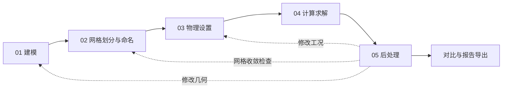

# CFD菜鸟｜后处理与全流程交互布局完整开发规格

文档日期：2026-09-23。状态：待开发规格，不代表功能已全部实现。

**部署前提：正式网格生成、流体/固体/流固耦合求解及正式结果处理均运行在 Linux 后端。用户通过电脑或手机浏览器使用网站，不需要在终端安装求解器。Windows 本地环境用于开发和界面调试，不能作为生产计算环境的验收依据。**

本文结合当前 `/simulation` 工作台、二维建模与网格模块、物理设置与求解代码制定。目标是一套从几何到计算报告的完整工程工作台。交付范围一次定义清楚，不拆成多个功能交付阶段；开发可按依赖安排，全部必需验收通过后才算完成。

关联文档：[边界与求解完整计划](CFD边界条件与求解计算完整开发计划.md)、[实际开发记录](CFD边界条件与求解计算开发记录.md)、[二维网格计划](二维网格划分与命名完整开发计划.md)、[全站布局规范](LAYOUT_SYSTEM.md)。本文细化后处理与工作台交互，不降低求解计划中的数值验收要求。仿真专用布局以本文为准，其他网站页面不受影响。

## 1. 当前基础与必须补齐的问题

| 当前代码基础 | 本次规划要求 |
|---|---|
| 已有建模、网格、物理设置、求解、后处理五步 | 五步始终可见，使用统一工作台外壳，不再前两步一套布局、后三步另一套布局 |
| 步骤状态主要依据当前页序号推算 | 改为依据真实产物、检查结果和版本依赖计算，不得“走过即完成” |
| 几何变化回调会清除页面结果引用 | 区分查看、显示修改与计算输入修改，保存历史结果并明确标记过期 |
| 结构结果有节点位移、单元应力和约束反力 | 建立字段目录、位置与单位说明、筛选、探针、统计、图表和导出 |
| 结构 SVG 云图已有自动变形放大 | 改为真实比例显示、可控放大、原始轮廓叠加；坐标轴采用相同缩放比例 |
| 流体结果类型为松散对象，页面以完成提示为主 | 为每个求解内核建立适配器，实际读取速度、压力等已有字段 |
| FSI 有薄通道压力分布、流量和迭代残差 | 清楚区分薄通道降阶结果与完整二维 FSI 场，不能用压力曲线生成虚假二维流场 |
| 任务保存于服务端文件，本机保存部分设置 | 建立工程、修订、任务、结果集、后处理场景的完整对应关系 |
| 外部程序能力探测和算例包已存在 | 外部求解结果接入仍须实际执行验证，生成输入包不等于已有结果 |

本次面向二维流体、二维固体、单向及双向流固耦合。三维体渲染、离面结构运动、任意脚本执行和 CAD 曲面建模不在本文范围内。

## 2. 全流程顺序

主流程固定为：

**01 建模 → 02 网格划分与命名 → 03 物理设置 → 04 计算求解 → 05 后处理**

工程的新建、打开、保存和另存为是全局操作，不单独增加第六个步骤。报告、图片、视频和数据导出归入后处理。



| 步骤 | 内部操作顺序 | 本步交付物 | 主操作按钮 |
|---|---|---|---|
| 建模 | 单位与坐标 → 绘图/导入 → 尺寸约束 → 面域生成 → 几何检查 | 有稳定标识和修订号的有效二维几何 | 检查并进入网格 |
| 网格划分与命名 | 面域识别 → 面域角色与命名 → 边界命名 → 方法/尺寸/局部加密/边界层 → 生成 → 质量检查 → 接受 | 已接受的网格、命名集合与质量报告 | 接受网格并进入物理设置 |
| 物理设置 | 分析类型 → 各面域模型与材料 → 边界 → 耦合接口/配对 → 初始条件 → 完整性检查 | 可执行的物理算例修订 | 检查并进入求解 |
| 计算求解 | 后端与数值控制 → 监控量 → 综合预检 → 提交任务 → 监控/停止/续算 | 任务日志、收敛记录、有效结果帧和求解摘要 | 开始计算；运行时显示停止计算 |
| 后处理 | 选择任务/结果集 → 选择域/字段/时刻 → 可视化 → 提取/积分 → 守恒与收敛核查 → 工况对比 → 导出 | 可复现的结果场景、曲线、表格与报告 | 导出；按上下文提供添加探针等操作 |

边界命名和面域命名仍归网格页管理；物理页通过稳定 ID 引用。名称用于显示，不用名称字符串绑定载荷。物理页需要重命名时跳回网格中的对应对象，返回后保留选中对象。

## 3. 步骤状态、切换和失效规则

### 3.1 状态须由数据决定

步骤具有“待完成、可编辑、有效、需更新、检查失败”状态；运行任务另有排队、运行、停止中、已停止、失败、结束状态。当前选中是独立的视觉状态，不代替有效性。

任务结束与数值收敛分开：进程正常退出但未达到收敛标准时显示“计算结束·未收敛”。后处理可以打开这样的结果，但图例、报告和导出均携带该状态。

| 目标步骤 | 开放编辑/执行的条件 | 条件不满足时 |
|---|---|---|
| 建模 | 工程可打开 | 提供新建或恢复入口 |
| 网格 | 至少存在一个有效面域，几何无阻断错误 | 允许打开查看，列出几何问题并定位；禁止生成/接受 |
| 物理设置 | 存在已接受且与几何匹配的网格 | 允许查看旧配置；禁止基于过期网格提交新算例 |
| 计算求解 | 当前网格、物理设置、后端能力和资源检查通过 | 可查看历史任务与诊断，开始按钮说明具体阻断项 |
| 后处理 | 至少一个通过完整性校验的结果帧 | 无结果时显示任务入口和原因；有历史结果时允许选择查看 |

所有步骤名称均可点击，点击不等于执行计算或生成网格。切换失败时在目标页给出可定位的原因，不能只留下灰色不可用按钮。

### 3.2 修改影响范围

| 用户操作 | 网格 | 物理设置 | 当前输入对应结果 | 历史结果 |
|---|---|---|---|---|
| 切换步骤、查看对象、平移缩放 | 保留 | 保留 | 保留 | 保留 |
| 改相机、配色、图例、变形显示倍数 | 保留 | 保留 | 保留 | 保留 |
| 只改显示名称，集合成员不变 | 保留 | 保留绑定 | 数值有效；显示元数据单独修订 | 使用任务提交时的原始名称，并可对照新名称 |
| 修改几何坐标、拓扑或内部长度尺度 | 标为需更新 | 能匹配者保留为待复核，悬空绑定显示问题 | 标为旧修订结果 | 保留并绑定旧网格 |
| 修改网格尺寸、网格方法或接受新网格 | 标为需更新/新修订 | 通过稳定集合 ID 恢复并复核 | 标为旧修订结果 | 保留 |
| 改边界集合成员或面域角色 | 重新检查并接受集合/域版本 | 受影响条件标为待复核 | 标为旧修订结果 | 保留 |
| 改材料、载荷、模型或初值 | 保留 | 新物理修订 | 标为旧修订结果 | 保留 |
| 改会影响计算的时间步、精度、迭代控制 | 保留 | 保留 | 下次任务使用新求解修订 | 保留 |
| 改仅用于展示的监控刷新频率 | 保留 | 保留 | 保留 | 保留 |

失效不等于删除。旧结果打开时显示“任务 J 的结果，几何 G / 网格 M / 物理 P / 求解 S”；默认禁止把旧字段直接绘制到当前网格上。重新网格化的对比必须使用显式采样与映射，且标注覆盖率。

### 3.3 运行、保存和恢复

- 提交时冻结输入快照。重复点击开始只创建一个任务，网络重试使用同一提交标识。
- 运行期间可切换页面、查看旧结果和监控。修改正在运行任务的输入时进入新修订草稿，已提交快照保持不变。
- 任务订阅归全局工程状态管理，不归单个页面生命周期管理；组件卸载不停止服务器任务，也不能让旧请求回写新工程。
- 结果完成时：用户仍在该任务监控页且未操作其他对象，可自动进入后处理；用户已在别处工作时仅显示完成提示及“查看结果”，不得抢走页面。
- 表单即时更新本地草稿，500ms 防抖同步至服务端工程修订；计算前等待 Linux 后端确认保存与校验完成。本机缓存用于恢复未同步编辑，正式任务以服务端不可变快照为准。保存失败常驻显示，并提供重试和导出草稿。
- 刷新恢复工程、当前步骤、各步选中对象、任务、结果集和视图配置；不能总是重回空白建模页。
- 推荐地址 `/simulation?project=<id>&step=post&job=<id>`。地址参数只引用本工程对象；非法 ID 显示可恢复提示，不能串读其他工程。
- 浏览器前进/后退恢复步骤，普通字段改动不新增浏览历史记录。
- “新建工程”保留原工程；“重置当前工程”移入可恢复历史并明确影响范围，不删除服务端任务；“清理历史结果”是独立操作。
- 实时预览只展示原子发布的完整帧。流固耦合仅把双方共同接受的时间窗作为最终物理帧；窗内迭代放在诊断中。

## 4. 统一工作台布局

### 4.1 桌面固定骨架

```text
┌──────────────────────────────────────────────────────────────────────┐
│ CFD菜鸟 / 工程名 / 保存状态       工程菜单   单位   任务状态   帮助      │
├──────────────────────────────────────────────────────────────────────┤
│ 01 建模   → 02 网格与命名 → 03 物理设置 → 04 计算求解 → 05 后处理       │
├──────────────────────────────────────────────────────────────────────┤
│ 当前步骤工具：按操作分组                              本步主操作       │
├───────────────┬─────────────────────────────┬────────────────────────┤
│ 对象树        │ 主视图区                     │ 当前对象属性           │
│ 几何/域/边界  │ 绘图、网格、边界方向、结果场   │ 参数、字段、单位与设置   │
│ 任务/结果对象 │ 坐标轴、比例尺、图例、时间     │ 上下文操作             │
│ 显隐与选择    │                              │                       │
├───────────────┴─────────────────────────────┴────────────────────────┤
│ 可折叠底部面板：诊断 | 日志 | 收敛 | 曲线 | 数据表                      │
├──────────────────────────────────────────────────────────────────────┤
│ 状态：选中对象 / 坐标 / 单位 / 网格或结果版本        上一步  下一步      │
└──────────────────────────────────────────────────────────────────────┘
```

五步共享上述骨架，只替换工具、树节点、主视图和属性面板。流程栏始终位于顶部，避免再占一个左侧流程栏压缩绘图空间。工程树负责对象组织，流程栏负责步骤切换，二者职责分明。

- 全宽工程页，取消现有大标题、重复说明、大摘要卡片及营销页脚对工作高度的占用。概要改为可展开的信息条。
- 桌面高度使用 `100dvh` 与站点头部高度计算，提供 `100vh` 回退；滚动限制在各面板内部。
- 工程栏建议 48px、流程栏 44px、工具栏 44px、状态栏 28px；文本缩放时允许自然增高，不能裁字。
- 左树默认 240px，可调 200–360px；右属性默认 320px，可调 280–420px；中央推荐至少 480px。
- 底部面板默认折叠至标签栏，需要日志或曲线时展开至 220–320px；竖向分隔线可拖动。
- 面板宽高按设备档位保存。中央宽度不足时自动切换抽屉，不允许左右面板挤出 0 宽画布。
- 展开、收起、拖动分隔线必须触发渲染器尺寸更新；网格列显式定位，隐藏抽屉不占列。

### 4.2 五步内容分配

| 页面 | 左侧对象树 | 中央视图 | 右侧属性 | 底部面板 |
|---|---|---|---|---|
| 建模 | 图层、草图、约束、面域 | 二维正交绘图 | 坐标、尺寸、约束、变换 | 几何检查、测量、操作记录 |
| 网格 | 面域、命名边界、局部加密、边界层 | 几何/网格叠加及质量着色 | 选中域/边的命名和网格设置 | 质量分布、坏单元列表、生成日志 |
| 物理设置 | 域、材料、边界、初值、接口 | 真实网格上的角色、法向及载荷示意 | 当前物理对象的参数 | 缺项、单位、接口及约束诊断 |
| 计算求解 | 当前任务、历史任务、监控对象 | 默认残差与监控图；可切换网格或已有场预览 | 求解控制；运行快照只读 | 日志、事件、守恒量、资源状态 |
| 后处理 | 结果集、场景、图层、探针、曲线、积分、对比 | 真实网格结果图；支持双视图 | 当前结果对象的字段、样式与提取参数 | 时间曲线、截线曲线、统计表、导出记录 |

每一步主要操作只出现一次。工具按钮采用图标加短标签；不熟悉的图标提供悬停/聚焦说明。顶部用于工作操作，底部用于导航，不复制一排“下一步”。

### 4.3 响应式与可访问性

| 宽度 | 布局 |
|---|---|
| ≥1440px | 左树＋中央＋右属性；可开底部图表或中央并排对比 |
| 1181–1439px | 保持三栏；中央不足 480px 时将右属性改抽屉 |
| 821–1180px | 左树 200–240px＋中央；右属性按需打开，默认不盖住整个视图 |
| 561–820px | 中央单栏；对象树/属性抽屉；曲线与视图通过标签切换 |
| ≤560px | 工程名与任务状态精简显示；流程使用“03/05 物理设置”选择器并保留上/下一步；工具收进分组菜单 |

手机画布建议最低 320px 高；属性作为独立可滚动面板，软键盘不遮住当前字段。关闭面板恢复原选择和相机，不重新初始化工程。不能将长边界表压成逐字换行；手机使用逐条边界卡片或选择列表＋单条编辑。

所有网格容器子项设置合理的 `min-width:0`/`min-height:0`；表格允许局部横向滚动，整页不得横向溢出。抽屉管理焦点，关闭后回到触发按钮。主要触摸目标至少 44×44px，关键状态兼用图标与文字，不能只靠颜色。数据字体 12–14px，正文 14px 左右，移动端输入文本至少 16px；不沿用当前 8–9px 的小字密度。

### 4.4 配色与动效

延续白色、灰色、淡蓝色。工作区使用白底，工具分组采用轻分隔，选中态淡蓝，减少重复卡片与厚重边框。科学视图区保持稳定的纯色底，字段色带不受透明背景或装饰动画影响。

仿真全部使用页面关闭背景流场动画。允许用户主动播放真实计算时间序列，允许 120–180ms 的面板过渡；数据云图不添加呼吸、漂移、闪烁等装饰效果。系统减少动态偏好下关闭布局过渡；时间播放由用户决定。

## 5. 后处理入口与结果对象

后处理默认打开当前修订最新的可用任务结果。没有对应结果但有历史结果时，明确列出历史任务，不自动把它当成当前结果。

结果选择栏至少包括：任务名称、物理模式、状态、结果修订、时间/载荷步、当前字段、单位、数据范围。需要更多信息时展开模型、网格、后端版本、输入哈希和警告。

结果对象树建议：

```text
任务 / 结果集
  流体域 / 固体域 / 耦合接口
场景 1
  云图 1
  网格与边界
  矢量 1
  流线 1
  结构变形 1
提取与分析
  点探针
  采样线
  边界积分
  时间曲线
对比
  工况 A 与 B
导出
  图片 / 数据 / 报告 / 动画
```

每个对象可重命名、显隐、复制、删除。删除后处理对象不删除原始求解数据。场景保存字段、作用域、时刻、相机、色带、图层、采样、积分和对比参数，可恢复相同视图。

## 6. 字段目录与可用性

不再将字段列表硬编码为“速度、压力、应力”。根据结果文件真实提供的字段动态生成目录，每个字段标明：标识、中文名称、分量、单位、物理域、数据位置、来源、可用时刻和有效性。

| 类型 | 必需支持的字段/数据 | 可用条件 |
|---|---|---|
| 流体 | 速度矢量、速度大小与分量、压力、残差、边界流量 | 求解器提供并完成单位转换 |
| 流体派生量 | 二维涡量、压力系数、沿线压降、壁面力/剪应力 | 所需场、参考量及边界梯度齐全，缺数据明确不可用 |
| 湍流结果 | k、ω、湍流黏度及 y+ | 仅相应模型求解器实际输出时显示，不从层流伪造 |
| 固体 | 位移矢量/大小、应力分量、von Mises、主应力、约束反力 | 小变形原生内核已有字段可直接接入；主应力从明确张量派生 |
| 固体扩展 | 应变、速度、加速度、应变能、材料内变量 | 后端提供或有可验证的计算方法；禁止填零冒充 |
| FSI | 流体场、固体场、接口位移/载荷、界面合力、耦合残差、位移/力时间曲线 | 每个参与者及耦合记录的数据完整 |
| 薄通道 FSI | 压力沿程曲线、单位深度流量、最小间隙、结构场 | 标注“薄通道降阶模型”，不显示不存在的二维速度场 |

具体规则：

- 区分节点值、单元值、边界面值、积分点值。原生结构应力保持单元数据；平滑到节点是可选显示处理，标注“节点平均”，默认不用于峰值验收。
- 不跨材料、面域、接触边界或不连续接口做应力平均；缺失值使用无数据遮罩，不补零。
- 压力区分 Pa 与运动学压力 m²/s²，记录密度、参考压力和压力类型。缺少基准时不能声称得到绝对压力。
- 二维应力保留 σzz 的约定。平面应力与平面应变采用各自完整应力分量计算主应力与等效应力，不能都假设 σzz=0。
- 有限变形结果记录应力/应变度量、参考或当前构形及计算位置，禁止把不同度量无说明叠加比较。
- 场值以原始精度保存；显示单位和有效数字只影响呈现，不能写回降低原始精度。

## 7. 主视图、云图和图例

主视图使用二维正交投影，X/Y 采用同一个物理缩放比。支持拖动、滚轮/双指缩放、适合窗口、框选缩放、选中对象居中、坐标轴、长度比例尺和截图。窗口变化不拉伸几何。

云图直接使用真实节点坐标与三角形/四边形连接关系。四边形为渲染拆三角时保留原单元 ID，不能让统计数量翻倍。结构场与流体场可独立显示、隐藏或设透明度。

必需能力：

1. 按域、边界、字段和分量筛选，选中对象在树、视图、属性和数据表同步高亮。
2. 单元常值、连续插值两种显示；切换后图例标出数据位置和插值方式。
3. 等值线，可设置数量及指定等值；数值标签避免重叠。
4. 网格线、外轮廓、边界名称、法向箭头分别开关；密网格默认隐藏内部边线。
5. 色带支持连续型和零中心发散型；压力差等带符号量适用发散型。支持反转、档位、透明度、线性/对数，非正数据不能直接用普通对数。
6. 范围支持当前帧、全时间范围、所选域、手动固定；时间播放和工况对比默认锁定共同范围，避免同一颜色随时刻改变含义。
7. 图例始终包含字段、单位、范围、数据位置。自动裁剪异常值时必须显示裁剪范围和被裁剪数量。
8. 最小/最大值定位显示原始值、坐标、对象 ID、时刻；按筛选范围重新计算，平滑峰值与原始峰值分开。
9. 常数场、零场、空域、NaN、无穷值和缺失帧有明确显示；禁止因除零导致整幅空白。

## 8. 速度矢量与流线

矢量箭头支持按几何间距采样、数量上限、固定长度/速度比例长度、大小、颜色和方向；不能依网格密度直接堆满箭头。

流线依据所选时刻的真实速度场积分。提供单点、线段及均匀种子布置，支持前向、后向、双向，种子数量、最大长度、步长控制、停滞阈值与停止原因。积分在有效流体单元内进行，遇到外边界、固体、孔洞、缺值或停滞条件终止。

单元速度的插值需要明确重构方式与边界处理，不允许沿薄壁两侧错误插值。每条流线保存起点、作用域、时刻和积分参数；几何/时刻/字段变化时重新计算并取消过期请求。

瞬时流线与粒子迹线分开命名：前者冻结一个时刻的场，后者使用随物理时间变化的速度积分。本次必须交付瞬时流线及逐帧重算；粒子迹线不设为必需功能，未实现时不出现可点击入口。流线上的移动标记若只是显示动画，必须标为“流向演示”，不能当作真实粒子运动。

## 9. 固体变形与 FSI 联合视图

- 变形坐标由参考坐标加实际位移乘显示倍数得到；输入单位先统一。倍数支持 0、1、手动及自动，自动值要显示；改变倍数不改变物理数值或积分结果。
- 同时显示原始轮廓和变形轮廓，默认在最大位移处提供可关闭的标注。
- 可按位移或应力着色，变形形状与着色字段独立选择。
- 动网格流体结果使用对应时刻的求解坐标。若数据本身已经是变形坐标，不得重复加位移。
- FSI 可同步显示流体压力/速度与固体位移/应力；接口突出显示配对关系、法向、所选侧及传递方向。
- 同步只使用共同接受时间窗；只有一侧写入完成时保留上一完整窗，并提示“等待另一参与者”。
- 界面载荷、位移、合力差、映射覆盖率及功率一致性分开显示。不能用位移残差下降代替力守恒证明。
- 薄通道 FSI 只绘制实际存在的结构变形和沿程量；完整 ALE 网格视图以外部后端真实结果为准。

## 10. 探针、截线、积分和统计

### 10.1 探针与采样线

点击或输入坐标创建点探针；显示所属域、单元/节点 ID、距离、插值方法、值及单位。域外点返回“域外”，不能吸附到很远的节点给出看似有效的值。节点吸附必须显示实际采样位置。

采样线支持两点和折线，设置采样数或物理间距；曲线横轴默认弧长，也可选 X/Y。穿过孔洞或多域边界时断开曲线，不连接不存在的数据。支持多字段曲线、图例显隐、局部缩放、游标联动和 CSV 导出；不同单位使用独立坐标轴或分图。

瞬态探针必须指定“固定空间坐标”或“跟随材料节点”。ALE 情况下二者结果可能不同，不能混用。节点 ID 不稳定时要求有映射定义，否则禁止跟随模式。

### 10.2 积分定义与单位

积分使用物理坐标和原始场，不使用显示放大坐标或渲染降采样值。区域平均采用面积权重，边界平均采用长度/实际表面面积权重；数据位置转换及积分规则写入结果说明。

| 指标 | 定义要求 |
|---|---|
| 域平均/极值 | 标出作用域、有效覆盖面积、缺失数量；不把无数据部分当零 |
| 二维体积流量 | 单位深度 Q′=∫u·n dl，单位 m²/s；有实际厚度 b 时 Q=bQ′，单位 m³/s |
| 质量流量 | 单位深度 ṁ′=∫ρu·n dl，单位 kg/(m·s)；乘厚度后单位 kg/s |
| 动边界通量 | 控制体积通量使用相对网格速度 u−w；另行标识绝对速度通量，质量平衡包括域内质量变化 |
| 边界载荷 | 使用指定侧外法向；流体应力牵引与作用在固体上的反力统一符号。单位深度 N/m、实际厚度总力 N 分开 |
| 压降 | 明确两条边界或截线、压力种类和平均方式，不只减两处不明位置峰值 |
| 升阻力系数 | 写出参考密度、速度、长度/面积和方向；参考量缺失或分母为零时不给数值 |
| 静力平衡 | 外载合力、约束反力与力矩共同核查；动力学平衡还需惯性和阻尼项 |
| FSI 接口检查 | 比较相同构形、时刻、厚度及方向下两侧合力；映射覆盖和功率误差另列 |

报告守恒误差时同时给绝对误差、归一化参考值、相对误差和验收阈值。接近零的分母采用明确的绝对容差，不能得到无穷百分比或通过任意大归一化掩盖误差。

### 10.3 时间统计与对比

时间平均、RMS 和极值必须选择实际时间范围；非等间隔采样按物理时间加权，记录积分方法。RMS 区分原信号均方根与相对时间平均的脉动均方根。

支持同工程多个任务的两工况并排比较、同步相机、共同色带和曲线叠加。同网格且 ID/坐标匹配时可直接求差；不同网格通过明确的公共采样网格或采样线比较，并记录映射方法、域交集、无覆盖范围。物理量、单位、压力基准、构形和时间不同不能静默相减。

## 11. 时间控制与收敛监控

时间控制区提供首帧、前后帧、播放/暂停、末帧、倍速、时间输入和可用帧列表。静力单步不显示伪时间动画；载荷步标为载荷步，迭代号标为迭代号，不以秒表示。

默认选择实际存储帧，不对两个时刻插值伪造新物理结果。缺失帧显示断点。播放缓存有限数量的邻近帧，后台标签暂停绘制和预取。播放只改变显示帧，不改工程输入。

底部监控面板统一展示线性残差、非线性残差、FSI 窗内耦合残差、物理监控量和守恒检查。每条曲线注明横轴是迭代、时间或耦合子迭代；重启任务保留分段标记。无历史残差时显示“未记录”，不能用最终误差造出一条下降曲线。

## 12. 导出与计算报告

| 产物 | 必需内容 |
|---|---|
| PNG 图片 | 当前视图或指定尺寸，包含字段、单位、时刻、色带、任务和收敛状态；至少支持 1920×1080 |
| CSV | 点探针、截线、时间序列、积分、收敛曲线；单位、坐标、采样和缺值约定完整 |
| VTU | 真实拓扑与节点/单元数据，保留域和边界标识、单位及字段位置 |
| PVD＋VTU 序列 | 时间排序、每帧真实物理时间、动网格逐帧坐标；能够在 ParaView 回读 |
| 场景 JSON | 只保存后处理对象与设置，引用固定结果集和字段标识，可重建视图 |
| 工程结果包 ZIP | 算例/网格修订、原始结果或明确清单、场景、日志、校验值和说明 |
| 独立 HTML 报告与打印 PDF | 工程概况、假设、材料边界、网格质量、数值设置、收敛/守恒、结果图表、局限和数据来源 |
| 动画 | 真实帧序列，固定相机/色带、时间标注；浏览器支持时导出 WebM，另提供 PNG 帧序列包作为跨平台回退 |

CSV 采用 UTF-8，中文可提供 BOM 兼容选项；单元格名称转义并防止表格公式注入。导出字段不得包含认证信息、服务器绝对路径或任意可执行代码。报告不得默认写“计算成功且结果可靠”，而应引用实际收敛与验证记录。

大型导出在后台任务执行，显示队列、进度、取消和下载有效期。用户切换步骤后导出继续存在，最终结果可从工程记录重新下载。

## 13. 数据结构与接口规划

### 13.1 对象关系

```text
Project
 ├─ GeometryRevision
 ├─ MeshRevision → geometryHash + topologyHash + namedSetsHash
 ├─ PhysicsRevision → meshRevision + model/material/boundary configuration
 ├─ SolverRevision → backend + numerics + time controls
 ├─ Job → immutable InputSnapshot + inputHash
 │   └─ ResultSet → manifest + meshes + frames + fields + monitors + provenance
 └─ PostScene → resultSetId(s) + filters + layers + probes + plots + view settings
```

内容哈希用于判断计算输入变化，显示名称/相机等不参与数值输入哈希。哈希计算先规范化键顺序和数值表示，不能依赖任意对象序列化顺序。

结果清单必须包含：schemaVersion、任务与修订引用、引擎版本、分析模式、收敛/完成状态、单位体系、坐标构形、厚度、压力约定、字段目录、可用时间帧、每个数组的大小/类型/校验值及警告。网格和字段用 ID 明确关联，不能假定节点 ID 从零连续。

字段描述至少包含 `id/name/components/unit/location/domainIds/source/derivation/validFrames`；帧描述包含 `frameId/time/step/accepted/meshRef/fieldRefs`。静力允许无物理时间，使用载荷步；不能用生成时间代替物理时间。

### 13.2 原生与外部数据适配

- 原生固体：把现有节点位移与单元应力映射为字段，不改变计算值；反力保留为约束节点数据。
- 原生方腔：检查原始规则数组的轴方向、网格尺寸、坐标与单位，生成可追溯的可视化网格；只暴露实际输出字段。无压力场则不给压力云图。
- 原生薄通道：将压力剖面注册为一维采样数据，与二维结构场并存；声明几何适用范围。
- 外部求解器：由 Linux 结果转换服务生成统一清单和数组。内核安装状态、任务执行状态、结果解析状态分开，不因检测到可执行文件就宣称后处理可用。
- 旧结果 JSON：以 schemaVersion 适配，无法确认单位或网格关联时显示迁移失败/待补全，不猜测。

### 13.3 推荐接口

以下为新增接口合同，不表示当前代码已有这些端点；延续同源 `/api/analysis` 命名。

| 接口 | 责任 |
|---|---|
| `GET /api/analysis/jobs/:id/result-manifest` | 结果字段、帧、版本和可用性清单 |
| `GET /api/analysis/results/:id/mesh?frame=...` | 原始网格或指定帧动网格；支持明确的预览级别 |
| `GET /api/analysis/results/:id/fields/:fieldId?frame=...&domain=...` | 二进制数组及匹配的类型/数量/校验元数据 |
| `POST /api/analysis/results/:id/sample` | 点/线采样，返回域覆盖、插值与单位 |
| `POST /api/analysis/results/:id/integrate` | 全精度物理积分与误差说明 |
| `GET /api/analysis/jobs/:id/monitors` | 增量日志和监控曲线；游标可恢复 |
| `GET/PUT /api/analysis/projects/:id/post-scenes/:sceneId` | 场景读取与带版本号的保存，冲突返回 409 |
| `POST /api/analysis/results/:id/exports` | 创建导出任务；独立查询、取消和下载接口 |

大数组不内嵌在每次轮询返回的任务 JSON 中。状态轮询只返回摘要与结果引用，结果文件按需拉取。文件解析错误、字段不存在、过期引用和资源超限使用不同错误码；客户端显示具体修复入口。

## 14. 渲染、性能与 Linux 运行设计

中央使用批量 Canvas/WebGL 渲染，避免每个单元一个 Vue/SVG 响应式对象。几何、边界、文本和操作层可独立组织；WebGL 不可用时提供有限规模 Canvas 降级，并明确性能范围。具体库版本经项目兼容测试锁定，本文件不凭库名宣称能力已完成。

计算密集的全精度字段派生、采样积分、流线生成和大 CSV 在 Linux 结果处理 Worker 中执行，UI 主线程负责交互。浏览器 Web Worker 承担数组解码、渲染缓冲整理及明确标识的交互预览；正式报告和数值提取引用服务端结果。视图切换取消过期请求并使用请求序号防止旧响应覆盖新状态。空间搜索复用网格索引；输入拖动防抖，不为每一像素重新计算全场。

建立分级预览与原始数据分离机制：预览可减少矢量/网格线和显示单元；探针、峰值、积分及正式导出使用全精度数据。图上必须提示降采样状态，不能把预览统计当最终统计。

性能验收目标（工程目标，须实测，非当前性能声明）：

| 验收集 | 目标 |
|---|---|
| 桌面 4 核/16GB、1920×1080、5 万二维单元 | 已缓存字段切换 P95 ≤300ms；平移/缩放中位帧率≥45fps |
| 桌面 20 万单元、100 帧 | 逐帧读取，清单先返回；缓存预算默认≤512MiB，不一次加载全历史 |
| 手机 390×844、1 万单元 | 交互中位帧率≥30fps，必要时减少显示层；不能白屏或页面横向溢出 |
| 本机/LAN 的 5 万单元首帧 | 预览 2s 内可见目标；网络传输与解码时间分别记录 |
| 连续切换 30 次和播放 10 分钟 | CPU/内存不持续无界增长；退出释放监听器、数组、GPU 资源及 Worker |

记录实际 CPU、内存、浏览器/GPU、数据大小、网络条件及 P95，不以单次最快成绩验收。超过预算时逐步降低显示负载，保留原始文件下载与数值分析。

Linux 采用服务端无窗口结果转换与导出；目录使用平台无关路径，注意文件名大小写及原子发布。若 PDF/动画采用无头浏览器，镜像内锁定浏览器、中文字体和相关运行依赖，并提供可重复构建文件。不能依赖 Windows 盘符、本机 GUI、Windows 字体或复制来的 `node_modules`。临时导出与原始结果分目录管理，清理临时文件不删除原始求解产物。

### 14.1 正式部署拓扑与职责

```text
电脑 / 手机浏览器
    │ HTTPS，同源工程 API、任务事件、结果数组与文件下载
Linux 反向代理
    │
网站服务（Nuxt/Nitro）── 工程与任务元数据 / 持久化队列
    │                         │
    │                  独立计算 Worker
    │                         └─ 受限 Linux 作业容器
    │                            网格 / 流体 / 固体 / 流固耦合
    │
    └─ 独立结果处理 Worker
          转换 / 采样 / 积分 / 流线 / 报告与动画导出
                     │
              Linux 持久化结果存储
              原始场、完整帧清单、派生缓存、下载文件
```

默认网站服务、计算 Worker 和结果处理 Worker 位于同一 Linux 服务器，使用独立进程/容器。网站 API 负责参数、校验、提交和查询，不能在处理 HTTP 请求的 Node 事件循环内同步求解。当前原生 FEM/薄通道计算也须迁入独立作业，不能只隔离外部求解器。

计算服务也可部署在独立 Linux 主机，通过明确的内部服务接口及可访问的结果存储通信；网站不能假定能够读取另一台主机的本地路径。浏览器始终访问网站同源接口，不直连计算节点，不使用用户电脑的 `localhost` 访问生产后端。

多主机部署采用集中元数据/队列和受控对象存储或文件服务，不把 SQLite 数据库放到网络共享盘；默认单机无需额外引入多节点依赖。

| 层 | 必须负责 | 禁止承担 |
|---|---|---|
| 浏览器 | 建模交互、参数编辑、渲染、有限缓存和订阅 | 正式长时间求解、唯一结果保存 |
| 网站 API | 工程修订、输入校验、任务提交、状态和结果索引 | 请求线程矩阵迭代、每次轮询重复发送完整场文件 |
| Linux 计算 Worker | 网格生成、内核执行、进程控制、检查点和完整帧发布 | 依赖浏览器在线或网站进程存活 |
| Linux 结果处理 Worker | 全精度派生、采样、积分、流线和可复现导出 | 改写原始场、用显示降采样值生成正式统计 |
| 持久化存储 | 校验、任务归属、保留和备份 | 随应用镜像更新被覆盖、随临时缓存清理被删除 |

### 14.2 环境与能力检测

验收基线沿用求解计划的 Ubuntu 24.04 x86_64。Node、Python/Gmsh、OpenFOAM、CalculiX、preCICE 及适配器锁定通过联调的精确版本或镜像摘要；候选组合不直接视为已验证。其他发行版和 ARM 根据实际测试标记支持范围。

能力接口必须查询计算 Worker 注册的环境与最近健康状态，不能只在 Nuxt 进程查找命令。至少返回节点在线状态、内核版本、支持模式、结果转换器版本、运行槽与资源上限。Worker 不可用时仍可保存工程和查看历史结果，但不能提交无法执行的任务。

用户 Windows 电脑未安装求解器，不得导致正式网站显示后端“未安装”。本地开发通过相同 API 合同连接开发用 Linux Worker；WSL 可做兼容测试，不能代替最终 Linux 部署验证。

### 14.3 队列、资源与运行中停止

沿用求解计划的单机初始配置：持久化队列、一个计算 Worker、一个运行槽。独立分析预算为 2 核/4GiB/2GiB 输出/30 分钟，FSI 为 4 核/8GiB/10GiB 输出/4 小时；部署时可调，这些预算不保证任意模型都能完成。

结果处理使用独立队列，初始预算一个处理槽、1 核/2GiB/10 分钟；大动画可明确提高预算。调度器综合检查两类任务资源并预留网站服务资源，不能因队列独立而超额运行。内存、输出、磁盘与超时分别返回原因；资源不足应排队或拒绝，不能拖垮网站。

Worker 事务领取任务，使用租约、心跳和领取代次标记；失联后先核查实际作业再恢复或重试，避免重复执行和旧进程覆盖新结果。作业容器独立于 Nuxt，更新网站不终止计算。

停止状态为“请求停止 → 停止中 → 已停止”。先要求内核在安全位置写入检查点并退出，宽限期后才终止整个作业进程组/容器；不能只改变数据库标签而让计算继续。FSI 两个参与者及子进程须共同退出。普通停止保留完整帧，未完成帧不开放。

跨服务重启续算仅适用于已验证的完整检查点；从零重算标为重试，不冒充续算。保留原始任务、重试关系与失败记录。

### 14.4 持久化目录、SQLite 与备份

生产根目录由管理员显式配置，例如 `/var/lib/cfdsolve`，不得硬编码；当前工作目录下 `.run` 不能作为生产唯一数据位置。

```text
<data-root>/
  metadata/                 工程修订、任务队列、事件与结果索引
  jobs/<job-id>/
    input/                 不可变输入快照
    raw/                   求解器原始结果
    checkpoints/           完整检查点
    logs/                  原始日志
    results/               完整帧清单和标准字段数组
  derived/<result-id>/     可重建的采样、积分、流线缓存
  exports/<export-id>/     报告、图片、动画、数据包
  temporary/              未完成写入，不作为有效结果开放
```

单机 SQLite 保存元数据、索引和队列，大数组和原始场保存到文件卷。现有知识库 SQLite 必须保留；仿真元数据可独立建库或采用版本化迁移，禁止部署时用本地库覆盖服务器库。正式目录挂载持久化卷，镜像内只放程序及模板。

文件写入采用临时文件、校验、同文件系统原子重命名，然后发布清单；跨存储上传必须完成提交后才更新索引。浏览器不能看到半写结果。路径由任务/结果 ID 在服务端解析，不能接受用户输入任意服务器路径。

备份应先获得数据库一致性快照，再按不可变结果清单备份引用文件，并执行恢复校验。原始场、检查点、派生缓存和导出各有保留策略；运行任务及正在下载文件不直接清理。磁盘余量不足时拒绝新任务，保留已有结果。

### 14.5 远程传输与前端状态

- 提交接口在任务持久化后返回 ID，不让一个 HTTP 请求等待数小时计算。
- 用带事件游标的 SSE 推送监控摘要，重连补读，轮询作回退；代理为事件路由关闭缓冲并配置心跳/超时。断流不停止计算。
- 清单与字段数组分别请求，按域/字段/帧拉取；带版本缓存标识和校验值，大文件支持断点传输或分块重试。
- 明确区分“服务器计算中、结果传输中、解码中、视图已更新”，不能把网络慢判断成求解失败。
- 场景服务端保存，离线编辑保留本地草稿。重连发生版本冲突时保留两份并支持恢复，不能静默覆盖。
- 手机锁屏、掉线、关页不丢任务；后台标签可降低订阅频率并暂停预取，后端照常运行。
- 计算节点和结果目录不直接暴露公网。沿用网站现有访问方式，不因此重新增加登录注册；工程/任务访问仍须用服务端校验的访问凭据或受控部署会话，不能仅凭可枚举 ID 读取全部工程。

### 14.6 部署交付边界

交付 Linux 镜像构建文件、服务编排/启动配置、数据库迁移、环境变量示例、健康检查、备份恢复脚本及运维说明。顺序为存储准备 → Worker 健康检查 → 网站服务 → 代理；分别验证网站可访问、计算节点在线、结果转换可执行。

密钥通过运行时配置注入，示例只含占位值。作业非 root 执行、挂载隔离及资源限制沿用求解计划，保留 FSI 必需的内部通信。网站进程不持有容器管理接口，客户端参数不得拼接为任意 shell 指令。

原生求解脱离网站进程、任务跨页面/服务生命周期、完整帧发布均是正式后处理交付的前置工作，不得以“属于后端”从验收中省略。目前只确认 Linux 部署，服务器发行版、资源和容器条件仍需部署时核实；先按默认规格实现可配置产物，不宣称已在用户服务器安装或验证。

## 15. 与当前代码对应的实施清单

以下路径为建议实现位置，可以按项目规范调整，但责任和合同必须保留。

| 文件/目录 | 改造内容 |
|---|---|
| `components/pages/SimulationWorkbenchPage.vue` | 统一五步外壳、真实完成状态、路由恢复、切换与失效提示 |
| `components/cfd/PhysicsWorkbench.vue` | 拆出物理设置、任务监控和后处理视图，移除“只显示完成提示”的流体结果页 |
| `components/cfd/WorkbenchShell.vue` | 工程栏、流程栏、工具栏、三栏和底部面板、抽屉与分隔线 |
| `components/cfd/post/` | 结果树、视图区、字段/图例、探针/截线、积分、时间、对比、报告组件 |
| `stores/simulation.ts` | 工程修订、依赖状态、任务订阅、切换、保存和恢复 |
| `stores/postprocessing.ts` | 场景及后处理对象、显示配置；大数组放非深响应缓存 |
| `types/physics.ts`、`types/postprocessing.ts` | 结果清单、字段、帧、场景、引用及有效性类型 |
| `utils/postprocessing/` | 原生数据适配、单位转换、网格索引、采样、积分、派生量和导出 |
| `workers/postprocessing.worker.ts` | 可取消的数组解码、渲染缓冲整理及有标识的交互预览，不承担正式求解 |
| `server/services/analysis-jobs.ts` | 摘要与大结果分离、不可变快照引用、增量监控、完整帧发布 |
| `server/api/analysis/` | 清单、字段、采样、积分、场景与导出接口 |
| `services/solver/` 或已有结果服务目录 | 外部内核结果转换、坐标/压力/厚度归一化、Linux 导出 |
| `services/postprocessing/` | Linux 全精度采样、积分、流线和批量导出队列，与网站请求进程隔离 |
| `deploy/`、Linux 运行脚本及迁移目录 | 网站/Worker 编排、持久化卷、资源限制、代理事件配置、仿真数据库迁移与恢复 |
| `tests/`、`docs/` | 数值基准、场景恢复、全流程/响应式回归、导出回读及验收记录 |

实施依赖为“结果合同与版本规则 → 工作台状态/外壳 → 数据适配与渲染 → 提取与导出 → 全流程验收”。这是内部依赖顺序，不将缺项留给下一版后宣布本次完成。

## 16. 验收清单

### 16.1 全流程与布局

| 编号 | 必需验收 |
|---|---|
| WF-01 | 五个步骤始终有统一入口，建模/网格不另起一套流程布局 |
| WF-02 | 未建有效域可查看网格步骤但不能生成，错误能定位到对象 |
| WF-03 | 任意往返五步不改变几何、网格、条件或结果，也不重复创建任务 |
| WF-04 | 改几何后旧网格/物理/结果按规则标记，旧结果仍能打开其原网格 |
| WF-05 | 修改材料只使对应新计算待执行，不强制重新建模/划分网格 |
| WF-06 | 只重命名/平移视图/改色带不使数值结果失效 |
| WF-07 | 运行中离开页面、刷新、返回能恢复任务；完成不抢走正在编辑的页面 |
| WF-08 | 输入快照不可变，运行中新修订不改旧任务；重复提交和网络重试无重复任务 |
| WF-09 | 保存失败、断网、无结果、部分帧、失败/未收敛有具体提示和恢复路径 |
| WF-10 | 新建、重置、打开和结果清理职责清楚，旧工程可恢复 |
| UI-01 | 1440×900、1024×768、768×1024、390×844、352×606 均无整页横向溢出 |
| UI-02 | 侧栏全部开/关、拖动分隔线、旋转屏幕、软键盘弹出时画布宽高始终有效 |
| UI-03 | 五步选中对象/相机恢复，隐藏面板不留空列和高度占位 |
| UI-04 | 关键参数与字段单位可读，触摸、键盘和200%文本缩放可操作，焦点不丢失 |
| UI-05 | 仿真使用页无背景动画；仅主动播放物理时间序列；布局过渡尊重减少动态偏好 |

### 16.2 后处理数据与科学正确性

| 编号 | 必需验收 |
|---|---|
| PP-01 | 非连续节点 ID、三角/四边形混合网格、孔洞、多域均正确渲染，X/Y 比例相同 |
| PP-02 | 节点/单元字段与真实 ID 一致，不因排序或渲染拆分错配 |
| PP-03 | 同一数据用 mm/m 显示得到一致物理值；压力基准、运动学压力及厚度转换可追溯 |
| PP-04 | 常数/零/缺值/异常值字段稳定显示；原始与平滑峰值分开 |
| PP-05 | 色带范围可锁定，瞬态播放/双工况同色同值，隐藏域统计按作用域明确更新 |
| PP-06 | 均匀速度流线为直线，旋转解析场流线为圆；流线不得穿墙或越过孔洞 |
| PP-07 | 变形倍数0/1/指定值正确，不改位移/应力数值；动网格不重复叠加位移 |
| PP-08 | 线性解析场点/线采样误差符合下述基准；域外与跨孔洞处返回断点 |
| PP-09 | 边界通量、面积平均、合力/力矩正确，法向翻转符号可验证 |
| PP-10 | 静力/载荷步/瞬态时间/迭代四种横轴标签准确，缺帧不伪造 |
| PP-11 | FSI 同步共同接受窗；薄通道数据不冒充完整二维流场 |
| PP-12 | 不同网格对比显式映射，报告无覆盖率；单位/基准不兼容阻止相减 |
| PP-13 | 结果选择、字段筛选和工程切换快速连续操作，旧响应不能覆盖新结果 |
| PP-14 | 未收敛结果可读且持续带状态，导出报告不掩盖失败、警告或模型局限 |

### 16.3 数值基准与导出回读

以下为后处理计算验收，独立于求解器离散误差；先使用解析构造数据隔离渲染、单位、采样和积分错误。阈值是开发目标，测试需记录参考量与绝对容差。

| 基准 | 检查和阈值 |
|---|---|
| 三角形上的常数/线性标量场 | 原始数组一致；双精度采样与积分相对误差≤1e-10，近零参考用与字段尺度相配的绝对容差 |
| 四边形线性场与三角拆分 | 渲染保持同一线性场，面积及积分误差≤1e-10；畸形/凹四边形按合法性检查处理 |
| 矩形均匀速度边界 | Q′=UH；不同长度单位、厚度及法向方向符合解析值，相对误差≤1e-10 |
| 二维刚体旋转速度场 | 涡量为2Ω；径向流线漂移≤特征半径的0.1%，减小步长后误差下降 |
| 已知位移结构 | 比较参考坐标＋位移倍数，坐标误差≤特征长度1e-10；显示截图不替代数值断言 |
| 常应力场与静力反力 | von Mises、主应力、合力/力矩按完整张量及约束检查；同时覆盖平面应力和应变 |
| 非均匀时间采样 | 时间平均/RMS 用独立解析或高精度参考核对，误差≤1e-6；记录数值积分误差 |
| ALE 均匀场 | 验证相对网格通量及域质量变化，不能用绝对速度通量误报质量不守恒 |
| 已知两工况差值 | 同网格精确求差；不同网格线性场映射精度与无覆盖区域正确 |

导出验收要求：PNG 无裁切且包含图例；CSV 与原始探针/积分值一致；VTU/PVD 用独立读取器和 ParaView 回读字段、节点/单元数、时间及动态坐标；报告在离线环境正常显示中文图文；场景 JSON 重新打开能够恢复同一结果和设置；Linux 无头导出通过，Windows 本地使用同一接口。

### 16.4 Linux 后端专项验收

| 编号 | 必需验收 |
|---|---|
| LX-01 | 干净 Linux 环境按交付配置启动，无 Windows 盘符/字体/PowerShell/本机依赖目录要求 |
| LX-02 | 未安装求解器的电脑和手机通过网站完成建模、Linux 网格生成、提交、求解、后处理和下载 |
| LX-03 | 运行中关页、断网并重启网站服务，作业继续；恢复页面可看到同一任务 |
| LX-04 | Worker 重启/失联不重复执行或覆盖结果；有效检查点可恢复，否则明确失败 |
| LX-05 | 运行中停止真实释放资源，FSI 所有参与者退出；完整帧保留，半帧不开放 |
| LX-06 | 超出运行槽排队；求解与导出同时进行仍能操作网站，资源不超配 |
| LX-07 | 内存/输出/时间限制及磁盘不足触发正确状态，不损坏结果与知识库 SQLite |
| LX-08 | Linux 采样、积分及流线通过数值基准；手机和电脑取得相同数值数据 |
| LX-09 | SSE 经代理断线重连恢复事件；大文件传输可重试，校验正确且不重复求解 |
| LX-10 | Linux 无头报告/动画、中文字体和导出回读通过，不要求图形桌面 |
| LX-11 | 重部署不丢原始场和元数据；独立目录恢复备份后引用关系完整 |
| LX-12 | 能力接口反映真实 Worker；离线/缺失内核时阻断对应提交，历史结果仍可读 |

### 16.5 完成定义

交付物为可运行代码、示例工程、数据格式说明、Linux 依赖与部署说明、自动化测试、浏览器尺寸回归、性能记录、原始数值基准、导出回读证据和逐项验收表。

所有 WF、UI、PP、LX 必需项和导出验收均需有证据。条件字段采用“有完整真实输出则可用，否则准确说明不支持”的能力规则，但外部求解接入若列为交付目标，不能仅靠隐藏入口通过验收。当前内核不提供的数据应记录为依赖缺口，不能通过填零、模拟动画或示例数据补齐。

## 17. 官方格式与功能参考

文档中的交互、范围和验收阈值是本项目设计。以下官方资料用于核对数据位置、文件格式和后处理概念，不能作为本网站已具备这些能力的证据：

- [VTK XML 文件格式](https://docs.vtk.org/en/v9.6.1/vtk_file_formats/vtkxml_file_format.html)：用于核对非结构网格及 PointData/CellData 表达，导出实现须遵循目标格式。
- [ParaView 过滤器用户指南](https://docs.paraview.org/en/latest/UsersGuide/filteringData.html)：参考流线积分、采样、积分统计和时间过滤的交互职责；其功能不能直接推定为浏览器端渲染库的已有能力。

实施时将实际采用的格式/工具版本、兼容范围和验证结果写入验收记录；已有求解计划中的外部内核版本选择仍以兼容性实测为准。
