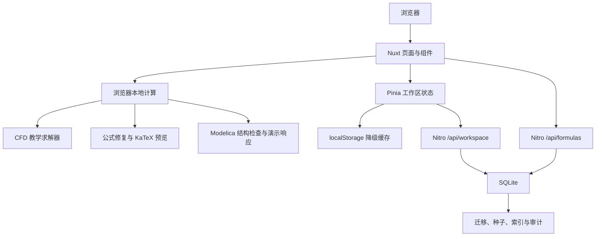
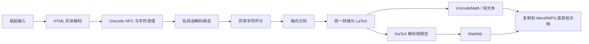
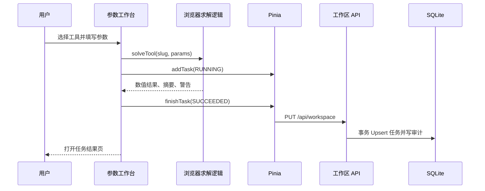
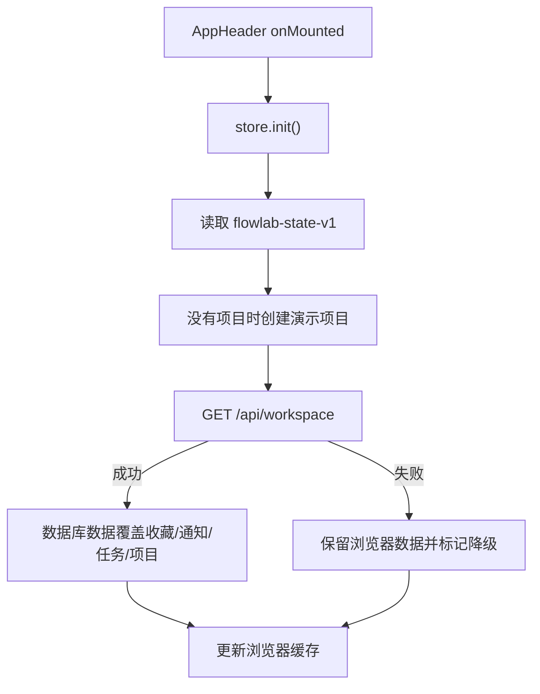

# 流研工坊 FlowLab 网站逻辑与功能总结

> 依据当前代码形成，更新日期 2026-08-04。  
> 本文描述“现在实际运行的逻辑”，不等同于《CFD 网站设计大纲》中规划的全部生产功能。

## 1. 产品定位

当前网站是一个 CFD 与 Modelica 工程学习和仿真平台原型，形成了以下主要入口：

1. CFD/数值方法知识库；
2. 算法和工程公式速查；
3. 乱码公式修复与多格式转换；
4. 四个浏览器端 CFD 教学工具；
5. Modelica 项目、源码检查和动态响应演示；
6. 工程社区内容展示与页面内回复；
7. 演示登录、个人工作区和管理仪表盘；
8. SQLite 数据库存储与浏览器降级缓存。

## 2. 当前实现等级

本文使用三个等级描述功能：

| 等级 | 含义 |
|---|---|
| 可用 | 逻辑真实执行，并能形成可验证结果或持久化数据 |
| 演示 | 可以交互和展示流程，但算法或身份链路是简化实现 |
| 占位 | 已有界面或入口，后端业务尚未实现 |

总体状态：

| 模块 | 等级 | 说明 |
|---|---|---|
| 页面导航与响应式界面 | 可用 | Nuxt 路由分发，桌面和移动导航可用 |
| 知识库 | 可用/混合 | 数据库导入文章可读取和展示，历史演示文章继续作为静态回退 |
| 算法与全站搜索 | 演示 | 搜索和筛选可用，算法和顶部快速搜索主要来自静态种子数组 |
| 公式库 | 可用 | 优先读取 SQLite，失败后使用静态回退 |
| 公式乱码转换 | 可用 | 本地执行编码修复、格式识别、预览和复制 |
| 四个 CFD 工具 | 可用/教学 | 真实执行当前 TypeScript 数学逻辑，不是通用工业 CFD 求解器 |
| CFD 任务记录 | 可用 | 结果保存到 SQLite；失败时保存到浏览器 |
| Modelica 项目编辑 | 可用 | 项目和源码可保存 |
| Modelica 编译 | 演示 | 使用正则与结构检查，不是完整 Modelica 编译器 |
| Modelica 动态仿真 | 演示 | 使用预设阻尼振荡响应，不调用 SUNDIALS |
| 社区浏览 | 演示 | 内容来自静态数据；新增回复仅存在当前页面内存 |
| 登录注册 | 演示 | 不验证邮箱和密码，使用固定演示用户 |
| 管理后台 | 占位/演示 | 仪表盘可查看本地任务和数据库状态，管理动作未落地 |
| SQLite 数据层 | 可用 | 迁移、种子、索引、事务、审计和备份均可执行 |

## 3. 总体架构



核心设计特点：

- 页面使用单个 catch-all Nuxt 路由，再由 `PageRouter.vue` 分发业务组件；
- CFD、公式转换和当前 Modelica 演示逻辑在浏览器运行；
- Pinia 负责跨页面工作区状态；
- SQLite 是任务、项目、收藏和通知的持久化主路径；
- `localStorage` 是数据库异常时的降级缓存；
- 公式历史因隐私设计仍只保存在当前浏览器。

## 4. 页面路由逻辑

Nuxt 文件路由入口：

- `/` 使用 `pages/index.vue`；
- 其他路径由 `pages/[...slug].vue` 接收；
- `components/PageRouter.vue` 按路径前缀选择页面组件；
- 未匹配路径显示自定义 404。

### 4.1 路由分发

| 路径 | 页面组件 | 功能 |
|---|---|---|
| `/` | `HomePage` | 首页、模块入口、公式和工具推荐 |
| `/knowledge*` | `LibraryPage` | 知识列表和文章详情 |
| `/algorithms*` | `LibraryPage` | 算法对比 |
| `/formulas` | `LibraryPage` | 数据库公式列表 |
| `/formulas/convert` | `FormulaConverter` | 乱码公式修复与转换 |
| `/search` | `LibraryPage` | 聚合搜索结果 |
| `/simulation*` | `SimulationPage` | CFD 工具、运行和结果 |
| `/modelica*` | `ModelicaPage` | Modelica 工作台 |
| `/forum*` | `CommunityPage` | 社区列表和帖子详情 |
| `/login`、`/register` | `AccountPage` | 演示登录注册 |
| `/me*`、`/notifications` | `AccountPage` | 个人工作区 |
| `/admin*` | `AccountPage` | 演示管理后台 |

### 4.2 主要子路由

| 路径模式 | 逻辑 |
|---|---|
| `/knowledge/:slug` | 根据静态文章 `slug` 显示文章详情 |
| `/simulation/:toolSlug` | 打开对应 CFD 参数工作台 |
| `/simulation/tasks/:taskId` | 从 Pinia/数据库状态中查找并展示结果 |
| `/modelica/projects` | 项目列表 |
| `/modelica/projects/:id/editor` | Modelica 源码编辑器 |
| `/modelica/runs/:id` | 动态响应结果演示 |
| `/modelica/libraries` | 组件库列表 |
| `/modelica/templates` | 项目模板列表 |
| `/forum/posts/:id` | 社区帖子和回复 |
| `/me/tasks` | 当前用户 CFD 任务 |
| `/me/modelica` | 当前用户 Modelica 项目 |
| `/me/bookmarks` | 收藏列表 |
| `/me/settings` | 演示账号设置 |

## 5. 全局页面框架

### 5.1 顶部导航

`AppHeader.vue` 实现：

- 品牌首页入口；
- 知识库、算法与公式、CFD 仿真、Modelica、社区主导航；
- 桌面和移动端导航；
- 登录/注册入口；
- 登录后的通知和账号菜单；
- `Ctrl/Cmd + K` 打开全站搜索；
- `Esc` 关闭搜索、抽屉或账号菜单；
- 跳到主要内容的无障碍链接。

### 5.2 全站搜索

当前搜索数据来自 `utils/content.ts` 中的：

- 文章；
- 算法；
- 静态公式；
- CFD 工具；
- 论坛主题。

输入后在前端进行标题包含匹配，最多显示 7 条快速结果。按 Enter 进入 `/search?q=` 聚合页。最近搜索保存在 `flowlab-state-v1`。

当前限制：全站搜索没有查询 SQLite 全文索引，数据库中新增加的非公式内容不会自动进入顶部快速搜索。

## 6. 首页逻辑

首页聚合展示：

- 产品主张和 CFD 仿真/知识库入口；
- CFD 流场与 Modelica 拓扑的 CSS 示意；
- 知识文章卡片；
- 算法摘要；
- 四个仿真工具；
- 公式快速复制和“乱码转换”入口；
- Modelica 与社区入口。

首页内容当前来自 `utils/content.ts`，不是由数据库运营位动态配置。

## 7. 知识库、算法和公式库

### 7.1 知识库

功能：

- 分类过滤；
- 标题、摘要和标签搜索；
- 文章详情、章节侧栏、页内目录；
- 公式/代码示例；
- 收藏切换；
- 相关文章与工具入口。

数据来源采用混合模式：

1. 页面请求 `GET /api/knowledge`；
2. 数据库文章按 `slug` 与 `utils/content.ts` 中的历史演示文章合并；
3. 数据库记录优先覆盖同 slug 元数据；
4. 新导入文章直接加入列表；
5. 带有 `body_html` 的文章详情使用服务端清理后的 HTML；
6. 旧演示文章没有数据库正文时继续显示原页面正文。

知识文章以 YAML Front Matter + Markdown 文件维护。模板、校验和导入流程见 `templates/knowledge/FORMAT.md`。

### 7.2 算法页

展示 SIMPLE、PISO、Rhie–Chow、QUICK、GMRES 等条目的适用场景、阶数、稳定性、成本和限制。

当前属于静态对比内容，不执行算法求解。

### 7.3 公式库

加载流程：

1. `LibraryPage` 服务端/客户端请求 `GET /api/formulas`；
2. API 查询 `formulas` 和 `categories` 表；
3. 只返回 `PUBLISHED` 状态条目；
4. 按分类顺序和名称排序；
5. API 失败或无数据时使用 `utils/content.ts` 的静态公式；
6. 用户可以搜索、收藏，并复制 LaTeX 或纯文本。

## 8. 公式乱码修复与转换

入口：`/formulas/convert`。

### 8.1 输入支持

- 常见 UTF-8 被 Windows/Latin-1 错误解码的乱码；
- HTML 实体；
- Unicode 数学符号；
- UnicodeMath；
- LaTeX；
- Presentation MathML；
- 从剪贴板 HTML 中提取的 `<math>` 内容。

### 8.2 转换流程



### 8.3 输出

- Word/WPS 使用的 UnicodeMath 文本；
- LaTeX；
- MathML；
- Unicode 纯文本；
- KaTeX 可视预览；
- 多 MIME 剪贴板写入，失败时回退纯文本复制。

### 8.4 检查与限制

- 检查圆括号、方括号和花括号数量；
- 检测不可恢复字符 `�`；
- 显示候选、评分和置信度；
- 不尝试伪造已经完全丢失的原始字符；
- 当前不支持图片公式 OCR；
- MathML 只覆盖转换器中定义的常见 Presentation MathML 元素；
- 转换结果用于辅助整理，工程公式仍需人工核对。

公式转换历史最多保留 20 条，保存在 `flowlab-formula-history-v1`，不会写入 SQLite。

## 9. CFD 仿真模块

### 9.1 公共运行流程



页面提供：

- 工具列表与参数范围提示；
- 默认参数恢复；
- 分阶段进度动画；
- 结果摘要、曲线、数据表和求解日志；
- 参数快照；
- JSON 清单和 CSV 数据下载；
- 警告信息。

### 9.2 四个工具

| 工具 | 路由 | 当前计算逻辑 | 主要输出 | 适用限制 |
|---|---|---|---|---|
| 一维对流—扩散 | `/simulation/convection-diffusion` | 稳态解析分布加离散误差模型 | Péclet 数、L2/L∞ 误差、数值/参考曲线 | 教学比较，不是通用 FVM 求解器 |
| 方腔顶盖驱动流 | `/simulation/lid-driven-cavity` | 根据 Re、容差和迭代上限生成收敛历史估计 | 迭代次数、最终残差、主涡中心 | 未真实组装二维 Navier–Stokes 方程 |
| 圆管充分发展层流 | `/simulation/pipe-flow` | Hagen–Poiseuille 解析关系 | Re、速度剖面、流量、压降、摩阻系数 | Re≥2300 时提示层流假设失效 |
| 湍流与近壁参数 | `/simulation/turbulence-compare` | 工程关联式计算 k、ε、ω、摩擦速度和首层高度 | Re、湍流强度、湍流量、首层高度 | 只用于预估，不能替代网格和模型验证 |

### 9.3 任务状态

类型定义支持：

- `QUEUED`；
- `RUNNING`；
- `SUCCEEDED`；
- `FAILED`；
- `CANCELLED`。

当前页面运行流程主要产生 `RUNNING` 和 `SUCCEEDED`。浏览器计算结束后生成模拟耗时，并同步参数、结果和警告到数据库。

## 10. Modelica 模块

### 10.1 页面能力

- Modelica 产品介绍和能力边界；
- 项目列表；
- 从模板创建项目；
- 源码编辑、脏状态提示和保存；
- 项目文件树和模型大纲；
- 基础语法/结构诊断；
- 编译输出摘要；
- 组件库和模板展示；
- 阻尼振荡动态响应结果页。

### 10.2 项目持久化

创建或保存项目时：

1. Pinia 更新 `projects`；
2. 立即写入浏览器缓存；
3. 180 ms 防抖后调用 `PUT /api/workspace`；
4. API Upsert `modelica_projects`；
5. 主 `.mo` 文件 Upsert 到 `modelica_files`；
6. 已存在文件保存时修订号加 1；
7. 同步动作写入 `audit_logs`。

### 10.3 当前诊断规则

检查器当前检测：

- 是否存在顶层 `model` 声明；
- 是否存在匹配形式的 `end <name>;`；
- 圆括号数量是否一致；
- `Real` 声明是否可能缺少分号；
- 粗略统计参数、Real 变量和等式数量。

诊断码：

| 代码 | 含义 |
|---|---|
| `MO1001` | 缺少顶层 model 声明 |
| `MO1002` | 缺少匹配的 end 语句 |
| `MO1003` | 圆括号不匹配 |
| `MO2001` | 声明可能缺少分号 |

### 10.4 重要边界

当前“检查模型”和“运行”属于演示逻辑：

- 没有完整词法、语法、AST、名称解析或类型系统；
- 没有实例化、连接展开、方程平衡、BLT 或 DAE 分析；
- 没有代码生成、原生编译或制品缓存；
- 没有真正接入 IDA、CVODE、KINSOL 或 KLU；
- 动态响应是预设质量—弹簧—阻尼解析/数值表达式；
- 组件库信息是静态展示。

因此它可用于页面流程和数据模型演示，不能声称为完整 Modelica 编译仿真平台。

## 11. 社区模块

已实现：

- 板块和主题列表展示；
- 状态、浏览量和回复数展示；
- 帖子详情；
- 采纳答案样式；
- 页面内添加回复；
- 相关主题和社区规则展示。

当前限制：

- 主题和初始回复来自静态内容；
- 页面内新增回复只保存在 Vue 内存，刷新即丢失；
- 发布主题、点赞、举报、审核按钮没有数据库写入；
- 数据库已有论坛表和种子主题，但页面尚未接入论坛 API；
- 没有权限校验、频率限制、内容审核或通知链路。

## 12. 登录、个人中心和管理后台

### 12.1 登录注册

当前表单验证昵称、邮箱格式和密码最小长度，但提交后只调用：

```text
store.login(displayName)
```

不会向服务端验证邮箱或密码。登录状态保存在浏览器，工作区 API始终操作固定数据库用户 `user-demo`。

因此：

- 适合演示登录后的界面；
- 不适合真实账号、多人共享或公网部署；
- 数据库中的 `password_hash`、角色和权限表是生产扩展预留，不代表认证已经完成。

### 12.2 个人中心

可查看：

- 活动任务和历史任务；
- Modelica 项目；
- 收藏；
- 通知和全部已读；
- 本地/数据库连接状态；
- 快速入口。

这些操作通过 Pinia 同步到 SQLite，数据库不可用时保留在浏览器。

### 12.3 管理后台

当前展示：

- 运营指标；
- 最近本地任务；
- CFD、Modelica 和数据库状态；
- 待审核内容示例；
- 今日概览；
- 内容、社区、任务、用户、配置和审计导航。

除任务列表和数据库连接状态外，多数指标为静态演示数据。管理按钮没有对应写接口，路由也没有正式管理员权限保护。

## 13. Pinia 状态逻辑

`stores/platform.ts` 是主要前端状态中心。

### 13.1 状态字段

| 字段 | 用途 |
|---|---|
| `ready` | 是否完成本地初始化 |
| `databaseConnected` | 最近一次数据库读写是否成功 |
| `databaseError` | 最近数据库错误消息 |
| `user` | 浏览器演示登录状态 |
| `bookmarks` | 收藏资源键 |
| `notifications` | 通知及已读状态 |
| `tasks` | CFD 任务、输入和结果 |
| `projects` | Modelica 项目和源码 |
| `recentSearches` | 最近搜索词 |

派生状态：

- `unread`：未读通知数量；
- `activeTasks`：`RUNNING` 或 `QUEUED` 任务数量。

### 13.2 初始化顺序



数据库返回的用户资料只有在浏览器已经处于登录状态时才覆盖 `store.user`，避免启动后自动登录。

### 13.3 持久化顺序

每次收藏、任务、项目、通知或登录状态变化时：

1. 同步写入 `localStorage`；
2. 重置 180 ms 同步计时器；
3. `PUT /api/workspace`；
4. 成功后设置 `databaseConnected = true`；
5. 失败后保留浏览器副本并设置错误状态。

这一设计保证基础功能不会因数据库短暂异常立即丢失，但当前没有自动冲突合并。多人或多设备模式需要引入版本号、服务端所有权和冲突策略。

## 14. 服务端 API 逻辑

### 14.1 `GET /api/health/database`

返回 SQLite 版本、Schema 版本、数据库路径和核心表计数。

当前风险：响应包含数据库绝对路径，只应在本地或受信网络使用。

### 14.2 `GET /api/formulas`

查询参数：

| 参数 | 类型 | 说明 |
|---|---|---|
| `q` | string，可选 | 在名称、备注和纯文本中执行 `LIKE` 搜索 |

返回：

```json
{
  "items": [
    {
      "id": "formula-reynolds",
      "slug": "reynolds-number",
      "name": "雷诺数",
      "latex": "Re = \\rho U L / \\mu",
      "unicodeMath": "Re = ρUL/μ",
      "plain": "Re = ρUL/μ",
      "note": "惯性力与黏性力之比",
      "category": "无量纲数"
    }
  ],
  "total": 1
}
```

### 14.3 `GET /api/knowledge` 与 `GET /api/knowledge/:slug`

列表接口只返回 `PUBLISHED` 文章，支持：

- `q`：标题、摘要和正文搜索；
- `category`：分类 slug；
- `limit`：1～100；
- `offset`：分页偏移。

详情接口返回文章元数据、标签、标题目录、SEO 数据和服务端清理后的 `bodyHtml`。原始 Markdown保存在数据库 `body_json` 中，不通过公开详情接口返回。

知识导入不是公开 HTTP 写接口，而是本机后台命令：

```powershell
npm run knowledge:validate -- <文件或目录>
npm run knowledge:import -- <文件或目录>
```

这样可以在管理员认证尚未完成时避免暴露匿名内容写入入口。

### 14.4 `GET /api/workspace`

按固定 `user-demo` 读取：

- 用户展示资料；
- 收藏；
- 通知；
- 仿真任务和 JSON 结果；
- Modelica 项目及主 `.mo` 文件。

数据库 JSON 字段解析失败时使用空对象或空数组回退。

### 14.5 `PUT /api/workspace`

在单个 `BEGIN IMMEDIATE` 事务中：

- 更新演示用户显示名；
- 全量替换该用户收藏；
- Upsert 通知；
- 校验任务状态和工具 slug 后 Upsert 任务；
- 校验项目状态/编译状态后 Upsert 项目和源码；
- 写一条 `workspace.sync` 审计记录；
- 任一步失败则整体回滚。

服务端限制：

| 数据 | 上限 |
|---|---:|
| 收藏 | 500 条 |
| 通知 | 200 条 |
| 任务 | 500 条 |
| 项目 | 100 个 |
| 项目源码 | 每个约 2,000,000 字符 |

当前不足：没有会话鉴权、资源所有权判断和请求体总大小限制。

## 15. SQLite 数据模型

当前表按领域划分：

### 15.1 身份与权限

- `users`；
- `roles`；
- `permissions`；
- `user_roles`；
- `role_permissions`。

### 15.2 内容与公式

- `categories`；
- `content_items`；
- `tags`；
- `content_tags`；
- `formulas`。

### 15.3 社区

- `forum_sections`；
- `forum_topics`；
- `forum_posts`。

### 15.4 CFD

- `simulation_tools`；
- `simulation_tool_versions`；
- `simulation_tasks`。

### 15.5 Modelica

- `modelica_projects`；
- `modelica_files`；
- `modelica_snapshots`。

### 15.6 工作区与运营

- `bookmarks`；
- `notifications`；
- `formula_conversions`；
- `system_settings`；
- `audit_logs`；
- `schema_migrations`。

数据库结构完整说明见 `docs/DATABASE.md`。

## 16. 数据来源矩阵

| 页面数据 | 当前主来源 | 回退/补充来源 |
|---|---|---|
| 首页内容 | `utils/content.ts` | 无 |
| 知识文章 | SQLite `/api/knowledge` | `utils/content.ts` 中的历史演示内容 |
| 算法 | `utils/content.ts` | 无 |
| 公式页 | SQLite `/api/formulas` | `utils/content.ts` |
| 顶部快速搜索 | `utils/content.ts` | 最近搜索在 localStorage |
| CFD 工具定义 | `utils/content.ts` | 数据库保存对应工具版本元数据 |
| CFD 任务 | SQLite 工作区 | `flowlab-state-v1` |
| Modelica 项目/源码 | SQLite 工作区 | `flowlab-state-v1` |
| Modelica 模板/组件库 | 页面静态数组 | 无 |
| 社区主题 | `utils/content.ts` | 数据库表尚未接页面 |
| 社区新增回复 | 当前页面内存 | 无，刷新丢失 |
| 公式转换历史 | `flowlab-formula-history-v1` | 无 |
| 管理指标 | 静态演示 + Pinia 任务 | 数据库连接状态 |

## 17. 错误与降级逻辑

### 17.1 数据库失败

- 初始化 API 失败：保留浏览器缓存；
- 同步 API 失败：状态仍写入浏览器，显示降级模式；
- 公式 API 失败：使用静态公式；
- 下次用户操作会再次尝试同步工作区。

当前没有后台定时重试；重试由下一次 `persist()` 操作触发。

### 17.2 找不到任务或项目

- CFD 任务页显示空状态并提供返回工具列表入口；
- Modelica 编辑器默认回退到第一个项目；
- 不存在的业务路径由 PageRouter 显示 404。

### 17.3 公式解析失败

- 生成诊断信息；
- 显示安全转义后的预览错误；
- 不执行受信 HTML 或任意 KaTeX 扩展；
- `trust` 为 `false`。

## 18. 测试和验证

当前自动验证：

| 命令 | 覆盖范围 |
|---|---|
| `npm run test:formula` | 7 个乱码修复、实体、Unicode、LaTeX 和诊断场景 |
| `npm run test:knowledge` | 模板解析、字段校验、目录提取和 HTML 清理 |
| `npm run typecheck` | Nuxt/Vue/TypeScript 类型检查 |
| `npm run db:check` | SQLite integrity、外键、必要表、种子数量和任务索引计划 |
| `npm run build` | 客户端、SSR 和 Nitro API 生产构建 |

当前缺口：

- 没有组件单元测试；
- 没有 API 自动集成测试文件；
- 没有浏览器 E2E；
- 没有 CFD 数值基准测试；
- 没有 Modelica 正/负语料测试；
- 没有认证、安全和权限测试。

## 19. 当前已知限制

1. 固定演示用户，未实现生产认证；
2. 管理路由没有 RBAC 保护；
3. SQLite 适合单机，不适合高并发多实例直接共享；
4. CFD 工具是教学/工程估算逻辑，不是工业通用求解器；
5. 方腔流当前是收敛历史估计，不是真实二维流场计算；
6. Modelica 不是完整编译器或运行时；
7. 社区发布、点赞、举报和审核没有持久化；
8. 顶部快速搜索仍以静态内容为主，尚未统一查询知识数据库；
9. 管理设置存储在数据库，但多数尚未真正约束业务；
10. 没有任务 Worker、Redis 队列、对象存储、邮件服务或监控告警；
11. 没有多设备冲突解决；
12. 公式转换不支持图片 OCR，且无法确定性恢复已经丢失的字符。

## 20. 建议开发顺序

### P0：从演示升级为安全单用户/多用户应用

1. 正式注册、密码哈希、会话和邮箱验证；
2. 工作区 API 改为按会话用户查询；
3. 管理路由和 API 接入 RBAC；
4. 文章、算法、论坛接入数据库 CRUD；
5. 增加 API 集成测试和浏览器 E2E；
6. 健康接口脱敏，增加日志和请求 ID。

### P1：计算执行链

1. 将任务提交和计算执行拆分；
2. 引入任务队列与隔离 Worker；
3. 为四个 CFD 工具建立公开基准和误差阈值；
4. 结果文件进入对象存储，数据库保存清单；
5. 增加取消、超时、失败重试和保留期清理。

### P2：Modelica 实际能力

1. 冻结 `PlatformModelica-1.0` 语法语义范围；
2. 实现词法、语法、AST、名称和类型检查；
3. 实例化、连接展开、方程平衡和 DAE 分析；
4. 代码生成、隔离编译和制品缓存；
5. 集成 SUNDIALS，并建立正/负语料与数值基准；
6. 项目快照、实验版本和结果可追溯。

## 21. 关键源码索引

| 文件 | 职责 |
|---|---|
| `components/PageRouter.vue` | 路径前缀到业务页面的分发 |
| `components/AppHeader.vue` | 导航、搜索、登录态入口 |
| `components/pages/LibraryPage.vue` | 知识、算法、公式和搜索页面 |
| `components/formulas/FormulaConverter.vue` | 公式转换工作台 |
| `utils/formula/converter.ts` | 公式修复、识别、转换和预览核心 |
| `components/pages/SimulationPage.vue` | CFD 参数、运行进度和结果展示 |
| `utils/solvers.ts` | 四个浏览器端求解/估算逻辑 |
| `components/pages/ModelicaPage.vue` | Modelica 项目、编辑、检查和结果演示 |
| `components/pages/CommunityPage.vue` | 社区列表与详情 |
| `components/pages/AccountPage.vue` | 登录、个人中心与管理后台 |
| `stores/platform.ts` | 工作区状态、本地缓存和数据库同步 |
| `server/api/workspace.get.ts` | 工作区读取 |
| `server/api/workspace.put.ts` | 工作区事务写入 |
| `server/api/formulas.get.ts` | 公式数据库查询 |
| `templates/knowledge/KNOWLEDGE_ARTICLE.template.md` | 知识文章标准模板 |
| `server/services/knowledge-importer.ts` | 模板解析、校验、安全渲染和事务导入 |
| `scripts/import-knowledge.mjs` | 单文件/目录批量导入命令 |
| `server/api/knowledge/` | 已发布知识文章读取接口 |
| `server/utils/database.ts` | SQLite 初始化、迁移与种子 |
| `server/database/schema.ts` | 表结构、索引和默认数据定义 |

## 22. 结论

当前版本已经形成可运行的 Nuxt 网站、SQLite 持久化、公式转换、四个本地 CFD 工具、Modelica 项目编辑演示和完整页面体系。它适合作为产品原型、教学演示和后续工程开发基线。

需要特别保持边界清晰：现阶段的登录、管理后台、社区写入、方腔 CFD 和 Modelica 编译/仿真仍属于演示或占位能力。正式上线前必须按第 20 节补齐认证、权限、服务端业务、任务隔离、数值验证和自动测试。
