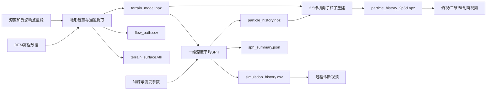

# 冰川融水—泥石流无网格仿真可重复利用模板

> 三维升级入口：请使用 [THREE_DIMENSIONAL_TEMPLATE.md](THREE_DIMENSIONAL_TEMPLATE.md)。本文后续保留的是旧一维动力与 2.5D 显示模板，不适用于解释新三维结果。

> 模板版本：1.0  
> 当前示例：Purepu冰川源区—吉隆口岸  
> 适用层级：研究初筛、高保真演示、计算路线验证  
> 不适用：未经现场标定直接用于预警、疏散、桥梁设计或风险区划

---

## 1. 模板目标

本模板用于快速建立一套可以重复运行、替换场地和调整情景的冰川融水—高含沙洪流—泥石流无网格仿真流程。整套流程包括：

1. 读取真实数字高程模型（DEM）；
2. 提取源区至下游受影响点的主运动通道；
3. 构建纵剖面、纵坡、谷宽和三角地形面；
4. 采用一维深度平均SPH求解沿程动力过程；
5. 将动力粒子扩展为地形跟随的2.5维横向子粒子；
6. 输出计算结果、VTK文件、图片、综合视频和分项视频；
7. 进行质量守恒、时间步、粒子数和结果合理性检查。

这里的“粒子”是携带质量、动量和体积的计算单元，不等于自然界中的单颗砂石。

---

## 2. 模型层级和物理边界

### 2.1 当前动力模型

当前主求解器属于一维深度平均SPH模型：

- 沿提取的谷地中心线计算运动；
- 显式考虑地形重力、静水压力梯度、等效库仑摩擦、二次速度阻力、粒子压缩阻尼和沟床物质裹挟；
- 适合估算前缘到达时间、沿程速度、总体积变化和计算参数量级；
- 不直接求解横向漫流、河道分汊、建筑物绕流和水固两相相对运动。

### 2.2 2.5维高保真表达

每个动力SPH粒子被质量守恒地细分为若干横向子粒子：

- 沿程速度、质量、流深来自一维SPH动力解；
- 横向位置依据局部谷宽、传播距离和DEM地形重建；
- 粒子高程通过DEM双线性采样获得；
- 适合真实地形上的传播展示和分项视频制作；
- 横向子粒子没有独立求解完整二维动量方程，不能冒充二维SPH预测。

### 2.3 工程级升级方向

工程分析应采用经过现场资料反演的二维深度平均SPH或局部三维非牛顿、多相SPH，并补充：

- 无人机/LiDAR高分辨率DEM；
- 沟道横断面、桥梁、道路和建筑模型；
- 冰湖水位—面积—库容曲线或崩体体积；
- 可侵蚀层厚度、颗粒级配和含水率；
- 密度、屈服应力、黏度、摩擦角或流变试验数据；
- 历史到达时间、流痕高程、峰值流量和堆积厚度。

---

## 3. 数据流



---

## 4. 标准目录结构

复制本项目作为新场地模板时，保留以下结构：

```text
[project_root]/
├─ REUSABLE_SIMULATION_TEMPLATE.md
├─ README.md
├─ MODEL_REPORT.md
├─ config/
│  └─ model_config.json
├─ data/
│  ├─ raw/
│  │  └─ [N/S][纬度][E/W][经度].hgt.gz
│  └─ processed/
├─ outputs/
│  └─ component_videos/
└─ src/
   ├─ build_terrain.py
   ├─ simulate_sph.py
   ├─ build_refined_2p5d.py
   ├─ create_video.py
   ├─ create_component_videos.py
   └─ build_visualization.py
```

不要把旧场地的 `data/processed/` 和 `outputs/` 当作新场地结果。新项目首次运行前，应使用新的空输出目录或复制一份完整工程后再运行。

---

## 5. 软件环境

### 5.1 已验证环境

| 软件 | 已验证版本 |
|---|---:|
| Python | 3.11.7 |
| NumPy | 1.26.4 |
| SciPy | 1.11.4 |
| Matplotlib | 3.8.0 |
| Numba | 0.59.0 |
| imageio-ffmpeg | 0.6.0 |

### 5.2 建议安装方式

Windows PowerShell：

```powershell
python -m venv .venv
.\.venv\Scripts\Activate.ps1
python -m pip install --upgrade pip
python -m pip install numpy==1.26.4 scipy==1.11.4 matplotlib==3.8.0 numba==0.59.0 imageio-ffmpeg==0.6.0
```

Numba首次运行会编译求解内核，第一次通常比之后运行慢。

---

## 6. 输入数据要求

### 6.1 DEM

当前地形脚本直接支持压缩的SRTM/HGT格式：

- 文件名必须包含瓦片编号，例如 `N28E085.hgt.gz`；
- 程序会从文件名自动读取瓦片西南角经纬度；
- 当前版本一次读取一个1°×1°瓦片；
- `terrain.bbox_wgs84` 必须完全位于该瓦片内；
- 若研究区跨越多个瓦片，应先在GIS中拼接并改造读取模块，不能只更改包围盒。

当前脚本把HGT中的无效高程用有效像元均值替换。正式研究应使用邻域插值、水文纠正或更高质量DEM处理空洞。

### 6.2 坐标

至少需要两个WGS84坐标：

- `source`：冰湖、冰川融水出口、崩塌体或泥石流源区；
- `receptor`：口岸、村镇、桥梁或模型下游出口。

两点均必须落在DEM裁剪范围内。当前局地坐标使用受影响点作为原点，通过经纬度近似换算为米。对于更大范围或工程计算，建议改用当地UTM投影。

### 6.3 物源和流变数据

最少需要给出：

- 初始释放体积；
- 初始释放长度；
- 混合物密度；
- 初始速度；
- 上游和下游等效摩擦角；
- 上游和下游二次阻力；
- 至下游出口的目标质量放大倍数；
- 最大计算时间和输出间隔。

没有现场数据时必须给出参数区间并进行情景分析，不应只报告单一基线值。

---

## 7. 配置文件模板

将以下内容保存为 `config/model_config.json`，把所有方括号占位内容替换为新场地参数。JSON中不能保留注释。

```json
{
  "model_name": "[项目名称]",
  "model_purpose": "研究级初筛；不得直接用于预警、工程设计或人员疏散决策",
  "coordinate_system": "WGS84 input; local tangent-plane metres with origin at receptor",
  "source": {
    "name": "[源区名称]",
    "latitude": 0.0,
    "longitude": 0.0,
    "reference_elevation_m": 0.0
  },
  "receptor": {
    "name": "[受影响点名称]",
    "latitude": 0.0,
    "longitude": 0.0,
    "reference_elevation_m": 0.0
  },
  "terrain": {
    "bbox_wgs84": [0.0, 0.0, 0.0, 0.0],
    "dem_file": "data/raw/[HGT文件名].hgt.gz",
    "dem_nominal_resolution_m": 30.0,
    "routing_resolution_cells": 3,
    "path_resample_spacing_m": 100.0,
    "terrain_mesh_spacing_m": 180.0,
    "valley_relief_threshold_m": 60.0,
    "maximum_half_width_m": 1500.0
  },
  "baseline_scenario": {
    "description": "[触发与演化情景]",
    "initial_released_volume_m3": 1000000.0,
    "initial_surge_length_m": 900.0,
    "particle_count": 1200,
    "particle_interpretation": "coarse-grained SPH computational parcels, not individual sediment grains",
    "bulk_density_kg_m3": 1850.0,
    "initial_velocity_m_s": 10.0,
    "basal_friction_angle_start_deg": 1.0,
    "basal_friction_angle_end_deg": 5.0,
    "quadratic_drag_start_per_m": 0.0004,
    "quadratic_drag_end_per_m": 0.0010,
    "mass_amplification_at_port": 4.0,
    "regularization_velocity_m_s": 0.5,
    "maximum_simulation_time_s": 3600.0,
    "output_interval_s": 10.0
  },
  "scenario_bounds_for_later_analysis": {
    "released_volume_m3": [500000.0, 3000000.0],
    "basal_friction_angle_end_deg": [2.0, 12.0],
    "quadratic_drag_end_per_m": [0.0006, 0.0030],
    "mass_amplification_at_port": [1.0, 8.0]
  }
}
```

### 7.1 关键参数说明

| 参数 | 含义 | 增大后的主要影响 |
|---|---|---|
| `initial_released_volume_m3` | 初始释放混合物体积 | 增大总质量、流深和潜在影响范围 |
| `initial_surge_length_m` | 初始物源沿程长度 | 改变初始线密度和粒子间距 |
| `particle_count` | 一维动力SPH粒子数 | 提高离散分辨率，同时显著增加计算量 |
| `bulk_density_kg_m3` | 水沙混合物体密度 | 改变质量和压力项 |
| `initial_velocity_m_s` | 源区初速度 | 缩短初期传播时间 |
| `basal_friction_angle_*` | 等效基底摩阻 | 减小速度和传播距离 |
| `quadratic_drag_*` | 高速阻力系数 | 强烈抑制高速段 |
| `mass_amplification_at_port` | 沟床裹挟目标倍数 | 增大下游质量，同时因动量混合降低速度 |
| `regularization_velocity_m_s` | 低速摩阻规则化参数 | 避免零速附近数值不稳定 |
| `output_interval_s` | 结果保存时间间隔 | 越小动画越平滑、文件越大 |

参数名称中的 `port` 表示下游受影响点。换场地后其物理意义仍是模型出口，不要求必须为口岸。

---

## 8. 地形模型构建

运行：

```powershell
python src/build_terrain.py
```

程序执行以下步骤：

1. 读取HGT高程矩阵；
2. 根据文件名解析1°×1°瓦片范围；
3. 按 `bbox_wgs84` 裁剪DEM；
4. 以受影响点为局地坐标原点；
5. 对降采样、平滑后的DEM执行A*谷地路径搜索；
6. 将路径重采样为等间距中心线；
7. 对中心线高程执行平滑和单调下降约束；
8. 沿路径法向搜索高出谷底阈值的位置，估算谷宽；
9. 输出地形数组、路径表、初始粒子和VTK地形面。

### 8.1 通道人工复核

必须检查 `outputs/terrain_overview.png`：

- 路径是否沿真实沟道或河谷；
- 是否出现穿越山脊、错误支沟或明显绕行；
- 源区和出口是否落在正确位置；
- 高程是否总体从上游向下游降低；
- 谷宽是否出现大量1500 m上限值。

若路径错误，应优先调整：

1. 源区和出口坐标；
2. DEM包围盒；
3. `routing_resolution_cells`；
4. DEM水文纠正；
5. A*代价函数或人工提供中心线。

当前脚本会强制中心线高程单调下降，以消除DEM伪洼地。这适合初筛，但正式模型应保留经过水文纠正后的真实河床起伏。

---

## 9. SPH动力模型

运行：

```powershell
python src/simulate_sph.py
```

### 9.1 粒子初始化

初始粒子间距：

```text
Δs = 初始释放长度 / 粒子数
```

光滑长度：

```text
h = 1.35 Δs
```

每个粒子的初始质量：

```text
m₀ = 初始释放体积 × 混合物密度 / 粒子数
```

### 9.2 SPH核函数

采用一维三次样条核，紧支撑范围为 `2h`。粒子线密度为：

```text
λᵢ = Σⱼ mⱼ W(sᵢ-sⱼ, h)
```

等效流深：

```text
dᵢ = λᵢ / (ρ Bᵢ)
```

其中 `ρ` 为混合物密度，`Bᵢ` 为局部估算谷宽。

### 9.3 运动项

沿程加速度由以下分量构成：

```text
a = 地形重力分量
  + SPH静水压力梯度
  - 规则化库仑摩擦
  - 二次速度阻力
  + 粒子间压缩阻尼
```

库仑摩阻使用沿程渐变的等效摩擦角；二次阻力也从上游值平滑过渡到下游值。

### 9.4 裹挟模型

粒子目标质量随沿程进度平滑增加，到出口趋近配置的质量放大倍数。新增沟床质量假定初始静止，并通过动量守恒与原混合物混合：

```text
v_new = v_old × m_old / m_new
```

这是总量化裹挟模型，没有显式计算沟床剪切应力阈值和空间变化的可侵蚀层厚度。

### 9.5 时间步

时间步由粒子速度和浅水波速控制：

```text
Δt ≤ 0.25 h / max(|v| + √(g d))
```

Numba编译内核运行整个时间循环。粒子沿一维通道保持顺序，因此仅搜索紧支撑范围内的相邻粒子。

---

## 10. 粒子数量与收敛检查

不能根据“自然界颗粒很多”无限增加SPH粒子。SPH粒子是连续介质离散单元，合理数量应由计算尺度和结果收敛性决定。

推荐至少计算三档分辨率：

| 档位 | 示例粒子数 | 用途 |
|---|---:|---|
| 粗 | 300或600 | 参数筛选、快速排错 |
| 中 | 1200 | 基线结果和视频 |
| 细 | 2400或更高 | 离散收敛验证 |

保持其他参数一致，对比：

- 前缘到达时间；
- 最大速度；
- 最大等效流深；
- 结束时总体积；
- 质量放大倍数。

建议判据：中、细粒子数结果的关键指标差异低于2%—5%，且曲线形态一致。当前吉隆示例从120加密到1200后，到达时间变化约0.07%，最大速度变化不足0.01%，可作为初步收敛证据，但仍需更细一级复核。

---

## 11. 2.5维横向粒子重建

运行：

```powershell
python src/build_refined_2p5d.py
```

当前设置把每个动力SPH粒子细分为5个横向子粒子：

```text
1200个动力粒子 × 5 = 6000个地形跟随子粒子
```

子粒子的质量和为父粒子质量。程序输出 `subdivision_mass_conservation_relative_error`，该值应接近机器精度。

横向流动核心宽度按估算谷宽和传播距离逐渐扩展。该步骤主要服务于空间表达；如果研究目标是淹没范围、分汊或建筑冲击，必须改用二维或三维动力求解器。

---

## 12. 视频生成

### 12.1 综合视频

```powershell
python src/create_video.py
```

输出：

```text
outputs/gyirong_debrisflow_sph_simulation.mp4
```

换场地时应同时修改视频标题中的场地名称和源区标签。

### 12.2 分项视频

```powershell
python src/create_component_videos.py
```

输出：

| 文件 | 内容 |
|---|---|
| `01_terrain_plan_view.mp4` | DEM阴影、等高线和俯视粒子传播 |
| `02_terrain_3d_perspective.mp4` | 三维山谷和速度着色粒子 |
| `03_longitudinal_profile.mp4` | 纵剖面和横向地形高程投影 |
| `04_process_diagnostics.mp4` | 前缘、速度、体积和流深 |

默认规格为1920×1080、12 fps、H.264、17.5 s。最后24帧重复，用于保留结束画面。

只重新生成某个分项时，Windows PowerShell可使用：

```powershell
$env:VIDEO_COMPONENT="02"
python src/create_component_videos.py
Remove-Item Env:VIDEO_COMPONENT
```

可选值为 `01`、`02`、`03` 或 `04`。

三维视频为了避免深谷遮挡，粒子显示高度上移65 m，并在画面中明确标注。该偏移仅用于显示，不改变计算坐标。

---

## 13. 完整运行顺序

在项目根目录执行：

```powershell
python src/build_terrain.py
python src/simulate_sph.py
python src/build_refined_2p5d.py
python src/create_video.py
python src/create_component_videos.py
```

依赖关系：

```text
修改DEM/坐标/地形参数
  → 必须从build_terrain.py重新开始

仅修改体积/密度/摩阻/阻力/裹挟/粒子数
  → 从simulate_sph.py重新开始

仅修改横向子粒子表达
  → 从build_refined_2p5d.py重新开始

仅修改视频样式
  → 只需重新运行对应视频脚本
```

---

## 14. 输出文件说明

### 14.1 地形阶段

| 文件 | 内容 |
|---|---|
| `data/processed/terrain_model.npz` | DEM、局地坐标、路径、高程、坡度和谷宽 |
| `data/processed/flow_path.csv` | 便于GIS和表格分析的通道数据 |
| `data/processed/source_particles.csv` | 初始一维动力粒子 |
| `outputs/terrain_surface.vtk` | ParaView可读地形面 |
| `outputs/terrain_overview.png` | 地形和通道检查图 |
| `outputs/longitudinal_profile.png` | 高程和谷宽纵剖面 |
| `outputs/terrain_summary.json` | 地形统计摘要 |

### 14.2 动力阶段

| 文件 | 内容 |
|---|---|
| `outputs/particle_history.npz` | 每个输出时刻的一维粒子位置、速度、质量和流深 |
| `outputs/simulation_history.csv` | 前缘、速度、体积、流深和到达状态 |
| `outputs/final_particles.vtk` | 最终动力粒子 |
| `outputs/sph_summary.json` | 仿真摘要和警告 |
| `outputs/sph_runout_history.png` | 前缘和速度曲线 |
| `outputs/sph_particle_snapshots.png` | 粒子纵剖面快照 |

### 14.3 高保真表达和视频阶段

| 文件 | 内容 |
|---|---|
| `outputs/particle_history_2p5d.npz` | 6000个2.5维子粒子历史 |
| `outputs/particle_history_2p5d_metadata.json` | 子粒子数量和质量守恒信息 |
| `outputs/component_videos/*.mp4` | 四个分项视频 |
| `outputs/component_videos/*_cover.png` | 视频封面 |
| `outputs/component_videos/component_videos_manifest.json` | 视频规格和结果清单 |

---

## 15. 质量控制与验收标准

每次运行后完成以下检查：

### 15.1 输入检查

- [ ] DEM文件名与真实瓦片一致；
- [ ] DEM包围盒位于一个瓦片内；
- [ ] 源区和受影响点位于包围盒内；
- [ ] 经纬度顺序没有写反；
- [ ] 初始体积、密度和速度有来源或明确标为假设；
- [ ] 单位全部使用SI制。

### 15.2 地形检查

- [ ] 提取路径沿真实河谷；
- [ ] 源区高程高于出口；
- [ ] 路径长度与地图量测同量级；
- [ ] 谷宽没有大面积卡在上下限；
- [ ] VTK地形方向正确，没有镜像或上下颠倒。

### 15.3 数值检查

- [ ] `particle_history.npz` 的粒子位置没有逆序；
- [ ] 速度、质量和流深均为有限值；
- [ ] 没有负质量或负速度；
- [ ] 粒子细分质量误差接近零；
- [ ] 模拟结束条件符合预期；
- [ ] 至少完成一组粒子数收敛对比。

### 15.4 结果合理性检查

- [ ] 到达时间与通道长度、平均速度量级一致；
- [ ] 最大速度没有因参数设置出现非物理尖峰；
- [ ] 体积增长没有超过可供裹挟的松散物总量；
- [ ] 最大流深与河谷宽度和总体积相容；
- [ ] 前缘曲线连续，没有明显倒退；
- [ ] 视频中的粒子颜色、位置和图表时间同步。

### 15.5 视频检查

- [ ] 分辨率为1920×1080；
- [ ] 编码为H.264、像素格式为yuv420p；
- [ ] 中文文字没有乱码；
- [ ] 颗粒、色标、指北针和比例尺清晰；
- [ ] 三维粒子显示偏移已标注；
- [ ] 研究级限制声明完整可见。

---

## 16. 情景分析建议

至少建立低、中、高三种情景：

| 情景 | 初始体积 | 摩阻/阻力 | 裹挟倍数 | 用途 |
|---|---|---|---|---|
| 低情景 | 参数下限 | 较高 | 较低 | 常规影响下界 |
| 基线 | 中位或反演值 | 中等 | 中等 | 主报告 |
| 高情景 | 参数上限 | 较低 | 较高 | 不利影响上界 |

每个情景应保存独立的配置文件、输出目录和摘要，避免后一次运行覆盖前一次结果。建议目录：

```text
runs/
├─ low/
│  ├─ model_config.json
│  └─ outputs/
├─ baseline/
│  ├─ model_config.json
│  └─ outputs/
└─ high/
   ├─ model_config.json
   └─ outputs/
```

当前脚本默认写入统一的 `outputs/`，所以批量情景计算前应增加运行编号管理，或为每个情景复制独立工程目录。

---

## 17. 参数标定顺序

推荐按以下顺序标定，避免多个参数互相补偿：

1. 用影像或记录确定源区位置、通道和实际到达时间；
2. 用水位—面积—库容关系确定初始体积；
3. 用流痕和到达时间标定摩阻与二次阻力；
4. 用灾前灾后DEM差分标定裹挟体积；
5. 用堆积范围和厚度检验体积守恒；
6. 完成独立事件或留出数据验证；
7. 最后开展参数不确定性和敏感性分析。

若只有一个观测指标，不应同时自由标定摩阻、阻力和裹挟三个参数。

---

## 18. 新场地复用步骤

### 步骤A：复制模板

复制整个项目目录并改为新项目名称，不要在原案例上直接覆盖。

### 步骤B：替换DEM

把新HGT文件放入 `data/raw/`，确保文件名包含正确瓦片编号。

### 步骤C：修改配置

至少替换：

- `model_name`；
- `source`；
- `receptor`；
- `terrain.bbox_wgs84`；
- `terrain.dem_file`；
- 全部 `baseline_scenario` 参数；
- 情景上下限。

### 步骤D：修改场地文字

当前视频脚本和说明文件中包含“Purepu”“吉隆口岸”等示例名称。复制到新场地后，应统一替换为配置读取或新项目名称。

### 步骤E：运行和检查

按第13节顺序运行，每完成一个阶段就检查其输出，不要在地形路径错误时继续做动力仿真。

### 步骤F：保存可重复性记录

每次正式运行至少归档：

- 配置文件；
- 原始DEM名称和校验值；
- Python及依赖版本；
- 脚本版本或Git提交号；
- 运行日期；
- 所有摘要JSON和CSV；
- 参数来源、假设和人工修改记录。

---

## 19. 常见问题

### 19.1 找不到地形路径

检查源区、出口和包围盒是否在同一DEM瓦片中，坐标是否写反，以及裁剪范围是否过小。

### 19.2 路径穿越山脊

减小 `routing_resolution_cells`、扩大包围盒、改进DEM水文处理，或使用人工核验的沟道中心线替换自动A*路径。

### 19.3 粒子速度异常大

检查高程纵剖面、初速度、摩擦角和二次阻力；同时确认单位没有把度、米和千米混用。

### 19.4 粒子增加后运行明显变慢

粒子间距减小会同时减小稳定时间步。计算量不只与粒子数线性增长。先做300/600粒子调参，最终再用1200/2400粒子验证。

### 19.5 三维视频看不到谷底粒子

深谷会遮挡粒子。当前三维视频使用65 m显示抬升并在画面中标明。该值只用于可视化，不能写回动力结果。

### 19.6 视频可以播放但文件很小

三维地形大部分时间为静态画面，H.264压缩率会很高。应抽取中间帧检查粒子是否实际更新，不能仅按文件大小判断失败。

### 19.7 中文显示为方框

系统需要Microsoft YaHei、SimHei或其他支持中文的字体，并应在Matplotlib字体设置中加入该字体名称。

---

## 20. 当前吉隆案例参考值

| 指标 | 当前结果 |
|---|---:|
| 动力SPH粒子数 | 1200 |
| 2.5维显示粒子数 | 6000 |
| 初始粒子间距 | 0.75 m |
| 光滑长度 | 1.0125 m |
| 初始释放体积 | 300万 m³ |
| 通道长度 | 36.3 km |
| 总高差 | 约3325 m |
| 前缘到达时间 | 约20.77 min |
| 最大速度 | 约48.38 m/s |
| 结束时混合物体积 | 约1398万 m³ |
| 最终质量放大倍数 | 约4.66 |

这些结果由未现场反演的参数产生，仅用于展示模板运行和参数量级，不是对吉隆口岸的正式灾害预测。

---

## 21. 最终交付清单

一个可以审查和复现的仿真项目至少应包含：

- [ ] 原始DEM及数据来源说明；
- [ ] 完整配置文件；
- [ ] 地形和通道检查图；
- [ ] 模型方程、参数定义和单位；
- [ ] 粒子数收敛结果；
- [ ] 质量守恒检查；
- [ ] 参数敏感性或情景包络；
- [ ] 计算结果CSV/NPZ/VTK；
- [ ] 综合视频和分项视频；
- [ ] 软件版本和运行记录；
- [ ] 不确定性、限制条件和禁止用途声明。

完成以上内容后，这套工程可作为新冰川融水、溃决洪水或泥石流场地的研究级无网格仿真起点。
