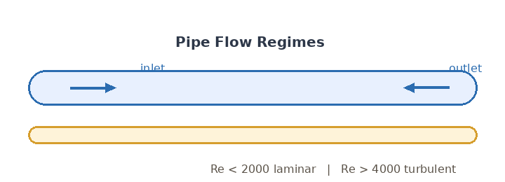

# 公式与图片导入示例

本文用于演示知识库导入模板中**公式**与**图片**的写法。导入后公式由 KaTeX 渲染为网页可用的 HTML，图片被自动复制到服务器并改写为站内地址。本文状态为 DRAFT，不会出现在知识库公开列表中。

## 1. 行内公式

行内公式使用单个美元符号包裹，例如雷诺数 $Re = \frac{\rho U L}{\mu}$，其中 $\rho$ 是密度、$U$ 是特征速度、$L$ 是特征长度、$\mu$ 是动力粘度。

如果正文中需要出现普通美元符号（如价格），请使用反斜杠转义：`\$5.00`。

## 2. 块级公式

独立成段的公式使用双美元符号，独占一行开始与结束：

$$
\frac{\partial \rho}{\partial t} + \nabla \cdot (\rho \mathbf{u}) = 0
$$

这是连续性方程。不可压缩流动时简化为：

$$
\nabla \cdot \mathbf{u} = 0
$$

## 3. 图片

图片使用标准 Markdown 语法，路径为**相对路径**，以本文所在目录为基准：

导入时该图片会被复制到服务器 `data/uploads/knowledge/formula-image-demo/` 目录，正文中的地址自动改写为 `/api/knowledge/assets/formula-image-demo/pipe-flow-regimes.png`，并在 `knowledge_assets` 表中登记。

外部图片直接引用原地址即可：

## 4. 验证

导入完成后，可以在正文中看到 `…` 形式的公式 HTML，以及指向本站的图片地址。搜索 `body_html` 时公式的渲染文本可被检索到。
