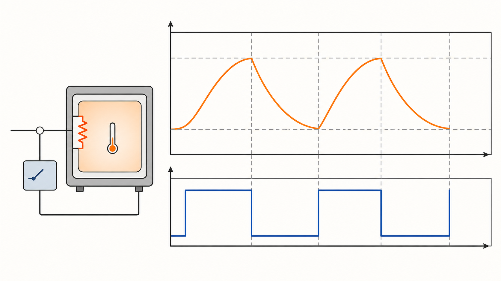

# Modelica 事件、when/reinit 与状态机建模

混合系统在连续积分与离散切换之间交替。事件应表达真实的模式改变；把每个分段关联式都变成事件会严重降低性能和鲁棒性。

*图：带滞回的恒温控制示意——温度连续演化，执行器状态在阈值事件处离散切换。该图为 AI 生成的教学示意，不包含特定模型参数或求解器误差数据。*

## 1. 事件类型

- 时间事件：预定时刻或 `sample()` 触发；
- 状态事件：连续表达式越过阈值；
- 关系事件：布尔条件变化；
- 离散事件：离散变量或状态机转换引起。

## 2. 核心操作

`when` 在条件由假变真时执行离散方程；`pre(x)` 取事件迭代前的离散值；`edge(b)` 检测上升沿；`reinit(x,v)` 只用于事件时重置状态。离散变量在所有分支必须有明确保持或更新语义。

## 3. noEvent 与 smooth

`noEvent()` 抑制关系生成事件，只有当忽略精确切换不会改变模型语义时才使用；`smooth()` 是对平滑阶数的承诺，不会自动让表达式变光滑。错误使用会漏检真实切换或让求解器使用无效导数。

## 4. 抖动处理

阈值附近反复切换时加入物理滞回、最小保持时间或连续正则化。不要简单扩大求解器容差来隐藏抖动。检查事件前后守恒量，`reinit` 引起的能量或质量跳变必须有物理解释。

## 5. 状态机

当模式数量多、转换条件明确时，用状态机比嵌套 `if/when` 更易审查。为每个状态定义不变量、入口动作、转换优先级和不可达状态测试。

## 6. 参考资料

1. Modelica Language Specification, Events, Discrete-Time Expressions and State Machines。
