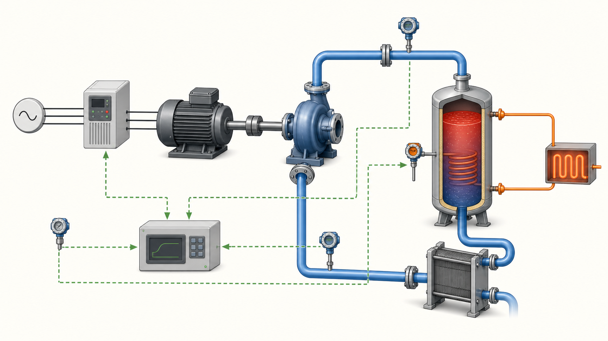

# Modelica 机械、电气与控制系统组合

多领域模型的价值在于把能量转换链完整表达出来：电源—电机—轴系—负载—热损耗—控制器。各域端口的势变量与流变量必须遵守库的符号约定，否则连接后会出现"能量无中生有"。



*图：电机、泵、流体回路、储热罐、换热器、传感器与控制器组成的多领域闭环示意。该图为 AI 生成的系统结构图，连接语义仍应以实际 Modelica connector 定义为准。*

## 1. 结论与适用场景

当系统由多个能量域耦合而成、且各域动态相互影响时，单域模型不再够用。典型场景包括：电驱动总成的电气—机械—热耦合、机器人的机电联合控制、液压—机械—热回路，以及需要同时评估能耗、峰值功率与热负荷的工况。判据是"某域的能量流会改变另一域的结论"。若只是给机械系统加一个事后计算的控制信号，用信号源即可，无需引入真实电气域；但一旦要考虑母线电压跌落、电机铜损或逆变器限流，就必须建立完整的功率接口。

## 2. 物理/数学基础

多领域建模的统一语言是功率共轭对：每个域都有一个势变量（effort）和一个流变量（flow），二者乘积为功率。平动机械用力与速度，转动机械用转矩与角速度，电气用电压与电流，热学用温度与热流率。端口功率的正负方向应通过简单测试验证。转动与电气耦合的直流电机常用方程为

$$L\frac{di}{dt}=u-R\,i-k_e\,\omega$$

$$J\frac{d\omega}{dt}=k_t\,i-b\,\omega-\tau_L$$

其中 $k_e$ 为反电动势常数、$k_t$ 为转矩常数、$b$ 为粘性阻尼、$\tau_L$ 为负载转矩。整个闭环满足功率守恒

$$\frac{d}{dt}\left(\sum E\right)=\sum P_{\mathrm{in}}-\sum P_{\mathrm{loss}}$$

其中电阻铜损 $R i^2$ 与机械阻尼损耗 $b\omega^2$ 都应以正号计入耗散。

## 3. 关键模型与公式

传感器与执行器是最容易出现"非物理"的地方。理想传感器（转速、电流、温度）不应向网络注入能量，它只读取势或流变量；执行器则必须连接能源，或显式给出效率与损耗。控制器把连续被控量与离散采样控制区分开：连续 PI 写成

$$u(t)=k_p\,e(t)+\frac{k_p}{T_i}\int_0^t e(\tau)\,d\tau$$

离散实现则每 $T_s$ 采样一次，并应加入输出限制、速率限制与抗积分饱和。电机效率与热损耗是机电热耦合的关键指标

$$\eta=\frac{P_{\mathrm{mech}}}{P_{\mathrm{elec}}}=\frac{\tau\,\omega}{u\,i}$$

未转换的部分变成热，应接入热端口而不是凭空消失。

## 4. 工程做法与参数

先验证各子域（电气空载、机械自由振荡、控制器开环）再逐步连接，是最省时的排错顺序。电气快速动态、机械惯性与热慢动态共存会形成刚性系统，应先确认时间常数跨度，再决定求解器与容差。对可忽略的快速动态使用有依据的准稳态简化，而不是随意放大电感、电容或惯量来"凑"稳定。连接器符号方向要在最小例子里核对；采样周期 $T_s$ 必须相对被控动态足够小，控制增益与积分时间应基于物理时间常数整定。热端口参数（热容、热阻）应有来源。

## 5. 可复现示例

下面是一个自包含的直流电机转速闭环，包含电气、机械与控制三个域，可直接抄用并替换参数。

```modelica
model MotorSpeedLoop "直流电机 + 惯量 + PI 转速闭环"
  Modelica.Blocks.Sources.Step w_ref(height=100, startTime=0.05);
  Modelica.Blocks.Math.Feedback fb;
  Modelica.Blocks.Continuous.PI pi(k=2, T=0.02, yMax=280, yMin=-280);
  Modelica.Electrical.Analog.Basic.Ground g;
  Modelica.Electrical.Analog.Basic.SignalVoltage vs;
  Modelica.Electrical.Analog.Basic.Resistor Ra(R=0.5);
  Modelica.Electrical.Analog.Basic.Inductor La(L=0.01);
  Modelica.Electrical.Analog.Basic.EMF emf(k=0.1);
  Modelica.Mechanics.Rotational.Components.Inertia shaft(
    J=0.02, phi(fixed=true, start=0), w(fixed=true, start=0));
  Modelica.Mechanics.Rotational.Sensors.SpeedSensor wSensor;
equation
  connect(w_ref.y, fb.u1);
  connect(wSensor.w, fb.u2);
  connect(fb.y, pi.u);
  connect(pi.y, vs.v);
  connect(vs.p, Ra.p);
  connect(Ra.n, La.p);
  connect(La.n, emf.p);
  connect(emf.n, g.p);
  connect(vs.n, g.p);
  connect(emf.flange, shaft.flange_a);
  connect(shaft.flange_b, wSensor.flange);
  annotation(experiment(StartTime=0, StopTime=1, Tolerance=1e-6, Interval=0.001));
end MotorSpeedLoop;
```

运行后应看到转速跟随阶跃并出现典型的一阶带超调响应；若符号接反，转速会发散或反向。

## 6. 常见坑与排查

- 符号约定错误：转矩、反电动势或端口方向接反，导致转速失控或能量凭空出现。
- 理想传感器注入能量：把传感器写成有功率来源的组件，破坏守恒。
- 信号强制物理状态：用信号源直接强制位移或温度，却没有对应功率来源。
- 代数环：控制器输出与被控量在同一时间点互相依赖，未做合理简化。
- 刚性未处理：电气与热时间常数相差数个量级，用非刚性求解器导致步数爆炸。
- 单位不一致：参考转速用 rpm、传感器输出用 rad/s，闭环增益失去意义。

## 7. 检查清单与参考

1. 稳态功率平衡、效率与损耗是否符合预期；
2. 阶跃响应、饱和恢复、能源中断与极限负载是否稳定；
3. 传感器是否零功率、执行器是否带效率或损耗；
4. 控制器是否含限幅、抗积分饱和与滤波；
5. 报告控制性能的同时是否报告能耗、峰值功率与热负荷。

参考：1. Modelica Standard Library, `Electrical`、`Mechanics`、`Blocks` 与 `Thermal` 包；2. Modelica Association, *Modelica Language Specification*；3. Fritzson, *Principles of Object-Oriented Modeling and Simulation with Modelica*。
