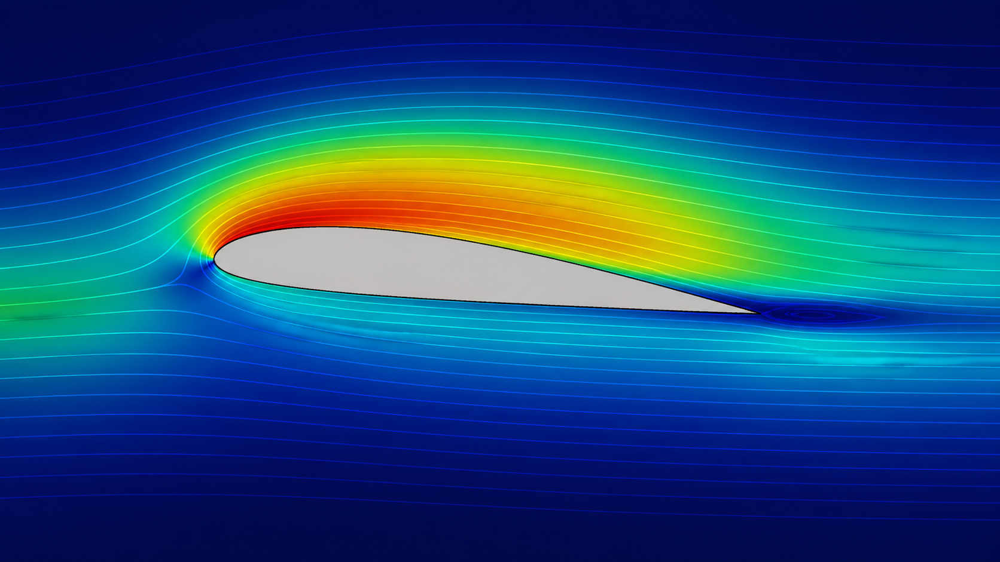

# OpenFOAM 14 incompressibleFluid 的 PIMPLE 与压力校正

不可压缩等温流满足：

```text
\nabla\cdot\mathbf{U}=0

\frac{\partial\mathbf{U}}{\partial t}
+\nabla\cdot(\mathbf{U}\mathbf{U})
=-\nabla p+\nabla\cdot\boldsymbol{\tau}+\mathbf{s}_U
```

其中源码中的 `p` 是运动学压力量纲。离散动量方程写成 `A_P U_P = H(U)-∇p`，定义 `rAU=1/A_P` 与 `HbyA=rAU*H`，则：

```text
\mathbf{U}=\mathbf{H}/A-\frac{1}{A}\nabla p

\nabla\cdot\left(\frac{1}{A}\nabla p\right)
=\nabla\cdot(\mathbf{H}/A)
```



*图：不可压外流场的速度分布与流线概念图，可辅助理解压力—速度耦合后的场结构。该图为 AI 生成的教学示意，不代表经过网格无关性与实验验证的定量结果。*

## 1. 对象构造

构造函数读取 `p`、`U`，若 `phi` 不存在则由插值速度点乘面面积生成；随后创建 viscosity、momentumTransport、MRF 和压力参考。

## 2. 调用链

`momentumPredictor` 形成并缓存 `tUEqn`；`pressureCorrector` 进入 PISO 校正；`correctPressure.C` 构造 `rAU`、`HbyA`、`phiHbyA`，处理 MRF、移动网格与一致算法，再在非正交循环中装配并求解压力方程。

最终一次非正交迭代用压力方程通量更新 `phi`，然后统计连续性误差、松弛压力，以 `U=HbyA-rAtU*grad(p)` 校正速度并约束边界。

## 3. 守恒关键

压力方程直接修正面通量，保证单元级离散连续性；仅用校正后的单元速度重新插值不能同等保证守恒。移动网格还必须把绝对通量转为相对网格通量。

## 4. 参考源码

1. `applications/modules/incompressibleFluid/incompressibleFluid.{H,C}`。
2. `applications/modules/incompressibleFluid/correctPressure.C`。
3. 同目录动量预测实现与 `constrainPressure`、`adjustPhi`。
