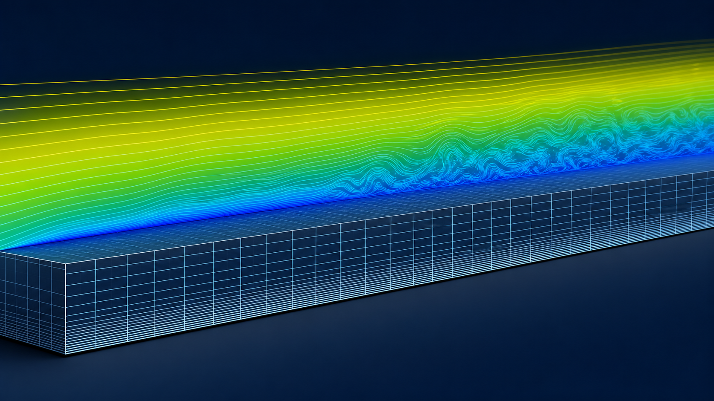

# OpenFOAM snappyHexMesh 表面贴合与边界层网格

`snappyHexMesh` 的可靠调试方法是把流程拆成几何、捕捉、贴合和加层阶段，而不是一次修改大量参数。

*图：平板湍流边界层、近壁速度梯度和层状网格增长的概念图。该图为 AI 生成的教学示意；首层高度、层数与增长率必须由目标 y+ 和实际网格检查确定。*

## 1. 前处理

检查三角面是否封闭、相交、重复、退化以及法向是否一致；确认单位和区域名称。`locationInMesh` 必须位于希望保留的流体区域，且不能落在表面或边界上。

## 2. 背景网格与加密

背景网格决定最终单元方向与最粗尺度。表面级别解析几何，区域加密解析尾流、射流或自由液面，特征边加密保留尖锐棱边。每提高一级通常会显著增加三维单元数，应先估算内存。

## 3. 三阶段策略

1. `castellatedMesh`：只完成切割和加密，检查区域是否保留正确；
2. `snap`：检查表面偏差、尖角和狭缝；
3. `addLayers`：最后添加边界层，并检查覆盖率、厚度和增长率。

若加层失败，优先检查局部表面质量、首层尺寸、总厚度、层数、曲率和相邻面尺寸，而不是单纯提高迭代次数。

## 4. 并行与确定性

大型网格可并行生成，但分解方式和版本可能影响边界附近的细节。网格验收时记录几何文件哈希、字典、进程数、最终单元数和质量统计。

## 5. 验收

检查最差单元的空间位置、patch 完整性、狭缝是否堵塞、层覆盖率、首层高度和增长率。对湍流计算还要用初步流场复核 y+，不能只根据几何先验宣布合格。

## 6. 参考资料

1. 当前 OpenFOAM 版本的 snappyHexMesh 文档与教程。
