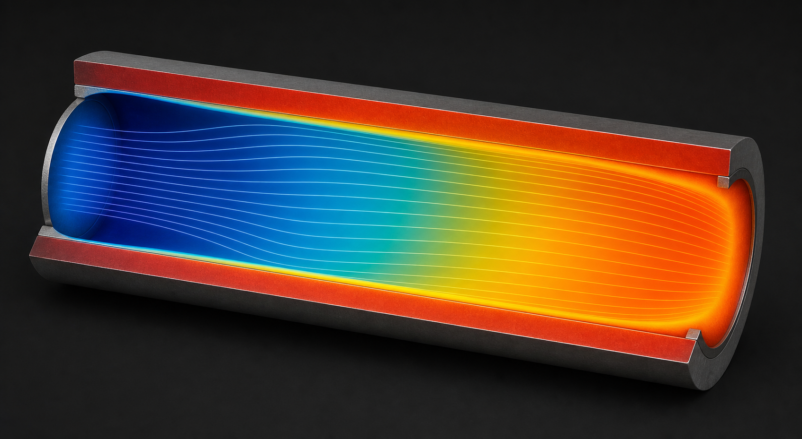

# OpenFOAM 传热、浮力与可压缩流配置

传热、浮力与可压缩案例里，最常出错的不是数值格式，而是热力学模型、求解变量与边界量的定义不一致：把去除静水项的压力当绝对压力、把总压当静压、把温变物性写成常数，都会让结果悄悄跑偏。这类错误往往不报错、能收敛，却让温度、密度与流量整体偏移，因此比数值发散更危险。本文按“配置顺序、变量语义、稳定策略、能量验收”这条主线整理，并给出可直接抄用的热物性与边界字典。



*图：加热管道内流体温升、热边界层与固体壁面导热的概念性可视化。该图为 AI 生成的教学示意，不含定量标尺，工程结论仍应来自实际求解与能量平衡。*

## 1. 结论与适用场景

一句话结论：**先定密度与热物性模型，再定求解变量，最后对齐边界的总静参数**。

- 不可压、密度变化可忽略（小温差常物性）：用 buoyantBoussinesqSimpleFoam，Boussinesq 近似只保留浮力密度差，其余物性按参考值处理，计算最省。
- 密度随温度明显变化、自然对流或混合对流：用 buoyantSimpleFoam 或 buoyantPimpleFoam，压力变量为 p_rgh，适合室内通风、电子散热与太阳能集热器。
- 高速、密度随压力变化（马赫数可观）：用可压缩求解器（rhoPimpleFoam、rhoCentralFoam、sonicFoam），边界必须区分总压与静压、总温与静温。
- 固流耦合传热：用多区域求解器 chtMultiRegionFoam，固体区解导热、流体区解对流，需检查界面热流连续与接触热阻。

选型的边界之处在于“密度是否随温度或压力显著变化”。温差不小时，常物性会把浮力低估，从而低估自然对流强度；而马赫数接近或超过 0.3 时，密度随压力的变化不能再忽略，必须切换到可压缩框架。

实际工程里，传热案例往往还叠加对流传热、辐射与共轭导热多种机制。稳妥的做法是先只开一种机制建立基线，再逐个加入并观察总热流在各项之间的重新分配；如果一次把所有机制都打开，出错时很难判断偏差来自哪一项，也无法解释能量收支为何不平衡。

## 2. 背景与原理

### 2.1 状态方程与热物性

可压缩流必须闭合密度与温度、压力的关系。理想气体状态方程为

$$
p = \rho R T,\qquad R = \frac{R_u}{M}
$$

其中 $R_u$ 为通用气体常数，$M$ 为摩尔质量。比热、黏度与导热率可设为常数，也可随温度变化。OpenFOAM 用 thermophysicalProperties 字典分层描述：状态方程（equationOfState）决定密度如何计算，输运模型（transport）给出黏度与普朗特数，热力学模型（thermo）给出比热与焓的关系，混合物（mixture）把它们组装起来。改任何一层，都会影响温度与密度的恢复方式，因此修改后必须重新核对边界。

选择常数物性还是温变物性，取决于温差跨越的温区：若温差只有几十开尔文，常数物性通常够用；若跨越数百开尔文或涉及燃烧与辐射，温变关系就不能省略，否则壁面热流与火焰温度都会明显失真。

### 2.2 能量表述

可压缩求解器可解内能、焓或总能量。以焓为例，总焓为静焓与动能之和

$$
h_0 = h + \frac{1}{2}|\mathbf u|^2
$$

能量方程包含对流、导热、压力做功与黏性耗散。马赫数较高时黏性耗散与压力功不可忽略，必须使用可压缩能量方程，而不是温度形式的对流扩散方程。求解变量是焓还是内能，决定了边界该给温度、总温还是热流，这一点在配置时最容易混淆。在温度形式与焓形式的能量方程之间切换时，边界条件与初始场的写法也要同步调整，否则会得到看似收敛但能量不闭合的结果。

### 2.3 浮力与 p_rgh

自然对流由密度差驱动。Boussinesq 近似把浮力项写为

$$
\mathbf f_b = -\rho_0\,\beta\,(T - T_0)\,\mathbf g
$$

其中 $\beta$ 为热膨胀系数。buoyant 系列求解器把压力拆为 $p = p_{rgh} + \rho\,\mathbf g\cdot\mathbf h$，只求解 $p_{rgh}$，也就是去除静水压的部分。这样做的目的是避免浮力项与压力梯度中巨大的静水压部分相互抵消所导致的数值误差。正因如此，后处理把 p_rgh 直接当绝对压力会漏掉静水项，压差与密度都会算错。需要牢记的是，p_rgh 只承担驱动流动的压差部分，任何与绝对压力相关的物性计算或边界设定，都要先把它换算回绝对压力再使用。

## 3. 关键配置与公式

### 3.1 浮力相似准则

判断浮力强弱与自然对流是否进入湍流，用两个无量纲数：

$$
Ra = \frac{g\beta\Delta T L^3}{\nu\alpha},\qquad Ri = \frac{Gr}{Re^2},\qquad Gr = \frac{g\beta\Delta T L^3}{\nu^2}
$$

$Ra$ 超过约 $10^9$ 时自然对流进入湍流；$Ri$ 衡量浮力相对惯性力的强弱，$Ri$ 大于约 1 时浮力主导，混合对流问题应同时考虑两者。这些数还用于判断是否需要开启湍流模型，以及是否可以用 Boussinesq 近似。

### 3.2 可压缩总静关系

等熵滞止关系给出总压与静压、总温与静温

$$
\frac{p_0}{p} = \left(1 + \frac{\gamma-1}{2}Ma^2\right)^{\frac{\gamma}{\gamma-1}},\qquad \frac{T_0}{T} = 1 + \frac{\gamma-1}{2}Ma^2
$$

其中 $\gamma = c_p/c_v$。入口给总压而出口给静压是常见组合；混用会让流量与激波位置都偏。低马赫数时总静差异很小，容易忽略，但一旦马赫数升高，差异会迅速放大。

### 3.3 温变黏度

气体黏度常用 Sutherland 公式

$$
\mu(T) = \mu_{ref}\left(\frac{T}{T_{ref}}\right)^{3/2}\frac{T_{ref}+S}{T+S}
$$

其中 $S$ 为 Sutherland 常数，空气约 $110.4\,\mathrm K$，$T_{ref}$ 常取 $273.15\,\mathrm K$。温变黏度与温变导热率会改变边界层内速度与温度剖面的耦合，是换热系数预测精度的关键。导热率随温度变化同样不可忽略，它与黏度一起决定普朗特数，进而影响热边界层与速度边界层的相对厚度。

## 4. 工程做法与参数

- **热物性选择**：小温差先用常数物性建立基线，再逐步引入温变比热、黏度与导热率；温变能显著改变边界层厚度、壁面热流与换热系数。
- **边界语义**：入口可给 totalPressure 与 totalTemperature，配 pressureInletOutletVelocity；出口给静压 fixedValue 或 waveTransmissive；壁面用 fixedValue 温度或 externalWallHeatFluxTemperature。
- **重力**：constant/g 定义重力矢量，必须与几何方向一致，浮力案例别漏掉 g，否则自然对流根本起不来。
- **稳定策略**：先常物性、较小时间步、较保守格式建立基线，再逐项放开；温变物性与辐射会引入额外刚性，放开时要观察残差与温度是否越界。
- **松弛**：能量方程松弛取 $0.7\sim1.0$，压力取 $0.3\sim0.7$；强浮力问题用 PIMPLE 多外迭代以改善压力与浮力的耦合。
- **时间步与 Courant 数**：浮力与可压缩案例的时间步受声速、浮力频率与热扩散共同约束，应先用小时间步建立稳定基线，再逐步放大，并监控温度与密度是否出现非物理振荡。
- **热物性有效范围**：多项式物性只在给定温区内有效，超出范围应改为分段拟合并检查外插行为。
- **辐射**：需要时用 fvDOM 或 viewFactor 模型，注意网格对视角因子的影响，并核查辐射与对流在总热流中的占比。

把上述参数按“先简后繁”的顺序逐项放开，是这类案例最可靠的稳定策略。每次放开一项后，都要重新检查温度场是否有非物理值、密度是否落在理想气体有效范围、残差是否明显恶化，确认无误后再进行下一步。

## 5. 可复现示例

buoyant 求解器的热物性字典与重力：

```cpp
// constant/thermophysicalProperties
thermoType
{
    type            hePsiThermo;
    mixture         pureMixture;
    transport       const;          // 或 sutherland
    thermo          hConst;         // 或 janaf / hPolynomial
    equationOfState perfectGas;
    specie          specie;
    energy          sensibleEnthalpy;
}
mixture
{
    specie         { molWeight 28.96; }
    thermodynamics { Cp 1005; Hf 0; }
    transport      { mu 1.8e-5; Pr 0.7; }
}
```

浮力案例的压力与温度边界（入口总参数、壁面定温）：

```cpp
// constant/g
dimensions [0 1 -2 0 0 0 0];
value      (0 -9.81 0);

// 0/p_rgh
boundaryField
{
    inlet  { type totalPressure; p0 uniform 101325; U U; phi phi; rho rho; psi none; gamma 1; value uniform 101325; }
    outlet { type fixedValue; value uniform 101325; }
    walls  { type fixedFluxPressure; value uniform 101325; }
}
// 0/T
boundaryField
{
    inlet   { type totalTemperature; T0 uniform 300; U U; phi phi; psi none; gamma 1; value uniform 300; }
    hotWall { type fixedValue; value uniform 400; }
    outlet  { type inletOutlet; inletValue uniform 300; value uniform 300; }
}
```

运行并做能量收支检查：

```bash
buoyantSimpleFoam > log.buoyantSimpleFoam 2>&1
postProcess -func wallHeatFlux -latestTime
postProcess -func 'fieldMinMax(fields=(T))' -latestTime
```

稳态收敛后，应把入口焓流、出口焓流、各壁面热流与体热源汇总，净差应接近零；瞬态则须让净输入与内能变化率在时间上闭合。这一步是这类案例的核心验收，比盯着残差下降更有意义。

## 6. 常见坑与排查

- **p_rgh 当绝对压力**：浮力案例后处理把 p_rgh 直接读成压力会漏掉静水项，压差与密度都错，这是最常见的隐性错误。
- **总静参数混用**：入口给静压却按总压理解，或反之，会使流量与激波位置系统性偏移。
- **温变物性越界**：非物理温度（负温、过高）会让多项式物性外插爆炸，必须先修正温度场再排查物性设置。
- **漏设重力**：浮力驱动案例忘给 g 或方向给错，自然对流根本起不来，表现为温度场几乎均匀。
- **能量不平衡**：稳态净焓流应接近零、瞬态净输入应等于内能变化，不核对这一点等于没有验收。
- **界面热流不连续**：共轭传热中若界面两侧热流不连续，多半是网格不匹配或接触热阻设置问题。
- **忽略黏性耗散**：高马赫数下不开启能量方程的耗散项会低估总温升，尤其在超声速或强剪切区域。
- **入口湍流与温度耦合错误**：湍流强度与温度边界若不协调，会同时影响换热系数与边界层发展，应一并检查。
- **多区域界面不匹配**：chtMultiRegionFoam 中流体与固体界面网格若不完全对齐，会引入虚假界面热阻，应使用一致的界面网格或专用界面处理。

## 7. 检查清单与参考

- [ ] 密度与热物性模型与物理一致，温变关系有依据；
- [ ] 求解变量语义清楚（p_rgh、焓或内能），边界针对该变量设置；
- [ ] 浮力案例的重力方向、参考温度、热膨胀系数正确；
- [ ] 可压缩边界的总参数与静参数一致；
- [ ] 能量收支（入口焓流、出口焓流、壁面热流、储能变化）闭合；
- [ ] 温变物性未越界，时间步与松弛稳定；
- [ ] 多区域案例的界面网格与接触热阻设置一致，界面热流连续。

参考：

1. OpenFOAM User Guide，Thermophysical Models 与 Heat Transfer 章节。
2. Versteeg H.K., Malalasekera W., An Introduction to Computational Fluid Dynamics, 2nd ed., Pearson, 2007.
3. 当前发行版 tutorials 中 buoyantSimpleFoam、rhoPimpleFoam、chtMultiRegionFoam 示例。
