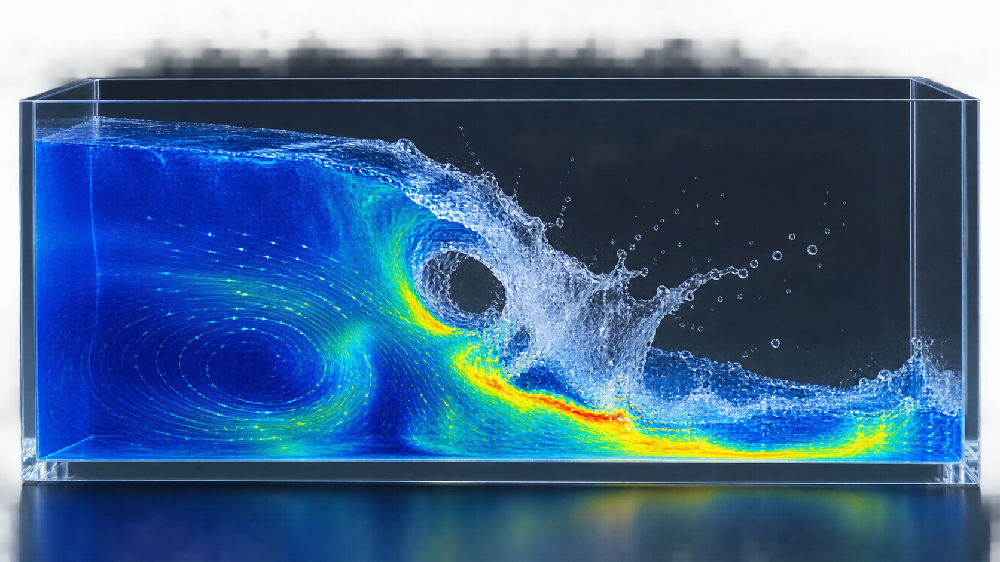

# OpenFOAM 多相流、组分与反应建模路线

多相与组分反应是 OpenFOAM 里分支最多的方向，也是最容易选错工具的地方。模型选择取决于是否解析界面、分散相尺度和耦合强度，而不是“相数越多越高级”。用错了路线，往往表现为“能算完、云图也好看”，但关键量的误差来自模型假设而非数值精度，再加密网格也无济于事。本文按物理尺度给出选型判据，把相分数、组分与反应的守恒验收串成一条可执行路线，并给出可直接抄用的字典片段。



*图：VOF 溃坝过程中自由液面卷曲、夹气区与液相速度分布的概念图。该图为 AI 生成的教学示意，用于辨认应关注的场结构，不作为相分数或速度的定量结果。*

## 1. 结论与适用场景

一句话结论：**先判断要不要解析界面、分散相有多小、耦合有多强，再选 VOF、欧拉多相或拉格朗日**。

- VOF（interFoam 系列）：需要解析大尺度自由界面时首选，典型场景有溃坝、波浪爬高、射流破碎初期、液舱晃动与溢流。重点在界面压缩、表面张力和重力，网格要能把界面切分得足够锐利。
- 欧拉多相（multiphaseEulerFoam）：两相都作为连续介质，适合相含率较高、界面无法逐一解析的鼓泡床、流化床、气液搅拌与管束两相流，需要曳力、升力、虚拟质量力与湍流弥散等闭合。
- 拉格朗日颗粒（ReactingParcelFoam、icoUncoupledKinematicParcelFoam）：分散相体积分数低时使用，逐个跟踪颗粒或液滴轨迹，可从单向逐步增加到双向与四向耦合，适合喷雾、颗粒输运与燃烧。
- 组分输运（scalarTransportFoam、reactingFoam）：在单相混合物内求解质量分数与扩散，反应流再叠加化学动力学、热效应与刚性化学时间尺度。

若尺度存在歧义，可自问：界面曲率是否影响主要结论？若影响，必须解析界面；若不影响，用弥散模型更经济。另一个常见判据是分散相体积分数：低于约 10% 且 $St$ 不太小时适合拉格朗日，更高时欧拉多相更合适，而 VOF 则用于界面连续、可分辨的情况。

还要注意，多相与组分常常叠加出现：喷雾燃烧既有液滴破碎，又有组分输运与化学反应。此时不要一步到位，而应按尺度分层搭建——先做纯流动，再加相变与破碎，再加组分与反应，每加一层都重新核对守恒与稳定性。分层的好处是，一旦结果异常，能立刻判断是哪一层引入的假设出了问题，而不是面对一个无法拆解的黑箱。

## 2. 背景与原理

### 2.1 界面捕捉与相分数

VOF 用相分数 $\alpha$（在 0 与 1 之间）描述两相分布，通过求解其输运方程并施加界面压缩保持界面锐利。多相共享一个速度场，并在界面处加入表面张力源项。相分数并非严格有界的物理量，界面在数值上总会有若干单元宽的过渡带，方法设计的目标就是把这条过渡带压窄而不引入伪流。

VOF 的难点不在方程本身，而在于界面附近的离散：界面必须足够锐利以保持表面张力与相分布正确，又不能因压缩过强而引入伪流。工程上通常配合自适应网格加密或在界面可能出现的位置预加密来控制成本，并密切监控界面处的速度量级，确认伪流远小于物理速度。

### 2.2 弥散相与相间力

欧拉与拉格朗日方法都把分散相平均化，区别在于离散相是否用粒子显式表示。相间力主要包括曳力、升力、虚拟质量力与湍流弥散力，其中曳力关联式通常是结果最敏感的参数。气泡或液滴的尺寸分布往往只能给平均值，这一假设的误差经常大于数值格式本身的误差。

### 2.3 拉格朗日轨迹与耦合层级

颗粒运动由牛顿第二定律积分，响应时间为 $\tau_p = \rho_p d_p^2/(18\mu)$，用 Stokes 数判断跟随性。耦合分为单向（颗粒只受流体影响）、双向（再加动量与能量交换）与四向（再加颗粒间碰撞）。工程上应先用单向跑通，再逐步打开双向与碰撞，每加一层都要核对守恒与统计量是否稳定。

## 3. 关键配置与公式

### 3.1 相分数输运与界面压缩

interFoam 求解的相分数方程为

$$
\frac{\partial \alpha}{\partial t} + \nabla\cdot(\alpha \mathbf U) + \nabla\cdot\big(\alpha(1-\alpha)\mathbf U_r\big) = 0
$$

第三项是人工界面压缩项，$\mathbf U_r$ 为压缩速度。它抑制数值扩散、保持界面锐利，但过大时会在界面处产生伪流，因此压缩强度 $cAlpha$ 需要权衡：太小界面模糊，太大出现伪速度。工程上应通过界面过渡带厚度与伪流两个指标联合标定，而不能照搬他人案例的默认值。

### 3.2 表面张力与曲率

界面两侧存在拉普拉斯压力跳变

$$
\Delta p = \sigma\,\kappa,\qquad \kappa = -\nabla\cdot\left(\frac{\nabla\alpha}{|\nabla\alpha|}\right)
$$

其中 $\sigma$ 为表面张力系数，$\kappa$ 为界面曲率。它通过连续表面力模型作用在界面单元上，网格必须足够细以解析曲率，否则会产生伪流。对表面张力主导的小尺度问题，还可用毛细数衡量黏性与表面张力的相对重要程度。对气液两相的大密度比流动，表面张力相对惯性很弱，界面破碎更多由流动剪切主导，此时界面分辨率往往比表面张力模型本身更关键。

### 3.3 颗粒受力与 Stokes 数

球形颗粒的曳力常写作

$$
\mathbf F_d = m_p\,\frac{18\mu}{\rho_p d_p^2}\,\frac{C_D Re_p}{24}\,(\mathbf U - \mathbf U_p)
$$

颗粒响应时间与流体时间尺度之比为 Stokes 数

$$
St = \frac{\tau_p}{\tau_f},\qquad \tau_p = \frac{\rho_p d_p^2}{18\mu}
$$

$St$ 远小于 1 时颗粒紧密跟随流体，可用弥散模型；$St$ 远大于 1 时颗粒惯性主导，必须跟踪轨道。介于两者之间的中等 $St$ 是最难处理的，因为颗粒既不完全跟随也不完全脱离，双向耦合往往是必需的。

## 4. 工程做法与参数

- **时间步**：VOF 除流动 Courant 数外，还要限制界面 Courant 数（interFoam 默认 maxAlphaCo），工程上取 $0.3\sim0.5$；拉格朗日受颗粒响应时间与源项刚性限制，反应流还要加化学时间尺度约束。
- **界面分辨率**：界面附近至少 3 至 5 个单元；对液滴、气泡等曲率敏感问题应更密。界面网格加密应配合自适应加密或局部细分，避免全域加密带来的成本爆炸。
- **相间闭合**：欧拉多相务必记录曳力模型、气泡直径假设与湍流弥散模型并做敏感性，这些闭合项的误差常大于数值格式。
- **耦合与松弛**：强相间交换用足够的 PIMPLE 外迭代；拉格朗日双向耦合需把动量与能量源项计入流体方程，并监控源项是否引发振荡。
- **初始化与边界**：用 setFields 设置相区，入口给出相含率或组分，出口考虑回流时的组成；组分案例用场函数或映射初始化，别用纯均匀值掩盖错误。
- **统计与后处理**：多相结果应报告逐相的质量与体积守恒、界面或颗粒统计（粒径分布、滞留时间）、压降与相含率剖面；这些量比单张云图更能暴露模型假设的问题。

## 5. 可复现示例

interFoam 最小可复现流程：

```bash
cp -r $FOAM_TUTORIALS/multiphase/interFoam/laminar/damBreak/damBreak .
cd damBreak
blockMesh
setFields
interFoam > log.interFoam 2>&1
# 监控水相体积随时间的守恒情况
postProcess -func 'volFieldValue(name=vol, fields=(alpha.water), operation=volIntegrate)' -latestTime
```

相分数求解与 PIMPLE 设置（MULES 保证有界）：

```cpp
// system/fvSolution
solvers
{
    "alpha.water.*"
    {
        nAlphaCorr      2;
        cAlpha          1;      // 界面压缩强度，过大产生伪流
        MULESCorr       yes;
    }
    p_rgh { solver PCG; preconditioner DIC; tolerance 1e-7; relTol 0.05; }
    U     { solver smoothSolver; smoother symGaussSeidel; tolerance 1e-8; relTol 0.1; }
}
PIMPLE
{
    nOuterCorrectors 2;
    nCorrectors      2;
    nNonOrthogonalCorrectors 1;
}
```

拉格朗日双向耦合与组分反应：

```cpp
// constant/cloudProperties：开启双向耦合
cloudProperties
{
    type    reactingCloud;
    coupled yes;            // 计入动量/能量交换
}
// constant/chemistryProperties：隐式积分刚性化学
chemistryType { solver EulerImplicit; method EDC; }
```

运行时重点观察相分数体积随时间的变化曲线：纯 VOF 无相变问题时，各相体积扣除进出口净流量后应基本守恒，若出现单调漂移，多半是界面压缩过强或边界处理不当。组分与反应案例还要看各组分质量分数之和是否为 1，以及元素收支是否平衡，这两项是判断组分输运是否可信的第一道关卡。

## 6. 常见坑与排查

- **把 interFoam 用于高相含率弥散流**：逐一解析界面成本爆炸，应改用欧拉多相；界面解析和高相含率是两条不同路线。
- **欧拉多相缺相间闭合说明**：直接套默认曳力会让床层压降与相含率系统性偏差，必须做敏感性分析并记录假设。
- **拉格朗日颗粒数不足**：统计量波动大，需做颗粒数无关性检查或使用 parcel 采样来降低统计噪声。
- **相分数越界**：$\alpha$ 超出 $[0,1]$ 说明界面压缩过强、时间步过大或格式不有界，应先用 MULES 与更小界面 Courant 数，而不是裁剪掩盖。
- **表面张力伪流**：网格过粗或曲率计算差会出伪流，应减小时间步、加密界面并检查表面力权重。
- **组分不守恒**：检查入口质量分数归一化（各组分质量分数之和为 1）、扩散系数一致性与源项线性化。
- **反应刚度过大**：显式积分发散时改用隐式或自适应化学积分器，或减小时间步，并对化学时间尺度与流动时间尺度之比做检查。
- **相变与传质闭合缺失**：蒸发或冷凝若只给单一传质系数，会在不同工况下系统性偏移，应核对关联式的适用范围与驱动温差。

## 7. 检查清单与参考

- [ ] 方法选择与界面尺度、相含率、Stokes 数匹配并有记录；
- [ ] 相分数在 $[0,1]$ 内有界，界面厚度可控；
- [ ] 各相的质量与体积守恒误差已量化；
- [ ] 相间闭合（曳力、升力、湍流弥散）已记录并做敏感性；
- [ ] 组分质量分数之和为 1，元素守恒已核对；
- [ ] 网格与时间步无关性验证完成。

参考：

1. Rusche H., Computational Fluid Dynamics of Dispersed Two-Phase Flows at High Phase Fractions, Imperial College, 2002.
2. OpenFOAM User Guide，Multiphase、Lagrangian 与 Combustion 章节。
3. 当前发行版 tutorials 中 interFoam、multiphaseEulerFoam、reactingFoam 示例。
